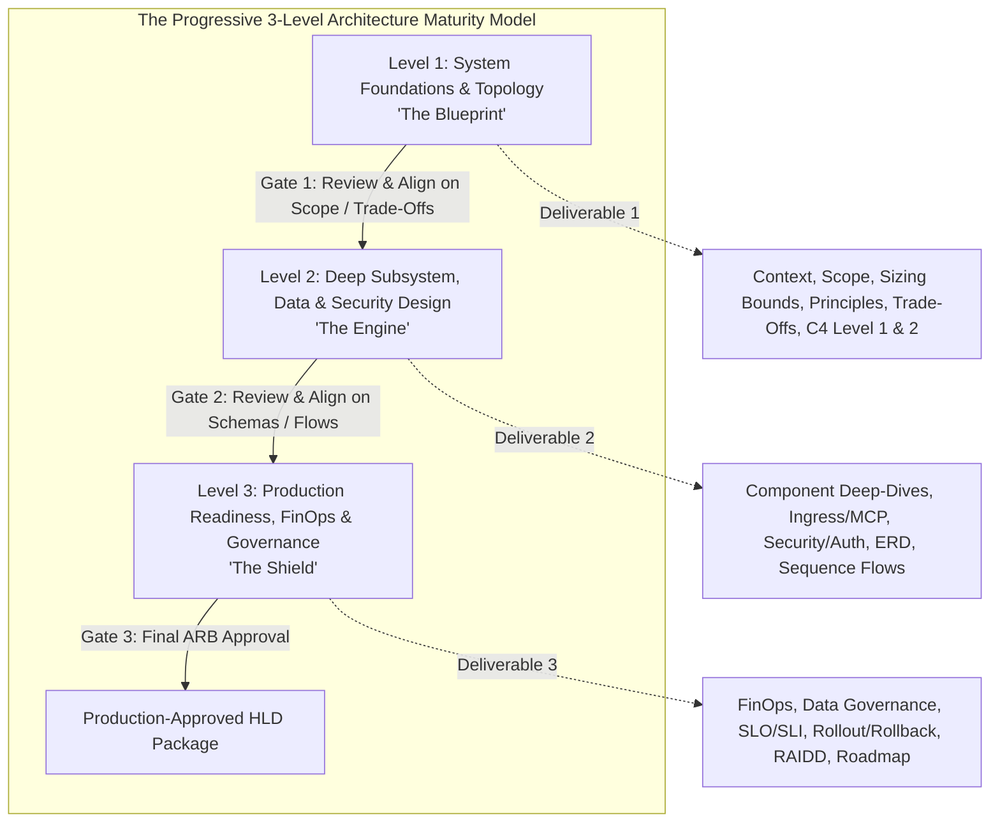
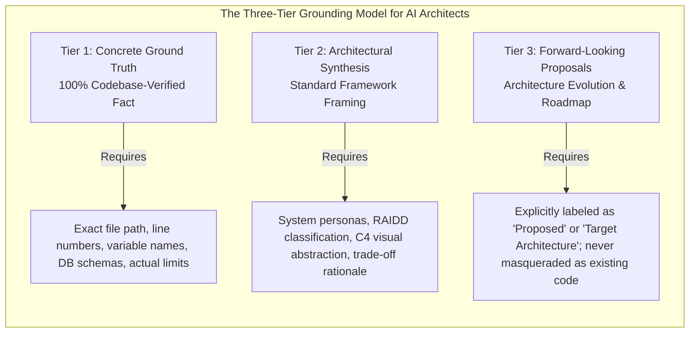
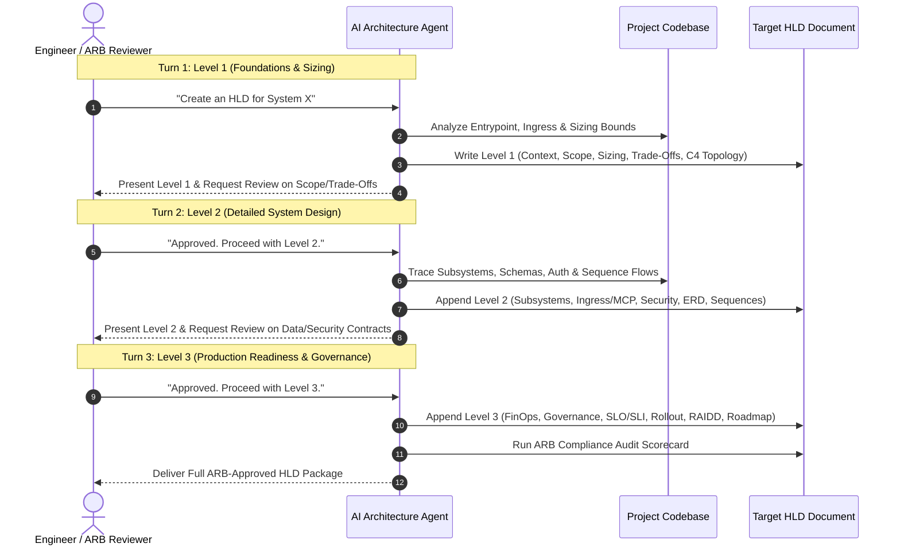

# Engineering Standard: Progressive HLD Authoring & ARB Compliance Guide for LLM Agents

**Document Reference:** `STD-ARCH-LLM-HLD-002`  
**Version:** 3.0.0 (Progressive Multi-Level Standard)  
**Status:** Canonical Reference Standard  
**Target Audience:** Autonomous AI Agents, AI Software Architects, Engineering Leads, and Architecture Review Boards (ARBs)  
**Applicability:** Greenfield System Design, Codebase Reverse-Engineering, Enterprise Software Architecture, and Architecture Review Board Auditing  
**Primary Frameworks Incorporated:**
- *TheOpenArch End-to-End High-Level Design Framework* (RAIDD, Solution Context, Application Impact Matrix, Operational Deliverables)
- *Ved Mulkalwar / Production Design Methodology* (Storyteller Narrative, Capacity Calculations, Trade-Off Matrix)
- *arc42 Architecture Template & IEEE 1016 (Software Design Descriptions)*
- *C4 Architectural Modeling (Context, Container, Component)*
- *Google & Amazon Production RFC / Design Doc Standards* (Non-Goals, ADRs, Failure Modes, Rollout Invariants)
- *FinOps Cloud Cost Modeling & Data Governance Frameworks (GDPR/SOC2)*

---

## 1. Executive Philosophy & The Progressive Delivery Strategy

### 1.1 The Anti-Pattern of One-Shot HLD Generation
When an AI agent attempts to generate a complete enterprise HLD (600–1000 lines) in a single response, it invariably encounters three catastrophic failure modes:
1. **Output Token Exhaustion & Truncation:** The agent exhausts its generation window, leaving critical operational, security, or data sections truncated.
2. **Detail Degradation (The Fatigue Curve):** The beginning of the document (Executive Summary, Scope) receives excessive detail, while later sections (Data Architecture, Failure Modes, RAIDD) collapse into superficial bullet points.
3. **Compounding Unvalidated Assumptions:** If the agent misinterprets a foundational requirement in Section 1, every downstream component (Subsystems, Sequence Flows, Schemas) is fundamentally compromised with zero opportunity for mid-course correction.

### 1.2 The Progressive 3-Level Architecture Model
To ensure maximum rigor, human-in-the-loop alignment, and zero token truncation, this standard divides High-Level Design into **Three Progressive Levels**:



- **Level 1 (Foundations & Topology — "The Blueprint"):** Validates the problem space, non-goals, sizing bounds, architectural trade-offs, and top-level C4 container topology.
- **Level 2 (Deep Subsystem, Data & Security Design — "The Engine"):** Details component mechanics, specialized protocols (MCP, REST, gRPC), cryptographic key hierarchies, relational ERDs, and UML runtime sequence flows.
- **Level 3 (Production Readiness, FinOps & Governance — "The Shield"):** Hardens the architecture with cloud unit economics (FinOps), compliance policies (GDPR/SOC2), service level objectives (SLOs/SLIs), zero-downtime deployment strategies, and a formal RAIDD log.

> [!TIP]
> **Agent Execution Rule:** An agent should **never** one-shot all three levels in a single prompt unless explicitly commanded. By default, the agent must propose Level 1, confirm alignment with the user, and progressively unlock Levels 2 and 3.

---

## 2. The Three-Tier Architectural Grounding Rule

To eliminate ambiguity and prevent hallucination, every technical assertion made by an LLM agent must strictly belong to one of three categories:



### Dual-Mode Execution (Brownfield vs. Greenfield)
- **Brownfield Mode (Reverse-Engineering Existing Code):**
  - **Tier 1** anchors to verified code files using `file:///path/to/file#L10-L45` links, real constants, database migration scripts, and exact function names.
  - **Tier 2** synthesizes business personas, operational trade-offs, and C4 visual containers.
  - **Tier 3** isolates architectural optimizations, technical debt mitigations, and future roadmaps.
- **Greenfield Mode (Designing Brand-New Systems):**
  - **Tier 1** anchors to verified PRD requirements, RFC constraints, industry RFC standards (e.g., OAuth RFC 6749, MCP v1.0), and mathematical sizing bounds.
  - **Tier 2** maps out components, technology evaluations, and data models.
  - **Tier 3** details Phase 2/3 enterprise expansion plans.

---

## 3. Detailed Breakdown of the Three Progressive Levels

---

### Level 1: System Foundations & Topology ("The Blueprint")
*Objective: Establish problem boundaries, calculate capacity constraints, justify core trade-offs, and visualize top-level topology.*

#### 1.1 Executive Summary & Problem Context
- **Core Mission:** Concise 2-paragraph statement of purpose.
- **Problem Statement:** Exact technical and operational bottlenecks in current/legacy systems.
- **Scope Matrix:** Explicit table of **In-Scope** vs. **Non-Goals (Out-of-Scope)**.
- **Personas & Stakeholders:** Who uses, operates, and audits the system?
- **Domain Glossary:** Canonical definitions of domain-specific terminology.

#### 1.2 Principles & Architectural Trade-Off Matrix
- **Core Principles:** 4–5 architectural axioms (e.g., CQS, Decoupled Data Plane, Protocol-First).
- **Formal Trade-Off Matrix:** Must compare the chosen approach against rejected alternatives with technical justification:

| Decision Dimension | Chosen Approach | Rejected Alternative | Architectural Rationale & Trade-Off |
| :--- | :--- | :--- | :--- |
| **State Sync** | Sequence-based streams | Persistent WebSockets | Eliminates connection leaks; 100% compatible with L7 proxies and serverless gateways. |
| **Payload Plane** | Decoupled Object Storage | Database BLOBs / Rows | Prevents database memory saturation; enables direct HTTP streaming with immutable cache headers. |

#### 1.3 Back-of-the-Envelope Sizing & Capacity Bounds
Mathematical calculations grounding system limits:
- **Throughput & IOPS:** Peak QPS/RPS and network bandwidth bounds.
- **Storage Sizing:** Ingestion rate (MB/sec), payload ceilings (e.g., max 24 MB part chunk, max 1.5 MB config).
- **Timeout Ceilings & Concurrency Bounds:** Long-poll timeouts, connection pool sizing, and memory bounds.

#### 1.4 C4 Level 1 (System Context) & Level 2 (Container Topology)
- **C4 Level 1 Context Diagram:** Human actors, the system boundary, and external SaaS/enterprise systems in Mermaid.
- **C4 Level 2 Container Diagram:** Process boundaries, network ports, ingress routers, backend services, databases, and storage buckets.

---

### Level 2: Deep Subsystem, Data & Security Design ("The Engine")
*Objective: Map out internal component mechanics, interface contracts, security architecture, relational schemas, and execution sequence flows.*

#### 2.1 Subsystem & Component Deep-Dives
For each core subsystem:
- **Core Responsibility & File Paths:** Clickable links to implementation files.
- **Concurrency & State Management:** Mutexes, transaction locks, thread pools, or channel dispatchers.
- **Error Handling & Failure Modes:** Upstream/downstream failure behavior and circuit breakers.

#### 2.2 Specialized Ingress & Protocol Architecture
*(E.g., Model Context Protocol (MCP), gRPC-Web, Public REST Gateway)*
- **Interface Matrix:** Exact endpoints, HTTP methods, headers, and payload structures.
- **Dynamic Schema Generation:** How schemas are reflected/generated (e.g., Protobuf reflection to JSON-Schema).
- **Validation Engine & Self-Correction:** How inputs are validated and how structured error payloads (with path, reason, expected, actual) enable automated AI self-correction.

#### 2.3 Security, Identity & Headless Authorization
- **Multi-Provider Authentication Matrix:** OAuth 2.0, OIDC/JWKS, AWS ALB, GCP IAP, and Dev Claims.
- **Headless Machine-to-Machine Authorization:** RFC 8628 Device Authorization flow for CLI and headless AI agents.
- **Cryptographic Key Hierarchy:** Derivation and rotation of Data Encryption Keys (DEKs), RSA instance keypairs, and AES-GCM ciphertexts.
- **Tenant Isolation & RBAC:** Workspace partitioning, row-level security, and role permissions.

#### 2.4 Data Architecture & Storage Schema
- **Relational Entity-Relationship Diagram (ERD):** Complete Mermaid ERD with primary keys, foreign keys, and cardinalities.
- **State Transition Patterns:** Justification of mutable records vs. append-only event logs.
- **Decoupled Storage URI Scheme:** Explicit bucket directory structures and asset naming conventions.

#### 2.5 End-to-End Runtime Sequence Flows
At least two detailed UML sequence diagrams in Mermaid:
1. **Primary Happy Path:** Request ingress $\rightarrow$ verification $\rightarrow$ asynchronous execution $\rightarrow$ storage streaming $\rightarrow$ client reconciliation.
2. **Complex Ingestion / Machine Onboarding Flow:** E.g., Chunked multipart file upload or headless device polling.

---

### Level 3: Production Readiness, FinOps & Governance ("The Shield")
*Objective: Ensure financial viability, legal compliance, operational observability, and enterprise disaster recovery.*

#### 3.1 FinOps & Unit Economics (Cost Architecture)
- **Infrastructure Cost Modeling:** Monthly compute, database, and storage cost projections based on capacity sizing.
- **Egress & Data Transfer Optimization:** Bandwidth cost mitigation via edge caching (`Cache-Control: immutable`) and gzip/zstd compression.
- **Third-Party API & Token Spend:** Managing external LLM token usage, map tile quotas, and warehouse compute credits.

#### 3.2 Data Governance, Privacy & Compliance (GDPR/SOC2)
- **Data Classification Matrix:** Public, Internal, Confidential, and Restricted (PII).
- **Data Residency & Sovereignty:** Regional storage and compute isolation.
- **Retention & Deletion Cascades:** "Right-to-be-forgotten" mechanics—how deleting an entity cascades across relational rows, cache keys, and object storage blobs.

#### 3.3 Day-2 Operations, Observability & Alerting
- **SLO / SLI Matrix:** Explicit availability and latency targets (e.g., `99.9%` availability, `p95 < 250ms`, error budget).
- **Telemetry & Logging:** Structured JSON logs, trace context propagation, and telemetry masking for test environments.
- **Alerting & Runbook Matrix:** Critical alerts, thresholds, and on-call mitigation actions.

#### 3.4 Deployment Topologies, Zero-Downtime Migrations & Rollback
- **Deployment Strategy:** Blue-Green or Canary rollout topology with health probe gates.
- **Zero-Downtime Database Migrations:** Expand/Contract migration pattern (adding nullable columns before backfilling).
- **Rollback & Blast-Radius Control:** Immediate rollback procedures and automated circuit breakers.

#### 3.5 Disaster Recovery & Data Resilience
- **Backup Strategy:** Continuous streaming backups (e.g., SQLite to S3) or automated database snapshots.
- **Recovery Objectives:** RPO (Recovery Point Objective) and RTO (Recovery Time Objective) in minutes/hours.
- **Graceful Drain:** Signal handling (`SIGINT`/`SIGTERM`), inflight job cancellation, and timeout invariants.

#### 3.6 RAIDD Log, Technical Debt & Evolutionary Roadmap
- **Formal RAIDD Table:** Comprehensive log of Risks, Assumptions, Issues, Decisions, and Dependencies.
- **Architectural Dispensations (Technical Debt):** Explicitly documented architectural trade-offs or bottlenecks.
- **Phased Evolutionary Roadmap:** Sequenced engineering milestones (Phase 1, Phase 2, Phase 3).

---

## 4. LLM Agent Operational Guardrails

To prevent common AI generation failures, agents must follow these operational rules:

### 4.1 Mermaid Defensive Syntax Rules
Mermaid syntax crashes frequently in Markdown renderers when LLMs output unescaped characters. Agents must enforce:
1. **Always quote node labels containing special characters:**
   ```mermaid
   %% BAD - Will crash renderer
   node1[POST /api/v1/file (Upload)]
   
   %% GOOD - Safe rendering
   node1["POST /api/v1/file (Upload)"]
   ```
2. **Never use raw HTML tags inside node labels.** Use clean text or markdown formatting.
3. **Always specify graph direction explicitly** (`graph TD` or `graph LR`).

### 4.2 Code Discovery Heuristics (Brownfield Execution)
When inspecting a repository to write an HLD, agents must systematically locate:
1. **Process Entrypoints:** Search for `main.go`, `server.ts`, `app.py`, `index.js`, or Dockerfile `ENTRYPOINT`.
2. **Ingress & Routing:** Scan for `mux.NewRouter()`, `express()`, `FastAPI()`, or Protobuf service definitions (`*.proto`).
3. **Database Schemas:** Locate SQL migrations (`migrations/`, `schema.sql`) or ORM models (`schema.prisma`, `models.py`).
4. **Asynchronous Queues:** Search for Go channels, Celery tasks, BullMQ workers, or background goroutines.
5. **Security Middleware:** Locate JWT validation, OAuth exchange handlers, and CORS filters.

---

## 5. 100-Point ARB Compliance Audit Scorecard

This scorecard evaluates High-Level Design documents for production readiness. It combines positive category scoring with strict negative penalty deductions for common AI failure modes.

```
========================================================================================
                      ARCHITECTURE REVIEW BOARD (ARB) SCORECARD
========================================================================================
Project Name: _______________________      Reviewer / Auditor: _________________________
Document Ref: _______________________      Evaluation Date:    _________________________
Progressive Level Evaluated: [ ] Level 1    [ ] Level 2    [ ] Level 3 (Full ARB)
========================================================================================

CATEGORY 1: CONTEXT, SCOPE & SIZING BOUNDS (Level 1)                   [ Weight: 10 pts ]
  [ ] 1.1 Problem statement articulates specific technical bottlenecks.         (3 pts)
  [ ] 1.2 In-Scope vs. Non-Goals (Out-of-Scope) are explicitly tabulated.        (4 pts)
  [ ] 1.3 Back-of-the-envelope capacity, memory, and timeout limits computed.   (3 pts)

CATEGORY 2: PRINCIPLES & TRADE-OFF MATRIX (Level 1)                    [ Weight: 10 pts ]
  [ ] 2.1 Core architecture principles and invariants are defined.              (3 pts)
  [ ] 2.2 Formal Trade-Off Matrix compares chosen design against alternatives.   (4 pts)
  [ ] 2.3 Rationale clearly explains why alternative designs were rejected.     (3 pts)

CATEGORY 3: SYSTEM TOPOLOGY & DECOMPOSITION (Level 1)                  [ Weight: 10 pts ]
  [ ] 3.1 C4 Level 1 System Context diagram correctly maps boundaries.          (4 pts)
  [ ] 3.2 C4 Level 2 Container/Process topology diagram is provided.            (4 pts)
  [ ] 3.3 Network ports, reverse proxies, and ingress routing are explicit.      (2 pts)

CATEGORY 4: SUBSYSTEMS & SPECIALIZED INGRESS (Level 2)                 [ Weight: 10 pts ]
  [ ] 4.1 Subsystems detail responsibilities, concurrency, and failure modes.   (4 pts)
  [ ] 4.2 Ingress contracts define exact HTTP verbs, paths, and schemas.        (3 pts)
  [ ] 4.3 Input validation, payload limits, and error payloads are specified.   (3 pts)

CATEGORY 5: SECURITY, IDENTITY & ACCESS ARCHITECTURE (Level 2)         [ Weight: 10 pts ]
  [ ] 5.1 Multi-provider authentication flows (OAuth, OIDC, JWT) documented.     (3 pts)
  [ ] 5.2 Headless / M2M authorization (e.g., RFC 8628 Device Flow) covered.    (3 pts)
  [ ] 5.3 Cryptographic key hierarchy (DEK, Master Key, RSA) mapped.            (2 pts)
  [ ] 5.4 Secret redaction and zero-trust credential hygiene guaranteed.        (2 pts)

CATEGORY 6: DATA ARCHITECTURE & STORAGE (Level 2)                      [ Weight: 10 pts ]
  [ ] 6.1 Relational ERD displays entities, keys, and cardinalities.            (4 pts)
  [ ] 6.2 Data state pattern (append-only log vs. mutable row) justified.       (3 pts)
  [ ] 6.3 Decoupled storage hierarchy, URI paths, and caching defined.          (3 pts)

CATEGORY 7: RUNTIME SEQUENCE FLOWS (Level 2)                           [ Weight: 10 pts ]
  [ ] 7.1 Primary execution sequence diagram includes all asynchronous hops.    (5 pts)
  [ ] 7.2 Secondary edge case / ingestion / error sequence flow is diagrammed.  (5 pts)

CATEGORY 8: FINOPS, DATA GOVERNANCE & COMPLIANCE (Level 3)             [ Weight: 10 pts ]
  [ ] 8.1 FinOps model estimates compute, storage, egress, and API costs.       (4 pts)
  [ ] 8.2 Data classification (Public/PII) and retention schedules defined.     (3 pts)
  [ ] 8.3 Deletion cascade mechanics across DB rows and object storage mapped.  (3 pts)

CATEGORY 9: OPERATIONAL EXCELLENCE & RESILIENCE (Level 3)              [ Weight: 10 pts ]
  [ ] 9.1 SLO/SLI targets, error budgets, and alerting matrix defined.          (3 pts)
  [ ] 9.2 Zero-downtime deployment (Canary/Blue-Green) & rollback planned.      (3 pts)
  [ ] 9.3 Disaster recovery (RPO/RTO), continuous backup, and drain covered.    (4 pts)

CATEGORY 10: RAIDD LOG, GROUNDEDNESS & ROADMAP (Level 3)               [ Weight: 10 pts ]
  [ ] 10.1 Formal RAIDD table captures Risks, Assumptions, Issues, Decisions.   (3 pts)
  [ ] 10.2 Technical debt is transparently logged with an evolutionary roadmap. (3 pts)
  [ ] 10.3 Brownfield facts strictly grounded in code via file:// links.        (4 pts)

----------------------------------------------------------------------------------------
POSITIVE SCORE SUBTOTAL: ______ / 100
----------------------------------------------------------------------------------------

AUTOMATED PENALTY DEDUCTIONS:
  [ ] Contains generic pseudocode instead of actual repo types/symbols:         -5 pts
  [ ] Contains broken markdown links or invalid file:// paths:                  -5 pts
  [ ] Missing alternative trade-offs (only lists chosen approach):              -5 pts
  [ ] Speculative / proposed features masquerading as existing code:           -10 pts
  [ ] Mermaid syntax error causing render failure:                              -5 pts

----------------------------------------------------------------------------------------
FINAL AUDIT SCORE: ______ / 100
CLASSIFICATION:
  [ ] 90 - 100: ARB Approved (Production Ready)
  [ ] 75 - 89:  Conditional Approval (Minor revisions required)
  [ ] 50 - 74:  Major Revision Required (Architectural gaps present)
  [ ] < 50:     Rejected (Lacks foundational engineering rigor)
========================================================================================
```

---

## 6. Agent Playbook: Progressive Multi-Turn Workflow

When an agent is prompted to create an HLD, it should execute the following 3-milestone sequence:


