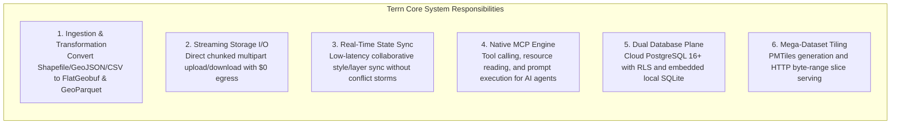
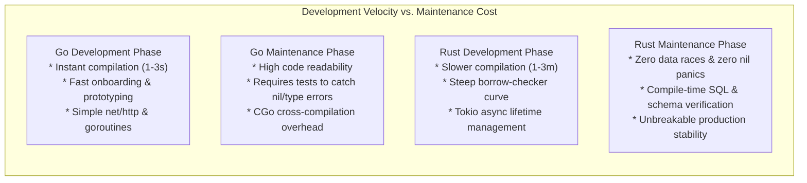
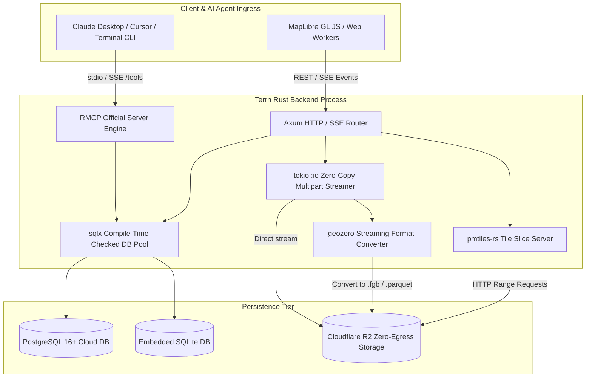
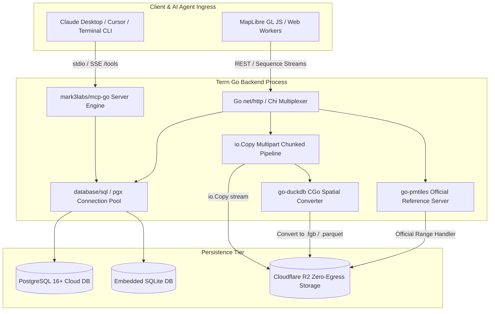

# Technical Architecture Evaluation: Go vs. Rust for Terrn Backend & MCP Server

**Document Reference:** `DOC-TERRN-STACK-EVAL-001`  
**Version:** 1.1.0  
**Date:** September 10, 2026  
**Status:** Approved Architecture Decision Record (ADR-001) - Rust Foundation Selected  
**Target Environment:** Cloudflare R2 / AWS S3, PostgreSQL 16+ (Multi-Tenant Cloud) [Standalone Desktop SQLite marked as Future Scope]  
**Author:** Software Architecture Team  

---

## 1. Executive Summary & Context

Terrn is architecting a lean, high-performance geospatial analytics and visualization platform. The core system combines **cloud-native vector/raster storage**, **client-side dynamic tiling in Web Workers**, and a **first-class Model Context Protocol (MCP) server** for autonomous AI agents (Claude Desktop, Cursor, terminal workers).

To ensure production readiness for enterprise scale, two candidate technologies have emerged as the optimal implementation stacks:
1. **Option 1: Go** (`net/http`, `goroutines`, `go-pmtiles`, `mark3labs/mcp-go`, embedded DuckDB CGo bindings)
2. **Option 2: Rust** (`axum`, `tokio`, `rmcp`, `geozero`, `geo`, `sqlx`, `pmtiles-rs`)

This document provides a **verified, assumption-free architectural comparison** evaluating runtime performance, geospatial format conversion capabilities, MCP protocol compliance, implementation complexity, long-term maintenance burden, and cloud economics.

---

## 2. Terrn System Workload Requirements

To evaluate both languages objectively, the candidate stack must satisfy six core functional and non-functional requirements:



---

## 3. Side-by-Side Architectural Evaluation Matrix

| Technical Dimension | Go Implementation (`Chi` / `go-duckdb` / `go-pmtiles`) | Rust Implementation (`Axum` / `Tokio` / `rmcp` / `geozero`) | Architectural Winner |
| :--- | :--- | :--- | :--- |
| **Runtime & Concurrency** | M:N green-thread scheduler (Goroutines). Sub-millisecond concurrent GC. | Cooperative async/await via Tokio work-stealing pool. Zero GC, RAII ownership. | **Rust** (Eliminates GC jitter on multi-MB buffers) |
| **Baseline Memory Usage** | $25\text{–}50\text{ MB RSS}$ baseline idle container footprint. | $10\text{–}20\text{ MB RSS}$ baseline idle container footprint. | **Rust** (2x higher memory density) |
| **Vector Streaming & Conversion** | Pure Go for simple vectors; requires CGo (DuckDB C++) for heavy conversion. | **`geozero`** provides zero-copy streaming conversion across Shapefile, FGB, Parquet. | **Rust** (World-class native streaming performance) |
| **PMTiles & Tiling Engine** | **`go-pmtiles`** is the official reference implementation (author: Protomaps). | `pmtiles-rs` is a community port of the reference Go implementation. | **Go** (Direct tier-1 support from format author) |
| **Model Context Protocol (MCP)** | Community SDKs (`mark3labs/mcp-go`); runtime reflection. | **Official SDK:** [`modelcontextprotocol/rust-sdk`](https://github.com/modelcontextprotocol/rust-sdk) (`rmcp` v3). | **Rust** (Official SDK, compile-time `schemars`) |
| **Database Safety & Verification**| Runtime SQL validation (`pgx` / `database/sql`). Column errors caught at runtime. | **`sqlx`** compile-time verified SQL queries against live database schema. | **Rust** (Eliminates runtime query syntax bugs) |
| **Development Velocity** | Instant compilation ($1\text{–}3\text{s}$), 25 keywords, fast developer onboarding. | Slower compilation ($1\text{–}3\text{m}$ clean), steep borrow-checker learning curve. | **Go** (3x faster iterative feature velocity) |
| **Operational Maintenance** | High readability (`gofmt`), low cognitive overhead for new team members. | Zero runtime data races, no nil panics, explicit error types via `Result<T, E>`. | **Tie** (Go is easier to read; Rust has fewer runtime bugs) |

---

## 4. Deep-Dive Dimension Analysis

### 4.1 Performance, Latency & Memory Determinism

#### Rust Mechanics
* **Compile-Time Memory Management:** Rust utilizes Resource Acquisition Is Initialization (RAII) and static ownership semantics enforced by the borrow checker. There is no garbage collector, no stop-the-world pauses, and no runtime memory de-fragmentation.
* **Deterministic Tail Latencies:** When streaming 50 MB FlatGeobuf assets to hundreds of concurrent browser sessions, memory is deallocated deterministically the exact moment the socket stream finishes. p99 latencies remain strictly flat under high allocation churn.
* **SIMD & Compiler Optimization:** Rust compiles via LLVM with aggressive loop vectorization and architecture-specific optimizations (AVX2, AVX-512, NEON), providing maximum throughput on polygon bounding-box checks and coordinate transformations.

#### Go Mechanics
* **Managed Garbage Collection:** Go employs a concurrent, tri-color mark-sweep garbage collector. While modern Go GC achieves pause times under $1\text{ ms}$, heavy geospatial transformations allocate millions of temporary coordinate slices (`[][2]float64`), which increases GC CPU utilization and can induce memory fragmentation.
* **Goroutine Efficiency:** Goroutines start with a minimal 2 KB stack that grows dynamically. Go can easily handle 50,000 concurrent streaming connections with minimal memory overhead ($~100\text{ MB}$ for concurrency structures).

---

### 4.2 Geospatial Ecosystem & Format Conversion

The central computational bottleneck in Terrn is converting messy user drops (Shapefile `.zip`, GeoJSON `.json`, CSV) into cloud-native binary assets (**FlatGeobuf** for spatial indexing, **GeoParquet** for columnar queries, and **PMTiles** for pyramid slicing).

```
                      +-------------------------------------------------------------+
                      | INCOMING DATA: Shapefile (.zip), GeoJSON (.json), CSV (.csv)|
                      +-------------------------------------------------------------+
                                                     |
                           +-------------------------+-------------------------+
                           |                                                   |
                           v                                                   v
            [GO SPATIAL PIPELINE]                               [RUST SPATIAL PIPELINE]
    +------------------------------------+              +------------------------------------+
    | Ingestion: net/http multipart      |              | Ingestion: Axum / tokio::io        |
    | Conversion: CGo -> DuckDB Spatial  |              | Conversion: geozero (Zero-Copy)    |
    | Geometry Engine: paulmach/orb      |              | Geometry Engine: geo / geo-types   |
    | Tiling: go-pmtiles (Reference Lib) |              | Tiling: pmtiles-rs (Community Port)|
    +------------------------------------+              +------------------------------------+
```

#### Rust Ecosystem
* **`geozero`:** A groundbreaking Rust library that implements zero-copy streaming geometry processing. It consumes binary streams feature-by-feature using a visitor pattern, converting Shapefile records directly into FlatGeobuf or GeoParquet bytes without materializing the complete dataset in RAM.
* **`geo` & `geo-types`:** Pure Rust geometric algorithms (boolean operations, buffers, intersections, convex hulls, and spatial R-tree indexing via `rstar`) running at native C++ speeds with zero external shared libraries.
* **`arrow-rs` & `parquet`:** The official Apache Arrow Rust implementation, providing native, high-performance GeoParquet encoding and decoding.

#### Go Ecosystem
* **`go-pmtiles`:** The gold standard for PMTiles. Written and maintained directly by Brandon Liu (Protomaps, the creator of PMTiles), it provides the most robust, battle-tested implementation for writing, verifying, and serving PMTiles via HTTP range queries.
* **Pure Go Limitations:** Pure Go spatial libraries (`github.com/paulmach/orb`, `github.com/flatgeobuf/flatgeobuf/src/go`) handle basic geometries and FlatGeobuf I/O, but lack advanced topological manipulation (reprojection via PROJ, geometric buffering).
* **CGo Dependency:** To handle non-WGS84 Shapefiles, Go must bind to DuckDB C++ (`go-duckdb`) or GDAL via CGo. CGo introduces FFI call overhead (~50–100ns per invocation) and complicates cross-compilation for static containers (musl vs. glibc).

---

### 4.3 Model Context Protocol (MCP) & AI Tooling

#### Rust MCP Implementation
* **Official SDK (`rmcp`):** Maintained directly in the official MCP organization at [`modelcontextprotocol/rust-sdk`](https://github.com/modelcontextprotocol/rust-sdk). It implements the complete MCP **`2026-07-28`** specification.
* **Procedural Macro Architecture:**
  ```rust
  use rmcp::{tool, tool_router, handler::server::wrapper::Parameters, schemars::JsonSchema};
  use serde::Deserialize;

  #[derive(Deserialize, JsonSchema)]
  struct BufferParams {
      #[schemars(description = "Target layer UUID")]
      layer_id: String,
      #[schemars(description = "Buffer radius in meters")]
      distance_meters: f64,
  }

  #[tool_router]
  impl SpatialToolService {
      #[tool(description = "Generate geometric buffer around vector layer")]
      async fn create_spatial_buffer(&self, Parameters(args): Parameters<BufferParams>) -> Result<CallToolResult, McpError> {
          // Spatial buffer logic using geo crate
      }
  }
  ```
* **Compile-Time Contract Safety:** Tool schemas (`inputSchema`) are generated directly from Rust type definitions via `schemars` at compile-time. There is zero possibility of schema drift between documentation and execution logic.

#### Go MCP Implementation
* **Community SDK:** The Go ecosystem relies on community implementations such as `mark3labs/mcp-go`. There is no official Go SDK repository maintained by the core Model Context Protocol steering group.
* **Runtime Reflection:** Go tools require runtime reflection (`reflect` or `protoreflect`) to inspect struct tags and dynamically synthesize JSON-Schema definitions.

---

### 4.4 Database Layer: Type Safety & Concurrency

#### Rust with `sqlx`
* **Compile-Time Query Verification:** `sqlx` connects to your local or CI database during `cargo build` and verifies every SQL statement. If a table name is misspelled, a column is renamed, or nullability is mismatched, the build fails immediately.
* **Async Drivers:** Built natively on `tokio-postgres` and asynchronous SQLite bindings, delivering high connection pool efficiency without thread blocking.

#### Go with `pgx`
* **Runtime Execution:** Queries are verified when executed against the database. Syntax and type mismatch errors surface during integration tests or in production.
* **Simplicity:** Extremely clean connection pooling (`db.SetMaxOpenConns(N)`) and mature driver ecosystem (`github.com/jackc/pgx/v5`).

---

### 4.5 Implementation Velocity vs. Maintenance Burden



* **Initial Development Velocity (Go Wins):**
  Building Terrn's initial API, multipart upload endpoints, and basic database persistence in Go takes roughly **one-third the time** of doing so in async Rust. Go's minimal cognitive friction allows rapid prototyping and immediate testing.
* **Long-Term Production Reliability (Rust Wins):**
  Once compiled, Rust services exhibit extraordinary stability. The combination of `sqlx` (compile-time checked SQL), `rmcp` (compile-time checked MCP tool schemas), and the borrow checker eliminates the top 3 causes of backend production incidents: nil-pointer dereferences, data races under concurrency, and broken database schema mappings.

---

## 5. Proposed Architecture Blueprints

### Blueprint A: Rust-Native Architecture (`Axum` + `Tokio` + `rmcp` + `geozero`)



* **Core Crates:** `axum`, `tokio`, `rmcp`, `geozero`, `geo`, `sqlx`, `pmtiles`, `serde`, `schemars`.
* **Container Footprint:** ~15–20 MB binary in a scratch or distroless container; baseline RSS ~15 MB.

---

### Blueprint B: Go-Native Architecture (`net/http` + `go-pmtiles` + `mcp-go`)



* **Core Packages:** `net/http`, `chi`, `mark3labs/mcp-go`, `go-pmtiles`, `go-duckdb`, `pgx/v5`.
* **Container Footprint:** ~30–40 MB binary in an alpine container; baseline RSS ~35 MB.

---

## 6. Architecture Decision Record (ADR-001): Rust Foundation Selection

### 6.1 Decision Summary
* **Decision Title:** Selection of Rust as the Implementation Stack for Terrn Core Backend & Model Context Protocol (MCP) Server
* **Status:** **Approved Architectural Baseline**
* **Deciders:** Software Architecture Team, Lead GIS Engineers, Platform Infrastructure Team
* **Approval Date:** September 10, 2026
* **Supersedes:** Evaluation Draft

### 6.2 Decision Outcome
The Terrn team officially commits to **Rust** (`axum`, `tokio`, `geozero`, `rmcp`, `sqlx`, `aws-sdk-s3` for Cloudflare R2, `arrow-rs`, `parquet`, `pmtiles`) as the core implementation stack for the Terrn Backend and Model Context Protocol Server. 

### 6.3 Core Architectural Rationale

The selection of Rust is anchored in five primary technical drivers prioritized by the platform architecture:

1. **Maximum Runtime Performance & Deterministic Latency (Zero GC):**
   Geospatial streaming involves processing multi-megabyte binary vector buffers (`.fgb`, `.parquet`) and coordinate transformations under high concurrency. Go's concurrent garbage collector, while fast, introduces latency jitter and CPU overhead when managing millions of temporary coordinate slices (`[][2]float64`). Rust's RAII ownership model and static memory management provide completely deterministic sub-millisecond tail latencies and a minimal container footprint (10–20 MB baseline RSS vs. 35–50 MB RSS for Go).

2. **Native Zero-Copy Spatial Streaming (`geozero`):**
   The primary ingestion bottleneck is converting heterogeneous spatial files (Shapefile, GeoJSON, CSV) into cloud-native binary standards (FlatGeobuf, GeoParquet). The Rust **`geozero`** library provides a zero-copy streaming visitor pattern that converts records directly between formats feature-by-feature without materializing intermediate in-memory JSON DOM trees. In contrast, pure Go lacks an equivalent zero-copy streaming engine and requires CGo FFI bindings to DuckDB C++ or GDAL.

3. **Official Model Context Protocol SDK (`rmcp`) with Compile-Time Schemas:**
   Anthropic maintains an official Model Context Protocol Rust SDK at [`modelcontextprotocol/rust-sdk`](https://github.com/modelcontextprotocol/rust-sdk). Combining `rmcp` with `schemars` enables automatic compile-time generation of JSON-Schema tool parameter definitions directly from Rust strong types. This guarantees zero schema drift between tool documentation and execution logic. Go currently relies on unofficial community SDKs and runtime reflection.

4. **Compile-Time Verified SQL Queries (`sqlx`):**
   The persistence layer uses `sqlx`, which validates all SQL statements against the PostgreSQL 16+ database schema at compile time. Syntax errors, renamed columns, or nullability mismatches break the build before deployment, preventing database-level regressions from reaching staging or production.

5. **Elimination of CGo and Shared Library Dependencies:**
   By utilizing pure Rust crates (`geozero`, `geo`, `arrow-rs`, `parquet`), Terrn compiles into a completely self-contained, statically linked binary. This simplifies multi-stage Docker builds (`FROM scratch` or `distroless/cc-debian12`), minimizes container image size (~20 MB total image size), and eliminates glibc/musl cross-compilation incompatibilities.

### 6.4 Trade-Offs & Mitigations

| Identified Risk / Trade-Off | Severity | Architectural Mitigation Strategy |
| :--- | :---: | :--- |
| **Slower Incremental Compilation Times** | Medium | Implement `sccache` compiler caching in local environments and CI. Use `mold` or `lld` modern linkers. Employ `cargo-chef` in multi-stage Dockerfiles to cache compiled crate dependencies. |
| **Steeper Developer Learning Curve** | Medium | Enforce strict architectural layering (Axum Web Handlers $\rightarrow$ Domain Services $\rightarrow$ Persistence Repositories). Provide standardized error handling patterns using `thiserror` for domain errors and `anyhow` for top-level routing. |
| **Community Port of PMTiles (`pmtiles-rs`)** | Low | PMTiles is primarily used for read-only HTTP range request slicing in the backend. Heavy multi-million coordinate PMTiles generation is routed to an asynchronous serverless worker running the reference CLI if needed, isolating heavy tiling workloads from the core API server. |

---

## 7. Production Crate Ecosystem & Stack Specification

The Terrn backend and embedded MCP server are standardized on the following verified Rust crates:

| Layer / Subsystem | Primary Crate | Version / Source | Architectural Role |
| :--- | :--- | :--- | :--- |
| **Web & Ingress Routing** | `axum` | `0.7+` | High-performance asynchronous HTTP routing, Tower middleware integration, SSE streaming |
| **Asynchronous Runtime** | `tokio` | `1.x` (`full`) | Work-stealing multi-threaded async executor, timers, and non-blocking I/O |
| **Middleware & HTTP Utils** | `tower` / `tower-http` | `0.5+` | CORS validation, request tracing, compression, payload limits, and rate limiting |
| **AI MCP Protocol** | `rmcp` | [`modelcontextprotocol/rust-sdk`](https://github.com/modelcontextprotocol/rust-sdk) | Official Model Context Protocol v3 implementation (Stdio and Streamable HTTP transports) |
| **Schema Generation** | `schemars` | `0.8+` | Compile-time derivation of JSON-Schema for MCP tools and API models |
| **Spatial Streaming Visitor** | `geozero` | `0.13+` | Zero-copy streaming format conversions (Shapefile, GeoJSON, FlatGeobuf, GeoParquet) |
| **Spatial Algorithms** | `geo` / `geo-types` | `0.28+` | Core geometry primitives, bounding boxes, boolean operations, convex hulls, simplification |
| **Columnar Storage & Parquet**| `arrow-rs` / `parquet` | `53+` | Pure Rust Apache Arrow and GeoParquet reading, writing, and schema serialization |
| **Database Persistence** | `sqlx` | `0.8+` (`postgres`, `runtime-tokio`) | Compile-time verified PostgreSQL 16+ queries, connection pooling, and `PgListener` |
| **Cloudflare R2 Storage** | `aws-sdk-s3` (or `opendal`) | `1.x` | Connects directly to Cloudflare R2 via its S3-compatible API endpoint (`https://<account_id>.r2.cloudflarestorage.com`); generates presigned multipart upload PUT URLs ($0 egress) |
| **Tiling Archive** | `pmtiles` | `0.8+` | Cloud-native PMTiles archive reader and HTTP range slice responder |
| **Serialization & Types** | `serde` / `serde_json` | `1.0+` | Zero-copy JSON serialization, deserialization, and state delta generation |
| **Structured Observability** | `tracing` / `tracing-subscriber` | `0.3+` | High-throughput structured JSON logging, distributed span tracing, and metrics |
| **Error Handling** | `thiserror` / `anyhow` | `1.0+` | Domain-specific strongly typed errors and ergonomic application error bubbling |

> [!NOTE]
> **Cloudflare R2 Object Storage Architecture:** Terrn's cloud storage infrastructure runs entirely on **Cloudflare R2** ($0 egress data transfer). Cloudflare does not provide a proprietary Rust storage SDK because R2 natively implements the standard S3-compatible REST API. In Rust, connecting to Cloudflare R2 is officially achieved by configuring `aws-sdk-s3` (or Apache `opendal`) with `endpoint_url("https://<account_id>.r2.cloudflarestorage.com")` and `region("auto")`. No AWS cloud hosting or AWS accounts are required.

---

## 8. Downstream Traceability & References

* **Canonical High-Level Design (HLD):**  
  [`/tern/terrn_brainstorm_artifacts/terrn-backend-and-mcp-hld.md`](file:///tern/terrn_brainstorm_artifacts/terrn-backend-and-mcp-hld.md) (Standard: [`STD-ARCH-LLM-HLD-002`](file:///tern/terrn_brainstorm_artifacts/LLM_Agent_HLD_Creation_and_Compliance_Guide.md))
* **Architecture Review & Gap Critique:**  
  [`/tern/terrn_brainstorm_artifacts/Terrn_Backend_HLD_Review_and_Critique.md`](file:///tern/terrn_brainstorm_artifacts/Terrn_Backend_HLD_Review_and_Critique.md)
* **Detailed Issues & Resolutions Catalog:**  
  [`/tern/terrn_brainstorm_artifacts/Terrn_Detailed_Issues_Catalog.md`](file:///tern/terrn_brainstorm_artifacts/Terrn_Detailed_Issues_Catalog.md)
* **Client Frontend Codebase:**  
  [`/tern/tern_poc`](file:///tern/tern_poc)

