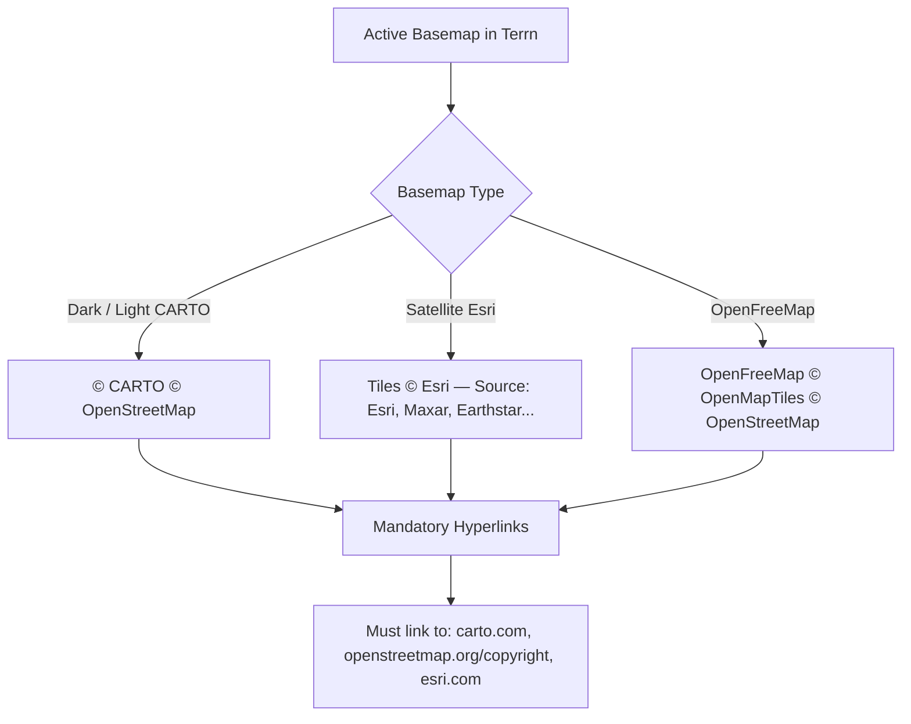

# Terrn: Basemap Attribution — Competitive Benchmark, Legal Compliance, and Sleek Implementation Design

**Document Version:** 2.0.0  
**Date:** 2026-09-18  
**Status:** Specification — verified against the codebase, ready to implement  
**Addresses:** `TODOS.md` Item `L13 — Map attribution is hidden`  
**Target Codebase:** [`/tern/tern_poc`](file:///tern/tern_poc)  

> **v2.0.0 revision note.** v1.0.0 was written against the codebase as described
> rather than as built. Its architectural choice (§5.1, native MapLibre control)
> survived verification intact and is unchanged. Its CSS (§5.2) and test plan
> (§6) did not, and have been rewritten. The competitive benchmark (§2) and the
> license analysis (§3) stand, with two corrections folded in. Everything below
> was checked against `maplibre-gl@5.24.0` in `node_modules`, the live
> stylesheets, and `index.html` — §9 lists each claim and how it was verified.

---

## 1. Executive Summary & Problem Statement

Terrn is a high-density, web-first geospatial analytics workspace. It pairs WebGL/Deck.gl data overlays with MapLibre GL raster and vector basemaps (primarily CARTO Dark Matter/Voyager, Esri World Imagery, and OpenFreeMap).

Currently, basemap attribution is explicitly disabled in [`src/core/canvas/base-map.ts`](file:///tern/tern_poc/src/core/canvas/base-map.ts#L65):
```typescript
attributionControl: false // Custom control adds sleek styling
```

This suppression leaves Terrn in violation of third-party licensing agreements, flagged as technical debt in [`TODOS.md`](file:///tern/tern_poc/TODOS.md#L193):
> `- [ ] **L13 — Map attribution is hidden.** Carto/OSM/Esri licenses require visible attribution. Enable MapLibre's compact attribution control. *Compliance, and cheap.*`

### The Core Design Challenge
1. **Strict Legal Compliance:** OpenStreetMap (ODbL 1.0), CARTO, and Esri require visible attribution with active hyperlinks.
2. **Minimal Visual Clutter:** Standard map attribution controls default to high-contrast white boxes or long text strips that compete visually with thematic geospatial data, disrupt dark-mode aesthetics, and cover vital UI chrome.
3. **Complex Viewport Dynamics:** Terrn features dynamic surrounding panels (collapsible 300px Left Panel, collapsible 408px Right Panel + Rail, and a 320px bottom-docked Tabular Attribute Table). A static corner attribution control risks being completely obscured by docked panels.

This document establishes a competitive benchmark of modern mapping platforms, breaks down provider legal guidelines, and delivers an engineering-ready specification for Terrn.

---

## 2. Competitive Benchmark

To determine modern best practices, we examined how leading geospatial analysis tools, consumer mapping platforms, and outdoor apps balance compliance against UI elegance.

| Platform | Format / Mechanism | Visual Weight | Expandable / Interactive | Theme Adaptability | Benchmark Takeaway |
| :--- | :--- | :--- | :--- | :--- | :--- |
| **Felt** | Micro-pill in bottom corner | Extremely low; 10–11px typography, muted contrast | Expands on hover/click | Frosted glass adapts to dark & light modes | **Gold Standard GIS UX:** Seamlessly integrated, respects canvas, meets OSM requirements. |
| **Mapbox GL JS** | Compact `(i)` badge or inline pill | Low in compact mode (24×24px circle) | Collapses into an `(i)` icon by default on small viewports | Standard white pill; requires CSS overrides for dark UI | **Industry Standard Interaction:** Universally recognized `(i)` icon; vetted by OSM legal counsel. |
| **Kepler.gl (Unfolded)** | Semi-transparent bottom-right overlay | Low; subdued text opacity (0.5–0.7) | Collapsible info badge | Inherits Kepler dark/light themes | Designed for dense multi-layer analytics without occluding legends or filters. |
| **ArcGIS Online / StoryMaps** | Dynamic bottom attribution strip | Medium to high; long provider strings | Collapses into an expandable modal/drawer on mobile | Standard neutral grey strip | Automatically aggregates dynamic source lists for satellite imagery. |
| **Google Maps** | Pinned micro-text beside scale bar | Very low; 10px `#5f6368` inline text, no background box | Static inline links | Light/dark mode styling | Flat, unboxed, minimal DOM presence. |
| **Apple Maps (MapKit JS)** | Single `Legal` link in bottom corner | Minimal (single 5-letter word) | Clicking triggers a native legal modal sheet | Minimalist monochrome | Ultra-clean, but requires custom proprietary licensing agreements not available under pure OSM ODbL. |
| **Strava / AllTrails** | Corner text with faint drop shadow | Very low; text-shadow over satellite/streets | Static inline text | Semi-transparent white/black | Prevents vector tracks and POIs from being obscured. |

### Key Benchmark Takeaways
1. **The Collapsible Information Badge `(i)` is the web standard:** Pioneered by Mapbox and standardized in MapLibre GL JS, the compact `(i)` badge satisfies OSM ODbL compliance while reducing the permanent visual footprint from ~240px of text to a 24px circle.
   > **Correction (v2.0.0):** v1.0.0 assumed `compact: true` *delivers* that 24px circle on load. It does not — see §5.3. MapLibre boots the compact control **expanded** and collapses it only after the user first drags the map. Reaching the benchmark's target state takes one extra line, which §5.3 specifies.
2. **Micro-typography is mandatory:** Basemap attribution is legal metadata, not primary UI. Typography should be sized at 10–11px with muted color tokens (`var(--text-secondary)`), transitioning to brighter contrast only on hover or focus.
3. **Low contrast, not blur.** v1.0.0's second takeaway called for frosted glass (`backdrop-filter: blur(12px)`). That is the right instinct for platforms whose surfaces are translucent; it is inert in Terrn. `--surface` resolves to `#0A1628` (dark) and `#F3F6FB` (light) — **fully opaque in both themes**, so `backdrop-filter` has nothing to blur and composites to nothing. `.map-tool-group` (`utilities.css:224`) already carries a dead `blur(12px)` for the same reason. Terrn gets its recessive quality from muted tokens and a hairline `1px solid var(--border)`, not from translucency. The word "frosted" is struck from this document.

---

## 3. Legal & License Compliance Analysis

Terrn centralizes its tile providers in [`src/services/basemap-providers.ts`](file:///tern/tern_poc/src/services/basemap-providers.ts). Each provider imposes specific contractual and copyright requirements:



### 3.1 CARTO (Default `dark` and `light` Basemaps)
* **Contractual Requirement:** CARTO's basemap terms mandate:
  `© <a href="https://carto.com/">CARTO</a> © <a href="https://openstreetmap.org/copyright">OpenStreetMap</a> contributors`
* **Visibility:** Must be visible on the map interface. Hiding it entirely breaches terms and risks token revocation.
* **Hyperlink Obligation:** CARTO and OpenStreetMap must be clickable links leading to their respective home/copyright pages.

### 3.2 OpenStreetMap (ODbL 1.0 & OSMF Guidelines)
* **Wording:** Must state `"© OpenStreetMap contributors"` (or `"© OpenStreetMap"` in space-constrained layouts).
* **Link Requirement:** Must link directly to `https://www.openstreetmap.org/copyright`.
* **Collapsibility & Compact Controls:** The OpenStreetMap Foundation (OSMF) Attribution Guidelines explicitly state:
  > *"For interactive digital maps or small-screen devices, an expandable control (such as an 'i' information icon) is acceptable, provided the icon is clearly visible and expanding it displays the full credit and link."*
  This confirms that MapLibre's `compact: true` mode is 100% compliant.

### 3.3 Esri World Imagery (`satellite` Basemap)
* **Wording:** 
  `Tiles © Esri — Source: Esri, i-cubed, USDA, USGS, AEX, GeoEye, Getmapping, Aerogrid, IGN, IGP, UPR-EGP, and the GIS User Community`
* **Handling Length:** Esri's imagery string is extensive. When expanded, it must wrap gracefully or scroll horizontally without overflowing the viewport.

### 3.4 OpenFreeMap (`openfreemap` Alternative)
* **Wording:**
  `<a href="https://openfreemap.org">OpenFreeMap</a> © <a href="https://openmaptiles.org">OpenMapTiles</a> © <a href="https://openstreetmap.org/copyright">OpenStreetMap</a>`
* **Terms:** CC-BY for OpenMapTiles and ODbL for OSM.

### 3.5 A second, separate defect: the OSM links already point to the wrong page

v1.0.0 states the `/copyright` requirement in §3.2 and then does not check whether
Terrn meets it. It does not. The attribution strings that ship today
(`basemap-providers.ts:45–50`) link OSM to its **home page**:

```typescript
const CARTO_ATTRIBUTION =
  '© <a href="https://carto.com/">CARTO</a> © <a href="https://openstreetmap.org">OpenStreetMap</a>';
const OFM_ATTRIBUTION =
  '<a href="https://openfreemap.org">OpenFreeMap</a> © <a href="https://openmaptiles.org">OpenMapTiles</a> © <a href="https://openstreetmap.org">OpenStreetMap</a>';
```

So `L13` is two defects wearing one label:

| | Defect | Fix |
|---|---|---|
| **L13a** | Attribution is rendered nowhere — `attributionControl: false` | §5 |
| **L13b** | The OSM link, once rendered, points at `openstreetmap.org` instead of `openstreetmap.org/copyright` | Two string literals |

L13b matters *because* we are fixing L13a. Today the wrong link is invisible and
harms nobody. The moment §5 lands, Terrn begins publishing a non-conforming
credit — strictly worse than publishing none, because it is now an assertion of
compliance that is wrong. **The two must land together.** The OSMF guidance is
specific that the link is to the copyright page, not the project.

Both strings should also gain `© OpenStreetMap contributors` — §3.2's preferred
wording. The current strings drop "contributors", which OSMF permits only where
space is genuinely constrained. An expandable pill is not space-constrained.

### What Constitutes "Overstating" vs "Understating"
* **Overstated (Anti-Pattern):** A permanent, high-contrast, multi-line banner stretching across the bottom of the map that overlaps analytics controls or table headers.
* **Understated (Non-Compliant Anti-Pattern):** Setting `attributionControl: false`, hiding attribution inside a nested Settings modal, or using unclickable plaintext.
* **The Sweet Spot (Terrn Target):** A 24px circular `(i)` button that sits in the bottom corner of the active canvas, matching Terrn's design tokens. When clicked or focused, it unfolds into a slim pill with accessible links. 24px, not 22px: it is both MapLibre's own button size and Terrn's icon grid (`docs/design/icons-and-buttons.md`), so the two agree for free.

---

## 4. Terrn Viewport Layout & Collision Analysis

Unlike static map applications, Terrn has dynamic chrome that shifts during analytical workflows:

```
┌────────────────────────────────────────────────────────────────────────┐
│ Topbar (44px)                                                          │
├──────────────┬──────────────────────────────────────────┬──────────────┤
│              │                                          │ [Rail: 48px] │
│ Left Panel   │             Active Canvas Area           │ Right Panel  │
│ (300px)      │                                          │ (360px)      │
│              │                                          │              │
│              │                                    [Tools]              │
│              ├──────────────────────────────────────────┤              │
│              │ Tabular Attribute Table                  │              │
│              │ (320px open / 40px minimized / 0px closed)│              │
│              │ [Attribution must dock cleanly above!]   │              │
└──────────────┴──────────────────────────────────────────┴──────────────┘
```

### Collision Risks:
1. **Right Panel & Rail Collision:**
   - The Right Panel has three states: Fully Open (`360px + 48px rail = 408px`), Collapsed (`48px rail visible`), or Hidden (`0px`).
   - If attribution is fixed at `right: 8px`, it is trapped behind the collapsed 48px rail.
2. **Bottom Tabular Panel Collision:**
   - The attribute table ([`grid.css`](file:///tern/tern_poc/src/features/tabular/components/grid.css)) docks to the bottom viewport edge with `z-index: 85`.
   - Open height: `320px`. Minimized height: `40px`.
   - If attribution is fixed at `bottom: 8px`, it is completely covered whenever a user opens the table.

3. **The stacking-context trap (missed by v1.0.0, and the most consequential fact in this document).**
   `#map` is declared in [`reset.css:27`](file:///tern/tern_poc/src/core/styles/reset.css#L27) as:
   ```css
   #map { position: fixed; inset: 0; width: 100%; height: 100%; z-index: 1; }
   ```
   `position: fixed` with a numeric `z-index` **creates a stacking context.**
   MapLibre mounts its controls inside that container, and `maplibre-gl.css`
   gives `.maplibregl-ctrl-bottom-right` `z-index: 2` — which is 2 *within
   `#map`'s context*, i.e. pinned to layer 1 of the document. Terrn's chrome
   lives outside `#map`: `.map-tools` at 80, `.tabular-panel` at 85, topbar at 100.

   **A natively-mounted attribution control therefore cannot be raised above any
   panel by any z-index.** v1.0.0's `z-index: 80` is inert, and its
   `position: fixed !important` is redundant (an `absolute` child of a
   full-viewport `fixed` parent is already viewport-positioned).

   The consequence is not cosmetic. For `.map-tools`, a docking miss means a
   button renders on top of a panel — ugly, and instantly obvious. For
   attribution, a docking miss means the credit is painted *underneath* an opaque
   panel and **silently disappears** — which is precisely the compliance failure
   L13 exists to fix, reintroduced in a form no one will notice. Docking accuracy
   is load-bearing for legality here, not for polish.

   This is why §6's browser guard is a **hit test** (`elementFromPoint`) rather
   than v1.0.0's assertion on computed `bottom`/`right` values. A computed-offset
   check confirms the CSS we wrote is the CSS that applied; it cannot tell us
   whether a human can see the thing.

### Solution: Dynamic Layout-Aware Docking
The attribution container must participate in Terrn's layout transitions, using CSS transitions identical to `.map-tools` ([`utilities.css#L213`](file:///tern/tern_poc/src/core/styles/utilities.css#L213)):
- `transition: right 0.28s cubic-bezier(0.16, 1, 0.3, 1), bottom 0.28s cubic-bezier(0.16, 1, 0.3, 1)`

…and it must be added to the `prefers-reduced-motion: reduce` block at
[`utilities.css:433`](file:///tern/tern_poc/src/core/styles/utilities.css#L433),
which enumerates every non-component piece of chrome that transitions.

---

## 5. Architectural Specification

### 5.1 Technology Choice: Native MapLibre Compact Attribution — **confirmed**

Instead of constructing a bespoke DOM component and manually syncing basemap change events, Terrn will leverage MapLibre's built-in `maplibregl.AttributionControl({ compact: true })`.

This was v1.0.0's call and it survives verification. The evidence is stronger than
v1.0.0 claimed, because the work is already done:

1. **The attribution data already exists.** `basemap-providers.ts` stamps an
   `attribution` string onto every source it authors — lines 132, 139, 166, 177,
   185. Nothing needs to be written, wired or passed in. Switching the control on
   makes strings that are already in the style object visible.
2. **Automatic lifecycle synchronization is real.** `AttributionControl.onAdd()`
   subscribes to `styledata`, `sourcedata` and `terrain`. `setBasemap()` calls
   `map.setStyle()`, which fires `styledata`; the control re-reads and re-renders.
   Controls are attached to the map, not the style, so they survive `setStyle`
   without re-registration.
3. **Deduplication is handled.** CARTO declares two sources (base + labels)
   carrying an identical string. `_updateAttributions()` drops exact duplicates,
   then sorts by length and drops any entry that is a substring of another. One
   pill, no repetition — including across a raster/label pair.
4. **Zero bundle overhead.** `maplibre-gl` is already imported, and
   `maplibre-gl/dist/maplibre-gl.css` is already imported at `base-map.ts:9`, so
   the classes we override are already in the bundle either way.
5. **Accessibility is built in.** `_setElementTitle()` sets both `title` and
   `aria-label` from MapLibre's i18n table (`AttributionControl.ToggleAttribution`).

The alternative — a custom control fed by `getBasemapAttribution()` — was
reconsidered in light of §4's stacking-context finding, which is the one real
argument for it (a custom element could live outside `#map` and above the panels).
It was rejected: the native control's synchronization is the legally load-bearing
part, and hand-maintaining "which sources are live right now" is exactly the code
that rots into non-compliance. The stacking constraint is instead answered by a
test that can actually detect occlusion (§6.3).

**Consequence:** `getBasemapAttribution()` (`basemap-providers.ts:226`) is the
vestige of the custom control that never shipped. It is exported and called from
nowhere. Choosing the native control means deleting it, not leaving it.

---

### 5.2 Three MapLibre facts that determine the CSS

v1.0.0's stylesheet was written against an imagined DOM. The real one, from
`maplibre-gl@5.24.0`:

**Fact 1 — it is a `<details>`/`<summary>`, not a div and a button.**
```
<details class="maplibregl-ctrl maplibregl-ctrl-attrib maplibregl-compact maplibregl-compact-show">
  <summary class="maplibregl-ctrl-attrib-button"></summary>
  <div class="maplibregl-ctrl-attrib-inner">© CARTO © OpenStreetMap contributors</div>
</details>
```
MapLibre already suppresses the disclosure triangle
(`summary.maplibregl-ctrl-attrib-button { appearance: none; list-style: none }`
plus a `::-webkit-details-marker` rule), so that needs no handling from us.

**Fact 2 — the `(i)` is an absolutely-positioned 24×24 square with an SVG
background-image**, sitting in a padding gutter its parent reserves:
```css
.maplibregl-ctrl-attrib-button        { position:absolute; right:0; top:0; width:24px; height:24px;
                                        border-radius:12px; background-image:url("…circle-i…"); }
.maplibregl-ctrl-attrib.maplibregl-compact { padding: 2px 24px 2px 0; }   /* ← the gutter */
```
v1.0.0's `padding: 3px 8px !important` **destroys that gutter**, so the icon
would overlap the credit text whenever the pill is expanded. Any padding
override must keep ≥24px on the right.

The background SVG has no `fill` attribute, so it renders **black** — invisible
on `#0A1628`. It must be recolored, and a `background-image` cannot be. The fix
is `mask-image` + `background-color: var(--text-secondary)`, which recolors
MapLibre's own glyph in both themes. This is deliberately *not* v1.0.0's
`::before { content: "i"; font-family: var(--mono) }`: a monospace letter is not
the circle-i the benchmark identified as the recognized standard, and it would
sit beside 33 Lucide icons drawn on a 24×24 grid at stroke 2. It is also not
Terrn's own `info` icon (`icons.ts:204`), because duplicating that path into CSS
would put a second copy of a registry glyph outside the registry — the exact
drift `icons.spec.ts` exists to prevent. Masking the vendor's own asset adds no
icon to Terrn's vocabulary at all.

**Fact 3 — margins and pointer-events live on the child, not the container.**
```css
.maplibregl-ctrl-bottom-left, .maplibregl-ctrl-bottom-right, … { pointer-events:none; position:absolute; z-index:2 }
.maplibregl-ctrl                                    { pointer-events:auto; transform:translate(0); clear:both }
.maplibregl-ctrl-bottom-right .maplibregl-ctrl      { float:right; margin:0 10px 10px 0 }
```
Two errors in v1.0.0 follow from this:
- `margin: 0 !important` is applied to `.maplibregl-ctrl-bottom-right`, but the
  10px margin is on the `.maplibregl-ctrl` **child**. It survives, so every
  offset v1.0.0 computes is 10px off.
- `pointer-events: auto` is applied to the container, undoing a deliberate
  MapLibre design: `none` on the container and `auto` on the control means the
  empty corner region does not swallow map drags. Restoring `auto` there gives
  the invisible container a hit area over the canvas. Leave it alone.

There is also a hardcoded vendor focus ring to override — and it is on `:focus`,
not `:focus-visible`:
```css
.maplibregl-ctrl-attrib-button:focus { box-shadow: 0 0 2px 2px #0096ff }
```
v1.0.0 styles only `:focus-visible`, so a mouse click would leave MapLibre's blue
ring visible next to Terrn's `--focus-ring-inset`.

---

### 5.3 The boot-state problem: `compact: true` does not start compact

This is the single behavioral fact that changes what ships. From
`attribution_control.ts`:

```typescript
_updateCompact = () => {
    if (this._map.getCanvasContainer().offsetWidth <= 640 || this._compact) {
        if (this._compact === false) { … }
        else if (!this._container.classList.contains('maplibregl-compact') && …) {
            this._container.setAttribute('open', '');
            this._container.classList.add('maplibregl-compact', 'maplibregl-compact-show');
        }                                          //  ↑ both classes
    } …
};

_updateCompactMinimize = () => {                   // bound to the map's `drag` event
    if (this._container.classList.contains('maplibregl-compact')) {
        this._container.classList.remove('maplibregl-compact-show');
    }
};
```

`maplibregl-compact-show` is the **expanded** state
(`.maplibregl-compact-show .maplibregl-ctrl-attrib-inner { display: block }`).
So a control constructed with `compact: true` renders with the **full credit
string visible**, and collapses to the `(i)` only after the user first drags the
map.

Two claims in v1.0.0 are wrong as a result: the benchmark's "reduce the permanent
footprint to a circle" (§2) describes a state the app never boots into, and
§6.2's "verify the button is visible on boot" would assert the opposite of what
happens. On the satellite basemap the boot state is the ~200-character Esri
string stretched across the bottom-right corner — the "overstated anti-pattern"
§3 defines, shipped by default.

**Resolution.** Collapse once on `load`, via the public container:

```typescript
mapInstance.on('load', () => {
  mapInstance!.getContainer()
    .querySelector('.maplibregl-ctrl-attrib')
    ?.classList.remove('maplibregl-compact-show');
});
```

This reads MapLibre's own class off our own DOM rather than touching the
control's private `_container`, so a MapLibre upgrade that renames the class
degrades to "boots expanded" — the compliant state — instead of throwing.

This is a deliberate deviation from MapLibre's default, and it is compliant:
OSMF's guidelines permit an expandable `(i)` provided the icon is clearly visible
and expanding it shows the full credit and link (§3.2). It is also what every
platform in §2's benchmark does.

---

### 5.4 Docking: `:has()`, corrected

v1.0.0's approach is sound and my first review was wrong to call it unprecedented
— `consent-banner.css:31` already uses `body:has(#left-panel:not(.collapsed))`
for exactly this problem, with a comment noting that `<768px` is blocked so
`:has()` support is safe to assume. Every Lit host in Terrn returns `this` from
`createRenderRoot()`, so all panel state is in the light DOM and reachable.

The JS mirror-class alternative (`.map-tools` gets `right-collapsed` /
`tabular-open` toggled by `right-panel-controller.ts` and
`attribute-table-element.ts`) is *not* available here anyway: those controllers
write to `.map-tools`, a sibling of `#map`, and CSS cannot select a sibling's
descendant. Using it would mean editing both controllers to also target the
MapLibre container. `:has()` keeps the change to one stylesheet.

What v1.0.0 got wrong is the selectors. The real DOM:

| Element | Markup | States |
|---|---|---|
| Right panel | `<aside class="right-panel collapsed panel-hidden" id="right-panel">` | `.panel-hidden` → `display:none` (0px); `.collapsed` → rail only (48px); neither → 408px |
| Table | `<terrn-attribute-table id="tabular-panel" class="tabular-panel collapsed">` | `.collapsed` → 0px; `.minimized` → 40px; neither → 320px |

Both boot in their *hidden* state, and both are always present in the DOM — so
absence-of-element is never the signal; the class is. Corrected rules:

```css
/* ============================================================
   MAP ATTRIBUTION — brand styling and layout-aware docking
   Overrides maplibre-gl.css. Selector specificity is matched to
   the vendor rule being replaced so `!important` stays rare;
   where the vendor ships `!important`-free 0,2,0 selectors we
   match 0,2,0 rather than escalating.
   ============================================================ */

/* Docking. Base case is the boot state: right panel hidden, table closed.
   `position`/`z-index` are deliberately NOT set — see §4 risk 3; the control
   is confined to #map's stacking context and cannot be lifted out of it. */
.maplibregl-ctrl-bottom-right {
  right: 0;
  bottom: 0;
  transition: right 0.28s cubic-bezier(0.16, 1, 0.3, 1),
              bottom 0.28s cubic-bezier(0.16, 1, 0.3, 1);
}

/* The 10px vendor margin lives on the child and is what actually spaces the
   pill off the corner. Normalize it to Terrn's 12px rhythm here, once, so the
   docking offsets above can be read as pure panel widths. */
.maplibregl-ctrl-bottom-right .maplibregl-ctrl {
  margin: 0 12px 12px 0;
}

/* Right panel: rail only */
body:has(#right-panel.collapsed:not(.panel-hidden)) .maplibregl-ctrl-bottom-right {
  right: var(--right-rail-w);
}
/* Right panel: fully open (rail + pane) */
body:has(#right-panel:not(.collapsed):not(.panel-hidden)) .maplibregl-ctrl-bottom-right {
  right: calc(var(--right-rail-w) + var(--right-panel-w));
}

/* Table: minimized (40px tab) / open (320px) */
body:has(#tabular-panel.minimized) .maplibregl-ctrl-bottom-right {
  bottom: 40px;
}
body:has(#tabular-panel:not(.collapsed):not(.minimized)) .maplibregl-ctrl-bottom-right {
  bottom: 320px;
}

/* ── The pill ──────────────────────────────────────────────── */
/* 0,2,0 matches the vendor's `.maplibregl-ctrl.maplibregl-ctrl-attrib`. */
.maplibregl-ctrl.maplibregl-ctrl-attrib {
  background: var(--surface);
  border: 1px solid var(--border);
  border-radius: var(--radius-pill);
  color: var(--text-secondary);
  font-family: var(--sans);
  font-size: 11px;
  line-height: 16px;
}

/* Expanded: keep MapLibre's 24px right gutter for the absolutely-positioned
   summary (§5.2 Fact 2). Only the left and vertical padding are ours. */
.maplibregl-ctrl-attrib.maplibregl-compact-show {
  padding: 3px 24px 3px 10px;
}

/* Collapsed: the pill shrinks to the button, so the border would draw a second
   ring around it. */
.maplibregl-ctrl-attrib.maplibregl-compact:not(.maplibregl-compact-show) {
  border-color: transparent;
  background: transparent;
  padding: 0;
}

/* ── The (i) button ────────────────────────────────────────── */
/* Recolor the vendor glyph by masking it. No new icon enters the registry. */
.maplibregl-ctrl-attrib-button {
  width: 24px;
  height: 24px;
  background-color: var(--text-secondary);
  background-image: none;
  -webkit-mask-image: var(--attrib-info-mask);
  mask-image: var(--attrib-info-mask);
  -webkit-mask-size: 24px 24px;
  mask-size: 24px 24px;
  cursor: pointer;
}

.maplibregl-ctrl-attrib-button:hover {
  background-color: var(--text-primary);
}

/* The vendor ships a hardcoded blue ring on :focus, not :focus-visible. */
.maplibregl-ctrl-attrib-button:focus {
  box-shadow: none;
  outline: none;
}
.maplibregl-ctrl-attrib-button:focus-visible {
  box-shadow: var(--focus-ring);
}

/* Vendor tints the button grey while expanded; we handle that with the mask. */
.maplibregl-ctrl-attrib.maplibregl-compact-show .maplibregl-ctrl-attrib-button {
  background-color: var(--text-secondary);
}

/* ── Links ─────────────────────────────────────────────────── */
.maplibregl-ctrl-attrib a {
  color: var(--text-secondary);
  text-decoration: none;
  transition: color 0.15s ease;
}
.maplibregl-ctrl-attrib a:hover,
.maplibregl-ctrl-attrib a:focus-visible {
  color: var(--arc-blue);
  text-decoration: underline;
}
```

Two notes on this stylesheet:

- **No `box-shadow` on the pill.** v1.0.0 specified
  `box-shadow: 0 4px 12px rgba(0, 0, 0, 0.25)`, which fails
  `no-hardcoded-colors.spec.ts` — that test permits colour literals only in
  `variables.css` and keeps `ALLOWLIST` deliberately empty. There is also no
  shadow token to substitute: no floating chrome in `utilities.css` casts a
  drop shadow, so introducing one here would make attribution the heaviest
  element on the canvas, inverting the whole design goal.
- **`--attrib-info-mask` is a new token** in `variables.css`, holding MapLibre's
  circle-i as a percent-encoded `data:` URI. It carries no colour (the mask
  discards channels other than alpha), so it does not trip the colour guard.
  It belongs in `variables.css` because that is the only file the guard exempts
  and the only place a shared literal is legible.

The Esri string is long enough to wrap. `--right-panel-w` is 360px, so the
narrowest canvas is ~1280 − 300 − 408 = 572px; the pill is `float: right` inside
a full-width container and wraps naturally. No `white-space` or scroll handling
is needed, contrary to §3.3's concern — but §6.3 asserts it rather than assuming.

---

## 6. Verification and Quality Assurance Plan

### 6.1 What is already covered

`basemap-providers.spec.ts:265` (`describe('attribution')`) already asserts that
every CARTO source names CARTO and OpenStreetMap, and every Esri source names
Esri. v1.0.0's §6.1 proposes writing this test. It exists. Extending it is still
worthwhile; duplicating it is not.

### 6.2 Unit — `basemap-providers.spec.ts`

Extend the existing `attribution` block:

- **Every OSM link points at `/copyright`.** This is the L13b guard (§3.5). Assert
  that no attribution string contains an `openstreetmap.org` href lacking
  `/copyright`. Written as an assertion on the *absence of the wrong link*, not
  the presence of the right one, so adding a fourth provider with a bare OSM link
  fails too.
- **Every attribution link is `https://`.** Cheap, and the only part of v1.0.0's
  §6.1 that was genuinely missing.
- **OpenFreeMap is covered.** The existing block tests CARTO and Esri only.

### 6.3 Unit — `base-map.spec.ts`

**A trap to disarm first.** `base-map.spec.ts` mocks `maplibre-gl` with a
`default` export exposing only `Map`. Adding
`new maplibregl.AttributionControl(…)` to `initializeMap()` makes that
`new undefined()`, which throws, which `initializeMap`'s own `try/catch` swallows
into its fallback mock — at which point **every existing assertion in that file
passes vacuously against a stub**. The file's header comment already documents
this exact failure mode from a previous incident. The mock must gain
`AttributionControl` in the same commit, or the suite goes quietly green and
blind.

New assertions:
- `AttributionControl` is constructed with `{ compact: true }` and passed to
  `addControl` with position `'bottom-right'`.
- `attributionControl: false` remains in the `Map` options (the control is
  registered explicitly, not doubled).

### 6.4 E2E — `e2e/attribution.spec.ts`

Needs a real browser: computed CSS, `:has()` evaluation, WebGL, and the vendor
stylesheet. Per CLAUDE.md's split rule this is `e2e`, not jsdom.

1. **Boots collapsed.** `.maplibregl-ctrl-attrib` has class `maplibregl-compact`
   and **not** `maplibregl-compact-show` — the §5.3 behavior, asserted because it
   is a deliberate override of vendor default that a MapLibre upgrade could undo.
2. **Expands on click,** and the inner container then has non-zero height and at
   least two `<a href>` children.
3. **Not occluded — the hit test.** For each of the four docking states (table
   closed/minimized/open × right panel hidden/collapsed/open, sampled at the
   extremes), take the button's bounding box centre and assert
   `document.elementFromPoint(x, y)` resolves to the button or a descendant.
   This is the guard §4 risk 3 demands: it fails when the control is painted
   under a panel, which a computed-`bottom` assertion cannot detect.
4. **Links are real.** The OSM anchor's `href` ends in `/copyright`. Asserted in
   the browser as well as in unit, because this is the one claim the licence
   actually turns on and unit tests only see the source string, not what rendered.
5. **Survives a basemap switch.** Click `#btn-basemap-satellite`; the pill's text
   changes to name Esri and no longer names CARTO. This is the §5.1 auto-sync
   claim — the entire justification for choosing the native control — under test.
6. **Contrast.** Sample computed colour against the pill background in both
   themes; assert ≥ 4.5:1.

Test 5 is the highest-value test in this plan. It is the one that fails if a
future MapLibre upgrade changes the `styledata` contract, and the one that would
otherwise rot into silent non-compliance on the satellite basemap.

### 6.5 Documentation

- Mark `L13` complete in [`TODOS.md`](file:///tern/tern_poc/TODOS.md#L193).
- If the docking rules need a home beyond their own comment,
  `docs/decisions/basemap-provider.md` already owns basemap-vendor reasoning.
  v1.0.0's "run `graphify update .`" is dropped: it is not a project command,
  and CLAUDE.md forbids invoking skills unprompted.

---

## 7. Implementation Plan

Six commits. The ordering is not arbitrary: **C1 must precede C2**, because C2
makes the credit visible and C1 makes it correct — landing them the other way
round publishes a non-conforming attribution, however briefly (§3.5).

Gate for each: `npm run lint && npm run test:all && npm run build`, clean.

| # | Commit | Files | Why separate |
|---|---|---|---|
| **C1** | `fix(basemap): link OSM attribution to the copyright page` | `basemap-providers.ts`, `basemap-providers.spec.ts` | The L13b defect. Independently correct, independently revertable, and a bug fix — so it starts with the failing test (CLAUDE.md). |
| **C2** | `feat(basemap): register MapLibre's compact attribution control` | `base-map.ts`, `base-map.spec.ts` | The functional fix. Unstyled but compliant after this commit — a safe stopping point if the styling work stalls. Includes the §6.3 mock repair. |
| **C3** | `feat(basemap): collapse attribution to the (i) badge on load` | `base-map.ts`, `e2e/attribution.spec.ts` | The §5.3 deviation from vendor default. Separate because it is the one behavioral judgement call in the set, and the one most likely to be questioned or reverted on its own. |
| **C4** | `style(basemap): brand the attribution pill` | `variables.css` (mask token), `utilities.css` | Pure presentation. No behavior, no test impact beyond contrast. |
| **C5** | `style(basemap): dock attribution clear of the panels` | `utilities.css`, `e2e/attribution.spec.ts` | The §5.4 `:has()` rules plus the hit test. Separate from C4 because this is the part that carries compliance risk (§4 risk 3) and deserves its own review attention. |
| **C6** | `chore(basemap): drop the unused getBasemapAttribution helper` | `basemap-providers.ts` | Dead-code removal that only becomes safe once C2 settles the architecture. Trivially revertable if something turns out to want it. |

### Step detail

**C1 — the licence fix**
1. Add the failing assertion to `basemap-providers.spec.ts`'s `attribution`
   block: no attribution string may contain an `openstreetmap.org` href without
   `/copyright`. Run it; watch it fail.
2. Update `CARTO_ATTRIBUTION` and `OFM_ATTRIBUTION` (`basemap-providers.ts:45`,
   `:49`) — `/copyright`, and restore the word `contributors` (§3.5).
3. Add the `https://` assertion and OpenFreeMap coverage (§6.2).

**C2 — register the control**
1. Add `AttributionControl: vi.fn(function () { return {}; })` to the
   `vi.mock('maplibre-gl')` default export in `base-map.spec.ts` **first**, and
   add the two assertions from §6.3. Verify they fail before the source change,
   so the trap is proven disarmed rather than assumed.
2. In `initializeMap()`, after the `MapboxOverlay` registration, add the control
   at `'bottom-right'`. Leave `attributionControl: false` in the `Map` options and
   replace its stale comment — it currently reads "Custom control adds sleek
   styling", describing a control that was never built.

**C3 — collapse on load**
1. Extend the existing `mapInstance.on('load', …)` handler (it already calls
   `updateDeckOverlay()`) with the `classList.remove` from §5.3.
2. Create `e2e/attribution.spec.ts` with tests 1, 2 and 5 from §6.4. Test 5
   belongs here rather than C2 because it needs a rendered pill to read text from.

**C4 — brand it**
1. Add `--attrib-info-mask` to `variables.css`, beside the other shared literals.
2. Add the pill, button and link rules from §5.4 to `utilities.css`, in a new
   section following `MAP TOOLS`.
3. Add test 6 (contrast) to the e2e spec.
4. Confirm `no-hardcoded-colors.spec.ts` and `design-system.spec.ts` still pass —
   these are the guards this commit is most likely to trip.

**C5 — dock it**
1. Add the `:has()` rules and the child-margin normalization from §5.4.
2. Add `.maplibregl-ctrl-bottom-right` to the `prefers-reduced-motion` list at
   `utilities.css:433`.
3. Add tests 3 and 4 (hit test, `/copyright` href) to the e2e spec.
4. Drive all four docking states by hand in the browser before trusting the test.
   The hit test proves visibility; only an eye proves the 0.28s transition lands
   in step with the panel rather than lagging or leading it.

**C6 — remove dead code**
1. Delete `getBasemapAttribution()` and, if it is now unreferenced, its
   `ESRI_ATTRIBUTION`/`OFM_ATTRIBUTION` re-export path. Typecheck via
   `npm run build`.

### Risks

| Risk | Signal | Mitigation |
|---|---|---|
| **Silent occlusion** (§4 risk 3) | None visible in-app; attribution simply absent | §6.4 test 3, the hit test. This is the risk the plan is shaped around. |
| **`base-map.spec.ts` goes vacuously green** (§6.3) | Suite passes, coverage unchanged, assertions meaningless | C2 step 1 requires proving the new assertions fail first. |
| **MapLibre upgrade renames a class** | `(i)` unstyled, or boots expanded | C3's implementation degrades to the compliant state. §6.4 tests 1 and 5 fail loudly. Note `maplibre-gl` is not version-pinned the way Lucide is. |
| **`:has()` selector drifts** when a panel class is renamed | Docking silently reverts to base case | §6.4 test 3 covers this: base case over an open table *is* an occlusion. |
| **Esri string wrapping** on a narrow canvas | Pill overflows or clips | §6.4 test 3 samples the satellite basemap; the bounding box is read after the switch. |

---

## 8. Conclusion

By registering MapLibre's native attribution control, collapsing it to the `(i)`
badge on load, styling it with Terrn's tokens and docking it around the panels,
Terrn achieves:

* **Full legal compliance** with CARTO, Esri, OpenMapTiles and OSM ODbL terms —
  including the `/copyright` link, which today is wrong in the source strings and
  would have shipped wrong (§3.5).
* **Understated presence** that preserves screen real estate: a 24px badge, not a
  200-character strip, and not — as the unmodified vendor default would give us —
  the Esri credit stretched across the corner on every boot (§5.3).
* **Layout-aware docking** verified by occlusion testing rather than by computed
  offsets, because inside `#map`'s stacking context a docking miss does not look
  wrong, it looks like nothing at all (§4).

---

## 9. Verification Log

Every claim in this revision, and how it was checked. Dated per CLAUDE.md's rule
on describing current state.

**Verified 2026-09-18 against `maplibre-gl@5.24.0`, working tree at `d949b48`.**

| Claim | Source |
|---|---|
| Attribution disabled | `src/core/canvas/base-map.ts:65` |
| Every authored source carries an `attribution` | `basemap-providers.ts:132, 139, 166, 177, 185` |
| OSM links omit `/copyright` | `basemap-providers.ts:46, 50` |
| `getBasemapAttribution` is unreferenced | `grep -rn getBasemapAttribution src/ e2e/` → declaration only |
| `compact: true` boots expanded | `node_modules/maplibre-gl/src/ui/control/attribution_control.ts`, `_updateCompact` / `_updateCompactMinimize` |
| Control is `<details>`/`<summary>` | ibid., `onAdd()` |
| Dedupe by exact match then substring | ibid., `_updateAttributions()` |
| Re-reads on `styledata` / `sourcedata` | ibid., `onAdd()` event bindings |
| `{compact:true}` suppresses the MapLibre self-credit | ibid. — the constructor default is an object, so passing one replaces `customAttribution` wholesale |
| 24px button, 24px padding gutter, black SVG, `#0096ff` focus ring, vendor margin on the child, `pointer-events` split | `node_modules/maplibre-gl/dist/maplibre-gl.css` |
| `#map` creates a stacking context at `z-index: 1`; controls are `z-index: 2` within it | `src/core/styles/reset.css:27` + vendor CSS |
| App chrome sits above it | `utilities.css` z-indices 80/90/100; `grid.css:10` (85) |
| `--surface` is opaque in both themes | `variables.css:35, 112, 133` |
| No shadow token exists | `grep -n shadow src/core/styles/variables.css` → focus rings only |
| Colour literals fail outside `variables.css`, empty allowlist | `no-hardcoded-colors.spec.ts:7–9` |
| `:has()` is established | `src/features/settings/components/consent-banner.css:31` |
| All Lit hosts are light DOM | `grep -rn createRenderRoot src/` — every hit returns `this` |
| Panel markup and boot classes | `index.html:171` (`right-panel collapsed panel-hidden`), `index.html:347` (`tabular-panel collapsed`) |
| Panel geometry 0/48/408 and 0/40/320 | `variables.css:73–74`; `grid.css:4–40, 495` |
| `.map-tools` mirror classes are written to a sibling of `#map` | `right-panel-controller.ts:45, 66, 86`; `attribute-table-element.ts:205–301`; `index.html:16, 262` |
| Attribution coverage already exists | `basemap-providers.spec.ts:265` |
| `base-map.spec.ts` mocks only `Map` | `base-map.spec.ts:39–43`, and its own header comment on the vacuous-pass failure mode |
| Reduced-motion list enumerates non-component chrome | `utilities.css:433` |
| Icon registry has `info`; 24×24, stroke 2 | `src/shared/icons.ts:204`; `CLAUDE.md` |
