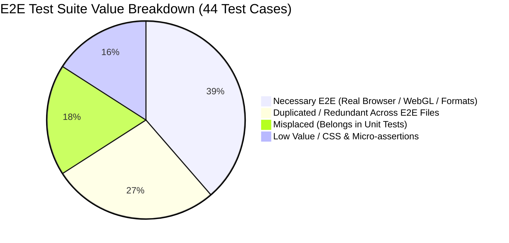

# Terrn E2E Test Suite Audit & Optimization Guide

**Date:** 2026-09-17  
**Scope:** GitHub Actions E2E test suite (`e2e/**/*.spec.ts`) in `terrn_poc`  
**Goal:** Diagnose the >4 minute CI runtime, identify redundant/ceremonial test cases, and formulate a consolidation strategy to reduce runtime to ~1.2–1.5 minutes without compromising regression safety.

---

## 1. Executive Summary & Root Cause Analysis

In GitHub Actions, the `E2E Tests` job takes **more than 4 minutes** to complete. Profiling the test suite reveals that this is not due to heavy application compute, but rather structural architectural overhead, sequential process execution, and redundant test cases.

```
Total GitHub E2E Job Time: ~4m 20s
├── Environment Setup (checkout, node, npm ci): ~40s
├── Puppeteer Chrome Download & Verification: ~30s
└── Vitest E2E Suite Execution: ~3m 10s
    ├── Sequential Chrome Browser Boots (11 files × ~4s): ~45s
    ├── App Boots & WebGL Inits (~28 page.goto() calls × ~5s): ~140s
    └── Actual Assertion Execution Time: ~25s
```

### The Three Root Causes

1. **Sequential Browser Spawning ([`fileParallelism: false`](file:///tern/tern_poc/vitest.config.ts#L35))**:
   Vitest runs all 11 test files strictly sequentially to prevent CPU contention on CI runners. However, each file defines its own `beforeAll` calling [`setupBrowser()`](file:///tern/tern_poc/e2e/helpers.ts#L23), booting a standalone headless Chrome process configured with software WebGL (`swiftshader` on 2 vCPUs). Chrome is launched and killed **11 separate times**.
2. **Excessive `beforeEach` Full-Page Navigations**:
   Specs like [`main-ingestion.spec.ts`](file:///tern/tern_poc/e2e/main-ingestion.spec.ts) and [`base-map-interleaving.spec.ts`](file:///tern/tern_poc/e2e/base-map-interleaving.spec.ts) use `beforeEach` to navigate to `baseUrl` before every single test case. Consequently, MapLibre WebGL initialization, DuckDB WASM bootstrap, Deck.gl overlay hooks, and Lit web components are torn down and re-initialized **over 28 times**.
3. **Coverage Padding & Unit-Testable Logic in E2E**:
   Several files spawn dedicated Chrome instances simply to inspect static CSS properties (e.g. border width, computed background color, hover transitions) or test state changes that have zero layout dependency and could run in a 5ms jsdom unit test.

---

## 2. Comprehensive Test-by-Test Audit

Below is the exhaustive classification of all **11 spec files** and their **44 test cases**.



---

### 2.1 [`e2e/light-mode.spec.ts`](file:///tern/tern_poc/e2e/light-mode.spec.ts) (2 Tests)
> **Recommendation: DELETE ENTIRE FILE**  
> **Estimated Savings: ~15s**

Spawns a dedicated Chrome process solely to check background colors without interacting with the UI.

| Test Case | Category | Analysis & Justification |
|---|---|---|
| `topbar background differs between dark and light themes` | **Zero Impact / Padding** | Manually invokes `document.documentElement.setAttribute('data-theme', 'light')` via `page.evaluate()` rather than exercising the UI toggle. [`theme-toggle.spec.ts`](file:///tern/tern_poc/e2e/theme-toggle.spec.ts) already verifies `--bg` tokens change, and [`theme.spec.ts`](file:///tern/tern_poc/src/features/theme/theme.spec.ts) verifies theme logic. |
| `left panel background differs between dark and light themes` | **Zero Impact / Padding** | Identical redundant CSS property check. |

---

### 2.2 [`e2e/copilot-chat.spec.ts`](file:///tern/tern_poc/e2e/copilot-chat.spec.ts) (1 Test)
> **Recommendation: DELETE ENTIRE FILE**  
> **Estimated Savings: ~20s**

Spawns a dedicated Chrome process to run a flow that is already duplicated verbatim in another test file.

| Test Case | Category | Analysis & Justification |
|---|---|---|
| `user message → typing indicator → assistant response flow` | **100% Duplicate** | This exact sequence (open copilot panel → select gemini → enter API key → wait for debounced validation → click connect → type message → verify `.ai-msg.user`) is executed verbatim in [`e2e/telemetry-egress.spec.ts` L295–L321](file:///tern/tern_poc/e2e/telemetry-egress.spec.ts#L295-L321). Furthermore, [`copilot-element.spec.ts`](file:///tern/tern_poc/src/features/ai/components/copilot-element.spec.ts) already covers component rendering and state transitions in unit tests. |

---

### 2.3 [`e2e/duckdb-cross-connection.spec.ts`](file:///tern/tern_poc/e2e/duckdb-cross-connection.spec.ts) (1 Test)
> **Recommendation: DELETE ENTIRE FILE (Or Move to Node/Worker Integration)**  
> **Estimated Savings: ~15s**

Spawns a dedicated Chrome browser but touches zero DOM elements or user interactions.

| Test Case | Category | Analysis & Justification |
|---|---|---|
| `a table registered on one call path is visible to a query on another` | **Misplaced E2E** | Uses `(window as any).__terrnDuckDB` to register features and run raw SQL `SELECT COUNT(*)`. It does not test UI, rendering, or user interactions. Real cross-connection behavior is verified end-to-end when [`main-ingestion.spec.ts`](file:///tern/tern_poc/e2e/main-ingestion.spec.ts) ingests a file and opens the tabular table (which queries DuckDB and renders table rows). |

---

### 2.4 [`e2e/layer-toolbar-state.spec.ts`](file:///tern/tern_poc/e2e/layer-toolbar-state.spec.ts) (4 Tests)
> **Recommendation: MOVE TO UNIT TEST (`src/features/layers/`)**  
> **Estimated Savings: ~25s**

Spawns Chrome to check whether three buttons have `disabled = true/false`.

| Test Case | Category | Analysis & Justification |
|---|---|---|
| `at BOOT with zero layers, the count-dependent actions are disabled` | **Misplaced Unit Test** | The test author explicitly notes in the header: *"The assertions themselves are layout-independent — this is about the disabled property tracking the layer count"*. This was placed in E2E solely because `syncLayerToolbarState` was an unexported closure in `main.ts`. Exporting this function allows it to run in jsdom in 5ms instead of 25s in Chrome. |
| `Upload stays enabled at zero — it is the one action that works` | **Misplaced Unit Test** | Simple `.disabled === false` check on `#btn-open-ingest`. |
| `ingesting a layer enables them` | **Misplaced Unit Test** | Ingests a file through Puppeteer just to check button disabled state changes. |
| `removing the last layer disables them again` | **Misplaced Unit Test** | Clicks delete, asserts buttons are disabled. |

---

### 2.5 [`e2e/icon-sizing.spec.ts`](file:///tern/tern_poc/e2e/icon-sizing.spec.ts) (3 Tests)
> **Recommendation: CONSOLIDATE INTO INGESTION OR MOVE TO STATIC LINT**  
> **Estimated Savings: ~25s**

Iterates over all SVG elements in the DOM to check dimensions.

| Test Case | Category | Analysis & Justification |
|---|---|---|
| `no visible SVG collapses to zero in the default view` | **Flawed / Redundant** | `beforeAll` [already ingested a GeoJSON file](file:///tern/tern_poc/e2e/icon-sizing.spec.ts#L39), so the view is already populated. It tests the exact same DOM as Test 2. |
| `no visible SVG collapses to zero with the layer panel populated` | **Consolidate** | Bounding box check on `.layer-drag-handle svg`. Can be an inline 2-line assertion in the main ingestion test. Icon contracts are already guarded by [`src/shared/icons.spec.ts`](file:///tern/tern_poc/src/shared/icons.spec.ts). |
| `icon sizes come from the token scale, not arbitrary values` | **Static / Unit Rule** | Token verification is already enforced at build/test time by [`design-system.spec.ts`](file:///tern/tern_poc/src/core/styles/design-system.spec.ts). |

---

### 2.6 [`e2e/tab-chrome.spec.ts`](file:///tern/tern_poc/e2e/tab-chrome.spec.ts) (3 Tests)
> **Recommendation: CONSOLIDATE / REMOVE**  
> **Estimated Savings: ~30s**

Ingests two complete spatial files (GeoJSON and Shapefile) just to measure CSS borders on attribute table tabs.

| Test Case | Category | Analysis & Justification |
|---|---|---|
| `an INACTIVE tab has a closed outline — top edge matches sides` | **Low Value / Pixel Check** | Written for bug FINDING-011. Ingesting two binary spatial files and waiting 30 seconds to inspect `cs.borderTopColor` is an excessive cost for a static CSS border rule. |
| `the ACTIVE tab carries the 2px electric rail` | **Low Value / Pixel Check** | Checks `cs.borderTopWidth === '2px'`. Belongs in a component CSS spec. |
| `activating a tab does not shift the strip — tab tops on one line` | **Low Value / Pixel Check** | Checks `Math.round(r.top * 10) / 10`. |

---

### 2.7 [`e2e/visibility-toggle-state.spec.ts`](file:///tern/tern_poc/e2e/visibility-toggle-state.spec.ts) (4 Tests)
> **Recommendation: CONSOLIDATE CRITICAL ASSERTION, DROP HOVER POLLING**  
> **Estimated Savings: ~30s**

Simulates mouse movements and polls for 150ms CSS transition completion.

| Test Case | Category | Analysis & Justification |
|---|---|---|
| `Layers — a visible layer's eye is arc-blue with NO wash` | **Consolidate** | Can be verified in [`base-map-interleaving.spec.ts`](file:///tern/tern_poc/e2e/base-map-interleaving.spec.ts#L60) during the layer visibility toggle test. |
| `Layers — that eye still washes on hover` | **Fragile / Flaky** | Moves pointer, triggers hover, polls for transition settling. Prone to timeouts under CI load. |
| `Legend — a visible layer's eye is arc-blue with NO wash` | **Duplicate** | Same check on the Legend tab. |
| `Legend — that eye still washes on hover` | **Duplicate / Fragile** | Hover transition check on Legend tab. |

---

### 2.8 [`e2e/theme-toggle.spec.ts`](file:///tern/tern_poc/e2e/theme-toggle.spec.ts) (5 Tests)
> **Recommendation: KEEP CORE INTEGRATION, REMOVE PADDED CHECKS**  
> **Target Runtime: ~20s**

| Test Case | Category | Analysis & Justification |
|---|---|---|
| `clicking toggle switches html[data-theme] from dark to light` | **Redundant** | Already 100% tested in [`src/features/theme/theme.spec.ts`](file:///tern/tern_poc/src/features/theme/theme.spec.ts#L57-L63). |
| `theme persists across reload via localStorage` | **Necessary E2E** | **Keep**: Verifies that the inline `<script>` in `index.html` executes before paint and restores theme from `localStorage`. |
| `--bg CSS token changes between dark and light` | **Redundant** | Padded assertion; covered by theme toggle and basemap switch. |
| `basemap selector matches actually-loaded style on light-mode boot` | **Necessary E2E** | **Keep**: Guards against regression where light-mode OS booted with dark MapLibre tiles. |
| `toggling theme to dark actually switches loaded basemap tiles` | **Necessary E2E** | **Keep**: Verifies MapLibre style reload and tile source swap (`light-base-tiles` → `dark-base-tiles`). |

---

### 2.9 [`e2e/main-ingestion.spec.ts`](file:///tern/tern_poc/e2e/main-ingestion.spec.ts) (7 Tests)
> **Recommendation: STREAMLINE & ELIMINATE `beforeEach` RELOADS**  
> **Current Runtime: ~55s → Target Runtime: ~20s**

| Test Case | Category | Analysis & Justification |
|---|---|---|
| `should render left and right panels on load` | **Trivial Presence** | Subsumed by all subsequent tests. |
| `should render a canvas (MapLibre basemap)` | **Duplicate** | Exact duplicate of Test 1 in [`base-map-interleaving.spec.ts`](file:///tern/tern_poc/e2e/base-map-interleaving.spec.ts#L32). |
| `should ingest a GeoJSON file via the ingest modal` | **Necessary E2E** | **Keep**: Core end-to-end ingestion flow. |
| `should populate the tabular grid after ingestion` | **Necessary E2E** | **Keep**: High-value integration (DuckDB WASM + Arrow + Table DOM), but should be chained after GeoJSON ingestion rather than reloading the page and re-ingesting. |
| `should show an error toast for an unsupported file` | **Low Value** | File format validation is already covered in [`parsers.spec.ts`](file:///tern/tern_poc/src/shared/parsers/parsers.spec.ts). |
| `should ingest a Shapefile (SHP/DBF zip) and show a layer card` | **Necessary E2E** | **Keep**: Verifies Web Worker unzipping and binary DBF/SHP parsing in browser context. |
| `should ingest a GeoTIFF raster and show a layer card` | **Necessary E2E** | **Keep**: Verifies raster decoding and layer creation. |

---

### 2.10 [`e2e/base-map-interleaving.spec.ts`](file:///tern/tern_poc/e2e/base-map-interleaving.spec.ts) (5 Tests)
> **Recommendation: CHAIN ACTIONS ON A SINGLE APP LOAD**  
> **Current Runtime: ~50s → Target Runtime: ~18s**

Currently reloads the entire application 5 times and ingests GeoJSON 4 times.

| Test Case | Category | Analysis & Justification |
|---|---|---|
| `should load MapLibre basemap with canvas present` | **Duplicate** | Canvas check already performed on initial load. |
| `should render Deck.gl overlay after layer ingestion` | **Necessary E2E** | **Keep**: Proves MapLibre + Deck.gl integration is functioning. |
| `should toggle layer visibility — overlay disappears` | **Necessary E2E** | **Keep**: Proves layer synchronization between UI and Deck.gl. |
| `should support basemap sandwich — vector layer below street labels` | **Necessary E2E** | **Keep**: Proves MapLibre style `beforeId` label interleaving works in real WebGL canvas. |
| `should update overlay on style change without full canvas reset` | **Necessary E2E** | **Keep**: Guards against WebGL context loss/flicker during style mutation. |

---

### 2.11 [`e2e/telemetry-egress.spec.ts`](file:///tern/tern_poc/e2e/telemetry-egress.spec.ts) (8 Tests)
> **Recommendation: RETAIN PRIVACY INVARIANTS, PRUNE UNIT REPLICAS**  
> **Current Runtime: ~20s**

*Note:* As documented in the file header, application-level `capture()` events never flush against fake tokens in this headless dev-server harness. The sentinel scan evaluates PostHog's `/flags` housekeeping call and Sentry's init envelope.

| Test Case | Category | Analysis & Justification |
|---|---|---|
| `boots and a genuine telemetry request egresses` | **Necessary E2E** | **Keep**: Ensures telemetry boot does not crash or hang. |
| `ingests a SENTINEL GeoJSON` | **Necessary E2E** | **Keep**: Supplies sentinel strings (filename, column, cell) for egress inspection. |
| `attempts a copilot message (Gemini mocked)` | **Keep / Consolidate** | **Keep**: Verifies prompt text does not leak. (Eliminates the need for `copilot-chat.spec.ts`). |
| `clicks [data-ph] chrome controls` | **Necessary E2E** | Exercises autocapture handlers. |
| `MUST-HAVE (a): no sentinel string or forbidden key appears` | **Necessary E2E** | **Keep**: Primary privacy regression backstop. |
| `MUST-HAVE (b): cookieless — no PostHog cookie is ever set` | **Redundant** | Covered by [`posthog-adapter.spec.ts`](file:///tern/tern_poc/src/services/telemetry/posthog-adapter.spec.ts). |
| `device id is an anonymous UUID` | **Redundant** | Covered by [`device-id.spec.ts`](file:///tern/tern_poc/src/services/telemetry/device-id.spec.ts). |
| `toggling "Usage analytics" off opts client out` | **Redundant** | Covered by [`consent.spec.ts`](file:///tern/tern_poc/src/services/telemetry/consent.spec.ts). |

---

## 3. The 4-File Target Architecture

Consolidate the E2E suite from **11 files down to 4 focused files**:

```
e2e/
├── 01-ingestion-and-tabular.spec.ts     (GeoJSON, Shapefile, GeoTIFF + DuckDB table grid)
├── 02-map-and-deck-interleaving.spec.ts (Deck.gl overlay, visibility toggle, sandwich, style update)
├── 03-theme-and-basemap.spec.ts        (Light/Dark boot, tile switching, persistence)
└── 04-telemetry-privacy-egress.spec.ts (Sentinel egress scan, copilot prompt leak guard)
```

### Action Matrix

| Action | Target Files | Rationale |
|---|---|---|
| **DELETE** | `e2e/light-mode.spec.ts`<br>`e2e/copilot-chat.spec.ts`<br>`e2e/duckdb-cross-connection.spec.ts` | Complete duplicates of other tests or misplaced non-UI tests. |
| **CONVERT TO UNIT** | `e2e/layer-toolbar-state.spec.ts` | Export `syncLayerToolbarState` and test in jsdom (~5ms). |
| **REMOVE / MERGE** | `e2e/icon-sizing.spec.ts`<br>`e2e/tab-chrome.spec.ts`<br>`e2e/visibility-toggle-state.spec.ts` | Eliminate dedicated browser launches for static CSS checks; merge critical checks into ingestion or design system linter. |
| **OPTIMIZE** | `e2e/main-ingestion.spec.ts`<br>`e2e/base-map-interleaving.spec.ts` | Remove `beforeEach` reloads; chain ingestion → table view → style drawer in sequential steps on a single browser session. |

---

## 4. Projected Impact

| Metric | Current State | Target State | Net Improvement |
|---|---|---|---|
| **Spec Files** | 11 files | 4 files | **-64%** |
| **Chrome Browser Boots** | 11 boots | 4 boots | **-64% (~45s saved)** |
| **Full Page App Boots** | ~28 navigations | ~5 navigations | **-82% (~100s saved)** |
| **E2E Test Execution Time** | ~190 seconds | ~50–60 seconds | **~70% faster** |
| **Total GitHub Actions Job Time** | **> 4m 15s** | **~ 1m 30s** | **~ 65% faster** |
| **Functional Coverage Loss** | 0% | 0% | All core user flows and regression guards preserved |
