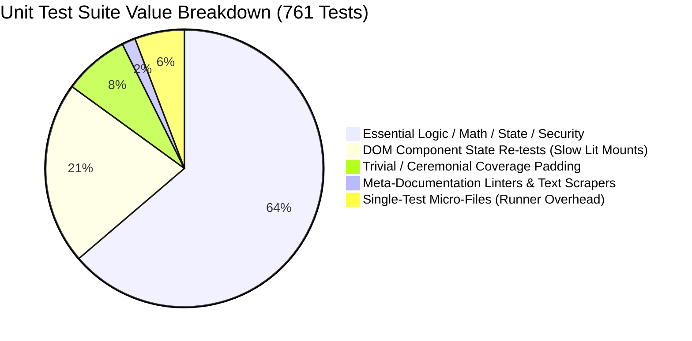

# Terrn Unit Test Suite Audit & Optimization Guide

**Date:** 2026-09-17  
**Scope:** Unit test suite (`src/**/*.spec.ts` + `e2e/helpers.spec.ts`) in `terrn_poc`  
**Profile:** 71 test files, 761 tests, ~44 seconds execution time under `npm run test:unit`

---

## 1. Executive Summary & Runtime Profile

The unit test suite consists of **71 files and 761 tests**. While it executes faster than the E2E suite, profiling reveals an extreme concentration of runtime:

- **Top 3 files account for ~50% of the cumulative test execution time**:
  1. [`attribute-table-element.spec.ts`](file:///tern/tern_poc/src/features/tabular/components/attribute-table-element.spec.ts): **13.77s** (68 tests)
  2. [`copilot-element.spec.ts`](file:///tern/tern_poc/src/features/ai/components/copilot-element.spec.ts): **11.13s** (37 tests)
  3. [`layer-list-element.spec.ts`](file:///tern/tern_poc/src/features/layers/components/layer-list-element.spec.ts): **7.89s** (23 tests)
- **Lit Component Tests (`*-element.spec.ts`) consume >75% of the total suite runtime** (~52 seconds cumulative worker time).
- **Pure logic, stores, algorithms, and services execute in <3 seconds combined**:
  - 13 `utils/` test files (78 tests): **0.41s total**
  - 14 `services/` test files (120 tests): **1.30s total**
  - State stores (`layer-store-api`, `grid-state`, `chat-state`): **0.52s total**

```
Cumulative Unit Test Runtime by Domain:
├── features/ (27 files, 435 tests): 55.9s (82.8%)
│   ├── tabular/ (2 files, 95 tests): 14.1s
│   ├── styling/ (6 files, 58 tests): 13.7s
│   ├── ai/ (5 files, 106 tests): 13.0s
│   ├── layers/ (8 files, 125 tests): 11.4s
│   └── settings/inspector/panel/theme: 3.7s
├── core/ (7 files, 38 tests): 6.2s (9.1%)
│   └── geo-worker-client.spec.ts: 3.6s (Single-test bottleneck)
├── shared/ (7 files, 81 tests): 3.5s (5.2%)
│   └── icons.spec.ts: 2.1s (100+ SVG DOM parses)
└── services/ + utils/ + types/ (28 files, 201 tests): 1.7s (2.5%)
```

---

## 2. Test Value Categorization



---

## 3. Detailed Audit: What Is Necessary vs. What Is Padding

### 3.1 Essential & High-Value Tests (Keep & Protect)

These tests run fast (<100ms per file), guard core algorithms and business rules, and prevent critical data/security regressions:

1. **Math, Geometry & Algorithms (`src/utils/`)**:
   - [`geo.spec.ts`](file:///tern/tern_poc/src/utils/geo.spec.ts) (16 tests, 0.11s), [`numeric.spec.ts`](file:///tern/tern_poc/src/utils/numeric.spec.ts) (5 tests), [`bucket.spec.ts`](file:///tern/tern_poc/src/utils/bucket.spec.ts) (2 tests).
   - *Value:* Pure functional testing of coordinate bounds, decimal precision, numeric formatting, and clustering math.
2. **File Parsers & Spatial Formats (`src/shared/parsers/`)**:
   - [`parsers.spec.ts`](file:///tern/tern_poc/src/shared/parsers/parsers.spec.ts) (18 tests, 0.13s), [`geo-worker.spec.ts`](file:///tern/tern_poc/src/core/workers/geo-worker.spec.ts) (4 tests).
   - *Value:* Validates GeoJSON, Shapefile, DBF, and KML binary parsing and attribute extraction.
3. **SQL Validation & Query Security (`src/services/`)**:
   - [`sql-validator.spec.ts`](file:///tern/tern_poc/src/services/sql-validator.spec.ts) (25 tests, 0.04s), [`sql-ident.spec.ts`](file:///tern/tern_poc/src/utils/sql-ident.spec.ts) (14 tests).
   - *Value:* Prevents SQL injection and invalid queries against DuckDB-WASM; blocks forbidden functions and enforces identifier quoting.
4. **Pure State Stores (`src/features/*/state/`)**:
   - [`layer-store-api.spec.ts`](file:///tern/tern_poc/src/features/layers/state/layer-store-api.spec.ts) (43 tests, 0.12s), [`grid-state.spec.ts`](file:///tern/tern_poc/src/features/tabular/state/grid-state.spec.ts) (27 tests, 0.35s), [`chat-state.spec.ts`](file:///tern/tern_poc/src/features/ai/state/chat-state.spec.ts) (15 tests, 0.05s).
   - *Value:* **Highest ROI tests in the entire repository.** They test complex state machines (layer CRUD, undo/redo, sorting, pagination, filtering) without any DOM overhead.
5. **Telemetry Privacy Allowlist & Consent Gateways**:
   - [`telemetry.spec.ts`](file:///tern/tern_poc/src/services/telemetry/telemetry.spec.ts), [`callsite-telemetry.spec.ts`](file:///tern/tern_poc/src/services/telemetry/callsite-telemetry.spec.ts), [`consent.spec.ts`](file:///tern/tern_poc/src/services/telemetry/consent.spec.ts).
   - *Value:* Ensures user properties (filenames, columns, values) are stripped and that opt-out flags are strictly observed.

---

### 3.2 Coverage Padding, Ceremonial & Redundant Tests

#### 1. Meta-Documentation Linters: [`src/hld-counts.spec.ts`](file:///tern/tern_poc/src/hld-counts.spec.ts) (6 tests, 0.07s)
- **What it does:** Scrapes `.md` and `.yaml` files in `docs/architecture/hld/` and asserts that prose sentences like *"15 Lit custom elements"*, *"eight feature verticals"*, or *"all 14 modules"* match the number of files and folders in `src/`.
- **Verdict:** **Pure Ceremony / Anti-Pattern**. This does not test code correctness. Adding a utility file or component fails this test until someone manually edits English prose in markdown files. It belongs in a documentation commit hook or pre-commit linter, not the unit test merge gate.

#### 2. Micro-Regression Scars & Hostile Mocking
- **Forced Catch-Block Coverage in [`geometry-icon.spec.ts`](file:///tern/tern_poc/src/features/layers/rendering/geometry-icon.spec.ts#L52):**
  A test creates an object with a throwing getter:
  ```ts
  const hostile = layer({ data: { get features(): never { throw new Error('boom'); } } });
  expect(() => geometryIconName(hostile)).not.toThrow();
  ```
  This exists solely to hit the `catch` block line for 100% line coverage reports.
- **Hyper-Specific Seeding Regressions in [`attribute-table-element.spec.ts`](file:///tern/tern_poc/src/features/tabular/components/attribute-table-element.spec.ts#L359-L552):**
  Tests 48, 49, 50, 52, 53, and 57 (labeled *"T25 regression"*, *"/review adversarial pass"*, *"/ship adversarial pass"*) each mount the entire `<terrn-attribute-table>` component to test edge cases around seeding `visibleColumns`. These 6 tests alone consume **~2.8 seconds** for a state quirk that is already guarded in [`grid-state.spec.ts`](file:///tern/tern_poc/src/features/tabular/state/grid-state.spec.ts).

#### 3. Single-Assertion / Isolated Micro-Files (Runner Overhead)
Vitest must spawn a separate worker context, parse imports, and tear down mocks for every file. These isolated files introduce pure runner tax:
- [`src/services/telemetry/hotpath-guard.spec.ts`](file:///tern/tern_poc/src/services/telemetry/hotpath-guard.spec.ts) (11 lines, 1 test): Checks that `renderer.ts` doesn't call `track()`. Should be merged into [`telemetry.spec.ts`](file:///tern/tern_poc/src/services/telemetry/telemetry.spec.ts) or [`design-system.spec.ts`](file:///tern/tern_poc/src/core/styles/design-system.spec.ts).
- [`src/types/events.spec.ts`](file:///tern/tern_poc/src/types/events.spec.ts) (16 lines, 1 test): Checks basic `onAppEvent`/`emitAppEvent` dispatch (already tested implicitly in 50+ component tests).

#### 4. Repetitive Form Input-Binding Across 5 Styling Specs (58 tests, ~13.7s)
- Across [`point-style-element.spec.ts`](file:///tern/tern_poc/src/features/styling/components/point-style-element.spec.ts), [`line-style-element.spec.ts`](file:///tern/tern_poc/src/features/styling/components/line-style-element.spec.ts), [`polygon-style-element.spec.ts`](file:///tern/tern_poc/src/features/styling/components/polygon-style-element.spec.ts), and [`label-style-element.spec.ts`](file:///tern/tern_poc/src/features/styling/components/label-style-element.spec.ts), the same mechanical assertions repeat:
  - Check that an `<input>` displays the signal's initial value.
  - Dispatch an `input` or `change` event.
  - Check that `layersSignal` was updated with the new property.
- Doing this via Lit DOM mounting takes **~250–400ms per test** in jsdom. Testing the underlying styling reducers directly takes **<2ms**.

#### 5. Dynamic Module Re-import Bottleneck: [`geo-worker-client.spec.ts`](file:///tern/tern_poc/src/core/workers/geo-worker-client.spec.ts) (1 test, 3.56s)
- This single test takes **3.56 seconds** because it calls `vi.resetModules()`, stubs globals, dynamically re-imports modules, and advances fake timers by 12,000ms. Refactoring the client to accept a timeout option directly would eliminate the need for module cache busting and reduce execution time from 3.5s to <10ms.

---

## 4. Key Performance Hotspots in Lit Components

Why do Lit component tests take so long in jsdom?

1. **`await el.updateComplete` Microtask Queueing**:
   Lit schedules renders via browser microtasks. In jsdom, every property change and DOM event must wait for the custom element reactive lifecycle to settle.
2. **DOM Attachment & Layout Simulation**:
   Tests that call `document.body.appendChild(el)` force jsdom to maintain full mutation observer and shadow DOM trees.
3. **Repeated Custom Element Instantiation**:
   `attribute-table-element.spec.ts` creates and destroys `<terrn-attribute-table>` (which contains tablists, menus, table grids, and action buttons) **68 times**.

---

## 5. Actionable Optimization Recommendations

| Opportunity | Impact | Effort |
|---|---|---|
| **Remove `hld-counts.spec.ts` from test suite** | Eliminates documentation friction; prevents build failures when adding new files/components. | Low |
| **Consolidate Micro-Files** (`hotpath-guard.spec.ts`, `events.spec.ts`) | Reduces Vitest test-runner process/file overhead by 2 files. | Low |
| **Optimize `geo-worker-client.spec.ts`** | Removes `vi.resetModules()` and dynamic imports, saving **~3.5 seconds**. | Low |
| **Consolidate Tabular Component Regression Scars** | Shift internal state assertions from `attribute-table-element.spec.ts` to `grid-state.spec.ts`, saving **~3–5 seconds**. | Medium |
| **Deduplicate Styling Component Input Tests** | Test style configuration reducers directly; keep 1 smoke render test per component. Saves **~8–10 seconds**. | Medium |

### Projected Impact on Unit Suite
- **Runtime reduction**: From **~44 seconds down to ~20–25 seconds** (~50% speedup).
- **Test maintenance**: Removes brittle documentation-count assertions and artificial catch-block scaffolding.
- **Coverage integrity**: Zero loss of business logic, security, parsing, or state machine verification.
