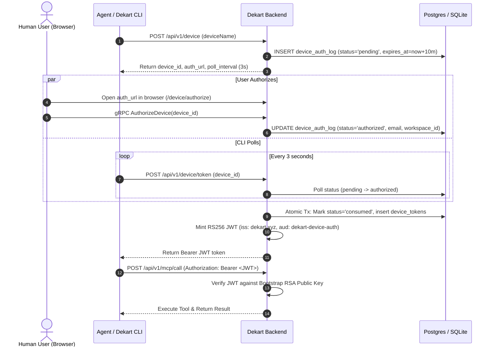
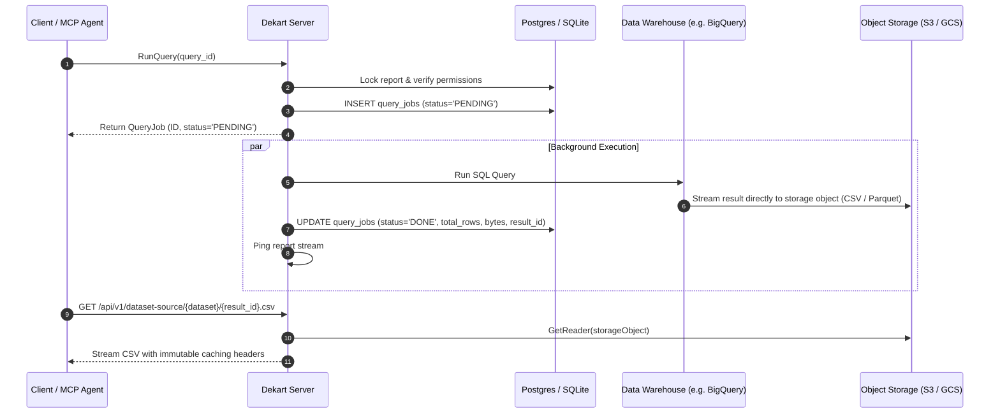
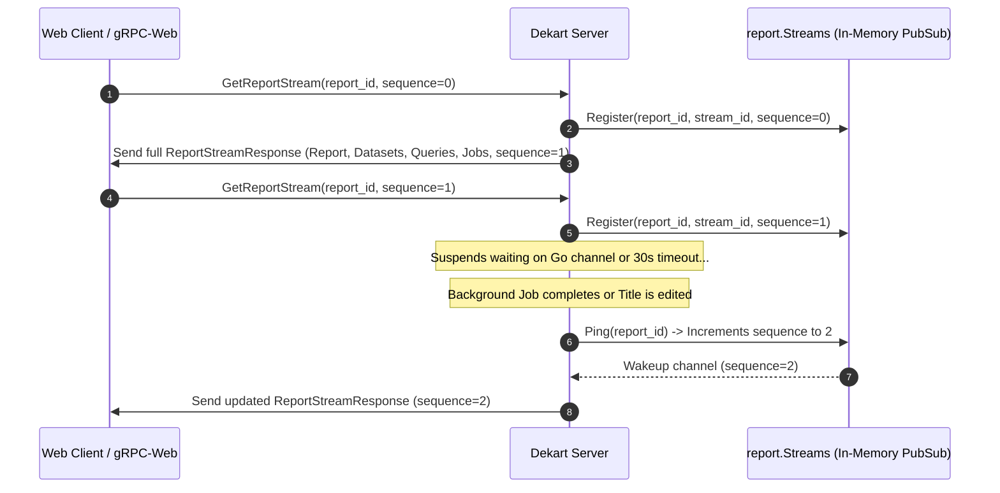

# Dekart Backend Architecture & MCP Server Design

**Document:** Comprehensive Architectural Guide & Codebase Reference  
**Scope:** Core Backend Services, gRPC-Web/REST Ingress, Pluggable Job Stores, Storage Decoupling, DuckDB Execution Graph, and the Model Context Protocol (MCP) Server  
**Source Codebase:** [`/tern/dekart`](file:///tern/dekart)

---

## 1. Executive Summary & System Topology

Dekart is an open-source geospatial visualization and analytics platform built around Kepler.gl. Its backend is implemented in Go and designed around the following architectural principles:

- **Strict Protocol-First Contracts:** Protobuf definitions in [`proto/dekart.proto`](file:///tern/dekart/proto/dekart.proto) serve as the single source of truth for client-server communication.
- **Command / Query Separation (CQS):** Mutations advance version counters (`updated_at`, `version_id`), and clients subscribe to lightweight, sequence-based streams for real-time reconciliation.
- **Decoupled Heavy Data Flow:** Query results and uploaded GIS assets are never loaded into the application metadata database. Data warehouses stream results directly to object storage (S3, GCS, Snowflake cache, or local disk), and the client downloads them via streaming HTTP endpoints with immutable cache headers.
- **Hybrid Warehouse + Local Compute:** Data warehouse engines (BigQuery, Snowflake, Athena, Postgres, ClickHouse) handle massive aggregation, while an integrated DuckDB compiler builds dependency directed acyclic graphs (DAGs) to run cross-dataset joins locally in the browser (Wasm) or CLI/agent environment.
- **Native AI Agent Integration (MCP):** A built-in Model Context Protocol server exposes Dekart's full suite of mapping, querying, and file management tools to LLMs with strict JSON-Schema contracts dynamically generated from Protobuf descriptors.

```mermaid
graph TD
    Client[Web Browser / Kepler.gl] -->|gRPC-Web & REST| PortRouter[HTTP Multiplexer :DEKART_PORT]
    Agent[MCP AI Agent / Dekart CLI] -->|HTTP POST /mcp/call| PortRouter
    Browserless[Browserless.io Service] -->|Screenshot render| PortRouter

    subgraph Server["Dekart Backend (Go)"]
        PortRouter --> AuthMW[Claims & Workspace Middleware]
        AuthMW --> GRPC[gRPC-Web Server]
        AuthMW --> REST[Gorilla Mux HTTP Router]
        
        GRPC --> DekartServer[Server Orchestration]
        REST --> DekartServer
        
        DekartServer --> MCPHandler[MCP Subsystem]
        DekartServer --> JobStore[Job Store Engine]
        DekartServer --> StreamSync[Sequence-Based Streams]
        DekartServer --> DuckDBCompiler[DuckDB Graph Compiler]
    end

    DekartServer --> MetadataDB[(Postgres / SQLite)]
    JobStore --> DW[(Data Warehouses: BQ, Snowflake, Athena, Postgres, ClickHouse)]
    JobStore --> StorageBackend[(Storage: S3, GCS, Snowflake Cache, Postgres, LocalFS)]
    REST -->|Stream results| StorageBackend
```

---

## 2. Server Ingress & Protocol Multiplexing

### 2.1 Process Lifecycle ([`main.go`](file:///tern/dekart/src/server/main.go#L254-L321))
The backend entrypoint in [`main()`](file:///tern/dekart/src/server/main.go#L254) orchestrates startup in deterministic phases:
1. **Logger & Storage Validation:** Configures `zerolog` with optional caller and stack traces ([`configureLogger`](file:///tern/dekart/src/server/main.go#L41)), and validates storage consistency via [`validateStorageConfig`](file:///tern/dekart/src/server/main.go#L64).
2. **License Check:** Invokes [`app.RequireValidStartupLicense`](file:///tern/dekart/src/server/main.go#L259) to verify enterprise license constraints where applicable.
3. **Database & Migrations:** Opens PostgreSQL or SQLite via [`configureDb`](file:///tern/dekart/src/server/main.go#L96) and runs migration scripts from [`migrations/`](file:///tern/dekart/migrations) via `golang-migrate` ([`applyMigrations`](file:///tern/dekart/src/server/main.go#L124)).
4. **Bootstrap Cryptography:** 
   - Generates or loads the persistent instance RSA key pair in the `instance_keys` table via [`jwtkeys.MustInitBootstrapKey`](file:///tern/dekart/src/server/main.go#L268).
   - Initializes the symmetric Data Encryption Key (DEK) via [`secrets.Init()`](file:///tern/dekart/src/server/main.go#L269).
5. **Storage & Job Store Factory:** Instantiates the configured object storage ([`configureBucket`](file:///tern/dekart/src/server/main.go#L184)) and data warehouse execution engine ([`configureJobStore`](file:///tern/dekart/src/server/main.go#L208)).
6. **HTTP / gRPC Server:** Initializes [`dekart.Server`](file:///tern/dekart/src/server/dekart/server.go#L56) and binds the HTTP server via [`app.Configure`](file:///tern/dekart/src/server/app/app.go#L308).
7. **Graceful Shutdown:** Intercepts `SIGINT`/`SIGTERM` via [`waitForInterrupt`](file:///tern/dekart/src/server/main.go#L247), issues a 5-second context cancellation, halts running warehouse queries via [`dekartServer.Shutdown`](file:///tern/dekart/src/server/dekart/server.go#L145), flushes SQLite backups, and terminates HTTP listeners.

### 2.2 Network Multiplexing ([`app/app.go`](file:///tern/dekart/src/server/app/app.go#L308-L347))
Dekart listens on a single configured TCP port (`DEKART_PORT`). The HTTP handler multiplexes traffic based on request headers:

```mermaid
graph TD
    InboundRequest[HTTP Request] --> ClaimsMW[claimsCheck.GetContext]
    ClaimsMW --> WorkspaceMW[dekartServer.SetWorkspaceContext]
    WorkspaceMW --> IsGRPC{Is Acceptable gRPC /<br/>gRPC-Web Request?}
    IsGRPC -->|Yes| GRPCWebHandler[improbable-eng/grpcweb Handler]
    IsGRPC -->|No| RESTHandler[Gorilla Mux HTTP Router]
    
    RESTHandler --> StaticUI[Static Assets / HTML5 SPA Fallback]
    RESTHandler --> MCPRoutes[/api/v1/mcp/*]
    RESTHandler --> DeviceRoutes[/api/v1/device/*]
    RESTHandler --> DatasetRoutes[/api/v1/dataset-source/*]
    RESTHandler --> UploadRoutes[/api/v1/file/*/upload-sessions/*]
```

- **gRPC-Web Routing:** Handled by [`configureGRPC`](file:///tern/dekart/src/server/app/app.go#L103) wrapping the standard gRPC server with origin validation ([`matchOrigin`](file:///tern/dekart/src/server/app/app.go#L71)).
- **REST Subrouter:** Mounted under `/api/v1/` by [`configureHTTP`](file:///tern/dekart/src/server/app/app.go#L133) for non-gRPC actions (MCP calls, device authorization, direct dataset streaming, and multipart uploads).
- **Static Assets:** Serves compiled frontend assets with SPA fallback routing through [`staticFilesHandler.ServeIndex`](file:///tern/dekart/src/server/app/app.go#L280).

---

## 3. The Model Context Protocol (MCP) Server

Dekart includes a first-class, built-in MCP server implementation in [`src/server/dekart/mcp.go`](file:///tern/dekart/src/server/dekart/mcp.go) and [`src/server/dekart/mcpupload.go`](file:///tern/dekart/src/server/dekart/mcpupload.go), supported by the helper packages [`src/server/mcp/`](file:///tern/dekart/src/server/mcp/) and [`src/server/mcpschema/`](file:///tern/dekart/src/server/mcpschema/).

### 3.1 Endpoints
The MCP surface exposes two HTTP endpoints in [`configureHTTP`](file:///tern/dekart/src/server/app/app.go#L172-L185):
1. **`GET /api/v1/mcp/tools`** ([`HandleMCPTools`](file:///tern/dekart/src/server/dekart/mcp.go#L131)):
   Returns the complete tool catalog ([`mcpToolsResponse`](file:///tern/dekart/src/server/dekart/mcp.go#L42)) describing tool names, JSON-Schema input contracts, required fields, operational side-effects, usage recommendations, and example inputs.
2. **`POST /api/v1/mcp/call`** ([`HandleMCPCall`](file:///tern/dekart/src/server/dekart/mcp.go#L137)):
   Accepts tool invocation payloads `{"name": "...", "arguments": {...}}`, validates workspace write permissions via [`requireWorkspaceWrite`](file:///tern/dekart/src/server/dekart/server.go#L86), dispatches execution to [`callMCPTool`](file:///tern/dekart/src/server/dekart/mcp.go#L157), and formats responses or structured errors.

### 3.2 Protobuf-to-JSONSchema Reflection ([`mcpschema/schema.go`](file:///tern/dekart/src/server/mcpschema/schema.go#L10-L23))
To eliminate schema drift between the gRPC contract and MCP tools, schemas are generated dynamically at runtime from Protobuf message descriptors:
- [`mcpschema.ForProto`](file:///tern/dekart/src/server/mcpschema/schema.go#L10) inspects a Protobuf message via `protoreflect`.
- Recursively converts primitives, lists, maps, and enums into JSON-Schema objects ([`protoSingularFieldSchema`](file:///tern/dekart/src/server/mcpschema/schema.go#L78)).
- [`mcpschema.NormalizeInputSchema`](file:///tern/dekart/src/server/mcpschema/toolmeta.go#L6) guarantees `type: "object"`, `additionalProperties: false`, and deterministic alphabetical ordering of `required` fields.
- [`mcpschema.MinimalExampleInput`](file:///tern/dekart/src/server/mcpschema/toolmeta.go#L31) generates minimal valid payloads for each tool so LLM clients understand the expected structure without guesswork.

### 3.3 MCP Tool Catalog
The MCP server exposes 20 tools ([`mcpToolDefinitions`](file:///tern/dekart/src/server/dekart/mcp.go#L988-L1221)):

| Tool Name | Scope | Description & Logic |
| :--- | :--- | :--- |
| [`list_connections`](file:///tern/dekart/src/server/dekart/mcp.go#L348) | Read | Lists active connections. All credential fields (`BigqueryKey`, `SnowflakeKey`, etc.) are scrubbed via [`sanitizeConnectionForMCP`](file:///tern/dekart/src/server/dekart/mcp.go#L243). |
| [`create_report`](file:///tern/dekart/src/server/dekart/mcp.go#L379) | Write | Creates a report in the active workspace. Checks free workspace limits via [`trackMCPCreateReportLimitReached`](file:///tern/dekart/src/server/dekart/mcp.go#L392). |
| [`get_report_properties`](file:///tern/dekart/src/server/dekart/mcp.go#L798) | Read | Fetches report title, map config, readme, attached datasets, and queries. |
| [`update_report_title`](file:///tern/dekart/src/server/dekart/mcp.go#L597) | Write | Renames the report and records a version snapshot. |
| [`get_map_config_schema`](file:///tern/dekart/src/server/dekart/mcp.go#L364) | Read | Returns the Kepler.gl v1 JSON-Schema used for map configuration validation. |
| [`update_report_map_config`](file:///tern/dekart/src/server/dekart/mcp.go#L663) | Write | Applies Kepler.gl layer and visual channel configs after semantic validation. |
| [`create_report_snapshot`](file:///tern/dekart/src/server/dekart/mcp.go#L829) | Read | Generates a short-lived tokenized map snapshot URL and optional PNG render. |
| [`create_dataset`](file:///tern/dekart/src/server/dekart/mcp.go#L406) | Write | Adds a new dataset slot to a report. |
| [`update_dataset_name`](file:///tern/dekart/src/server/dekart/mcp.go#L785) | Write | Renames the display label of a dataset tab. |
| [`remove_dataset`](file:///tern/dekart/src/server/dekart/mcp.go#L558) | Write | Removes a dataset and cascades associated query/file records. |
| [`create_query`](file:///tern/dekart/src/server/dekart/mcp.go#L419) | Write | Associates a connection or DuckDB query with a dataset slot. |
| [`update_query`](file:///tern/dekart/src/server/dekart/mcp.go#L435) | Write | Updates SQL text and runs dry-run syntax verification without executing. |
| [`run_query`](file:///tern/dekart/src/server/dekart/mcp.go#L484) | Write | Initiates asynchronous execution on the warehouse or prepares DuckDB. |
| [`check_job_status`](file:///tern/dekart/src/server/dekart/mcp.go#L522) | Read | Polls query progress, rows, bytes processed, and execution errors. |
| [`create_file`](file:///tern/dekart/src/server/dekart/mcp.go#L571) | Write | Allocates a file metadata record for a dataset. |
| [`replace_file`](file:///tern/dekart/src/server/dekart/mcp.go#L584) | Write | Re-allocates file metadata to replace an existing dataset's source file. |
| [`start_file_upload_session`](file:///tern/dekart/src/server/dekart/mcpupload.go#L29) | Write | Starts a chunked multipart upload session for files up to `DEKART_MAX_FILE_UPLOAD_SIZE`. |
| [`complete_file_upload_session`](file:///tern/dekart/src/server/dekart/mcpupload.go#L43) | Write | Finalizes uploaded chunks and promotes the stored object. |
| [`abort_file_upload_session`](file:///tern/dekart/src/server/dekart/mcpupload.go#L58) | Write | Cancels the upload session and cleans up temporary parts. |
| [`add_report_readme`](file:///tern/dekart/src/server/dekart/mcp.go#L738) / `update` / `remove` | Write | Manages markdown documentation associated with the map. |

### 3.4 Kepler Map Config Semantic Validation ([`mapconfigvalidation.go`](file:///tern/dekart/src/server/dekart/mapconfigvalidation.go#L53-L68))
When an agent invokes `update_report_map_config`:
1. The JSON config is verified against the official schema [`kepler_map_config_v1.schema.json`](file:///tern/dekart/src/server/dekart/kepler_map_config_v1.schema.json).
2. The server extracts all `dataId` values defined across layers in `visState.layers[*].config.dataId` and ensures they reference valid `dataset_id` values owned by the report ([`getReportDatasetIDSet`](file:///tern/dekart/src/server/dekart/mapconfigvalidation.go#L71)).
3. If errors occur, the server returns a structured [`mcpValidationErrorResponse`](file:///tern/dekart/src/server/dekart/mcp.go#L55) with exact JSON paths, reasons, expected values, and actual values.

---

## 4. Authentication & Headless Device Authorization

Dekart supports multiple enterprise authentication schemes alongside a headless device flow tailored for MCP agents and the Dekart CLI.



### 4.1 Authentication Providers ([`src/server/user/claims.go`](file:///tern/dekart/src/server/user/claims.go#L279-L323))
The [`ClaimsCheck`](file:///tern/dekart/src/server/user/claims.go#L69) factory processes the HTTP context and verifies caller identity:
- **Google OAuth 2.0:** Validates bearer tokens against Google's tokeninfo API and handles code exchange caching.
- **OIDC / Keycloak:** Validates JWT signatures against JWKS URLs ([`oidcJWTVerifier`](file:///tern/dekart/src/server/user/oidc.go)).
- **AWS ALB OIDC:** Extracts user claims from the `x-amzn-oidc-data` header signed by AWS ALB public keys.
- **Google Cloud IAP:** Verifies `X-Goog-IAP-JWT-Assertion` signatures.
- **Dev Claims:** Development bypass enabled via `DEKART_DEV_CLAIMS=1` reading `X-Dekart-Claim-Email`.

### 4.2 The RFC 8628-Style Device Flow ([`src/server/deviceauth/`](file:///tern/dekart/src/server/deviceauth/deviceauth.go))
For non-browser clients (MCP agents and CLI):
1. **Initialization:** The client sends [`POST /api/v1/device`](file:///tern/dekart/src/server/dekart/device.go#L23). [`StartDeviceSession`](file:///tern/dekart/src/server/deviceauth/deviceauth.go#L68) inserts an entry into the append-only table `device_auth_log` with status `pending` and a 10-minute TTL.
2. **Browser Approval:** The user navigates to the authorization URL (`/device/authorize?device_id=...`). Once logged in, the browser invokes the gRPC endpoint [`AuthorizeDevice`](file:///tern/dekart/src/server/dekart/device.go#L77), updating the session to `authorized` with the user's email and workspace ID.
3. **Atomic Polling & Concurrency Control:** The client polls [`POST /api/v1/device/token`](file:///tern/dekart/src/server/dekart/device.go#L48). [`consumeAuthorizedSessionTx`](file:///tern/dekart/src/server/deviceauth/deviceauth.go#L243) executes an atomic `INSERT ... SELECT ... RETURNING` transaction ensuring only one poller can transition the status to `consumed`.
4. **Token Minting:** Dekart signs an RS256 JWT containing `email` and `workspace_id` using the instance bootstrap private key.
5. **Validation:** In subsequent requests, [`validateDeviceAuthToken`](file:///tern/dekart/src/server/user/devicejwt.go#L37) verifies the JWT signature against the bootstrap public key, binding the request context to the correct user and workspace.

---

## 5. Query Engine, Job Stores & Decoupled Storage



### 5.1 Pluggable Job Stores ([`src/server/job/job.go`](file:///tern/dekart/src/server/job/job.go#L18-L44))
The [`job.Store`](file:///tern/dekart/src/server/job/job.go#L18) and [`job.Job`](file:///tern/dekart/src/server/job/job.go#L26) abstractions isolate warehouse communication:
- [`bqjob`](file:///tern/dekart/src/server/bqjob): BigQuery runner with Google Cloud Storage export and BigQuery Storage API streaming.
- [`snowflakejob`](file:///tern/dekart/src/server/snowflakejob): Snowflake runner utilizing Snowflake internal stages or S3 external stages for query result caching.
- [`athenajob`](file:///tern/dekart/src/server/athenajob): AWS Athena runner targeting S3 query output locations.
- [`pgjob`](file:///tern/dekart/src/server/pgjob): Direct PostgreSQL query execution engine with EWKB geometry normalization.
- [`clickhousejob`](file:///tern/dekart/src/server/clickhousejob): High-throughput ClickHouse analytics integration.
- [`userjob`](file:///tern/dekart/src/server/userjob): Multiplexed job runner delegating to user-configured connections.

### 5.2 Decoupled Object Storage ([`src/server/storage/storage.go`](file:///tern/dekart/src/server/storage/storage.go#L37-L45))
All query outputs and uploaded files are managed through [`storage.Storage`](file:///tern/dekart/src/server/storage/storage.go#L37):
- **S3 / GCS:** Standard cloud storage backends supporting direct streaming and pre-signed URLs.
- **Postgres Storage (`PGStorage`):** Replays query results directly from Postgres when external object storage is disabled.
- **Local File System (`LocalFS`):** Persists uploaded file assets to the host filesystem under `DEKART_LOCAL_FILES_ROOT`.

### 5.3 Serving Results ([`ServeDatasetSource`](file:///tern/dekart/src/server/dekart/dataset.go#L425))
Clients fetch query results or files via `/api/v1/dataset-source/{dataset}/{source}.{extension}`. The endpoint:
- Verifies dataset ownership and authorization.
- Reads directly from [`StorageObject.GetReader`](file:///tern/dekart/src/server/storage/storage.go#L23).
- Applies `Cache-Control: public, max-age=31536000, immutable` and gzip compression, enabling fast edge caching.

---

## 6. DuckDB Hybrid Execution & Dependency Graph

Dekart supports running cross-dataset SQL queries locally via DuckDB ([`duckdbcommand.go`](file:///tern/dekart/src/server/dekart/duckdbcommand.go) and [`duckdbprepare.go`](file:///tern/dekart/src/server/dekart/duckdbprepare.go)).

### 6.1 Virtual Dataset Schemas
Users can write SQL queries referencing other datasets:
```sql
SELECT 
    t.trip_id, 
    z.zone_name, 
    t.fare_amount 
FROM datasets.trips_warehouse_query t
JOIN datasets.zones_uploaded_csv z ON t.zone_id = z.zone_id
WHERE t.fare_amount > 20
```

### 6.2 Graph Compilation & Cycle Detection
- [`prerequisiteDuckDBQueries`](file:///tern/dekart/src/server/dekart/duckdbprepare.go#L69) parses dataset dependencies into a directed graph.
- Detects circular references and returns `codes.FailedPrecondition` ("Circular DuckDB dependency").
- Generates a topological execution order ensuring dependent datasets (e.g. warehouse queries or uploaded CSVs) are executed or downloaded before the DuckDB query runs.

### 6.3 Lowering Execution Plans ([`lowerDuckDBExecution`](file:///tern/dekart/src/server/dekart/duckdbprepare.go#L371))
[`PrepareDuckDBExecution`](file:///tern/dekart/src/server/dekart/duckdbprepare.go#L233) emits a sequence of ordered SQL statements:
- Creates schemas `datasets` and `dekart_internal`.
- Loads input files/results into DuckDB tables.
- Binds parameter tables for runtime query parameters.
- The compiled plan is executed client-side in the browser (via DuckDB-Wasm) or locally in the CLI/MCP process.

---

## 7. Real-Time State Reconciliation (Streams)

Dekart replaces complex WebSocket frameworks with a sequence-based long-polling stream pattern ([`src/server/report/report.go`](file:///tern/dekart/src/server/report/report.go#L9) and [`src/server/dekart/stream.go`](file:///tern/dekart/src/server/dekart/stream.go#L159)):



1. **Client Subscription:** The client calls `GetReportStream(report_id, sequence=N)`.
2. **Immediate vs Delayed Dispatch:**
   - If the server's current sequence is greater than $N$, the server immediately sends the latest report state and finishes the call.
   - If the sequence matches, the handler blocks on an in-memory channel registered with [`report.Streams`](file:///tern/dekart/src/server/report/report.go#L9).
3. **Change Notification:** When a query completes, a title is updated, or a dataset changes, [`s.reportStreams.Ping(reportID)`](file:///tern/dekart/src/server/report/report.go#L82) increments the sequence and wakes up waiting listeners.
4. **Timeout & Reconnection:** If no event occurs within `DEKART_STREAM_TIMEOUT` (default 30 seconds), the stream completes cleanly, and the client reconnects with the same sequence number.

---

## 8. File Upload Session Architecture

To handle multi-gigabyte GIS files (GeoJSON, CSV) without exhausting server memory, Dekart provides a chunked multipart upload session pipeline ([`fileuploadsession.go`](file:///tern/dekart/src/server/dekart/fileuploadsession.go)):

1. **Session Start:** `POST /api/v1/file/{id}/upload-sessions` allocates an upload session with the storage provider via [`StartUploadSession`](file:///tern/dekart/src/server/storage/storage.go#L41) (24 MB maximum part size).
2. **Chunk Ingestion:** `PUT /api/v1/file/{id}/upload-sessions/{session_id}/parts/{part_number}` streams byte chunks directly to storage, returning part ETags.
3. **Completion:** `POST /api/v1/file/{id}/upload-sessions/{session_id}/complete` validates the ordered part manifest, finalizes the multipart object, updates the file's stored size and status in PostgreSQL/SQLite, and triggers [`reportStreams.Ping`](file:///tern/dekart/src/server/report/report.go#L82).

---

## 9. Comprehensive Codebase Symbol Reference

| Subsystem | Key Files | Core Types & Functions |
| :--- | :--- | :--- |
| **Server Lifecycle** | [`main.go`](file:///tern/dekart/src/server/main.go) | [`main`](file:///tern/dekart/src/server/main.go#L254), [`configureDb`](file:///tern/dekart/src/server/main.go#L96), [`configureBucket`](file:///tern/dekart/src/server/main.go#L184), [`configureJobStore`](file:///tern/dekart/src/server/main.go#L208) |
| **Ingress & Router** | [`app/app.go`](file:///tern/dekart/src/server/app/app.go) | [`Configure`](file:///tern/dekart/src/server/app/app.go#L308), [`configureGRPC`](file:///tern/dekart/src/server/app/app.go#L103), [`configureHTTP`](file:///tern/dekart/src/server/app/app.go#L133), [`matchOrigin`](file:///tern/dekart/src/server/app/app.go#L71) |
| **Orchestration** | [`dekart/server.go`](file:///tern/dekart/src/server/dekart/server.go) | [`Server`](file:///tern/dekart/src/server/dekart/server.go#L30), [`NewServerWithRuntimeLicense`](file:///tern/dekart/src/server/dekart/server.go#L56), [`Shutdown`](file:///tern/dekart/src/server/dekart/server.go#L145) |
| **MCP Subsystem** | [`dekart/mcp.go`](file:///tern/dekart/src/server/dekart/mcp.go)<br/>[`dekart/mcpupload.go`](file:///tern/dekart/src/server/dekart/mcpupload.go) | [`HandleMCPTools`](file:///tern/dekart/src/server/dekart/mcp.go#L131), [`HandleMCPCall`](file:///tern/dekart/src/server/dekart/mcp.go#L137), [`callMCPTool`](file:///tern/dekart/src/server/dekart/mcp.go#L157), [`mcpToolDefinitions`](file:///tern/dekart/src/server/dekart/mcp.go#L988) |
| **MCP Schema Engine** | [`mcpschema/schema.go`](file:///tern/dekart/src/server/mcpschema/schema.go)<br/>[`mcpschema/toolmeta.go`](file:///tern/dekart/src/server/mcpschema/toolmeta.go) | [`ForProto`](file:///tern/dekart/src/server/mcpschema/schema.go#L10), [`NormalizeInputSchema`](file:///tern/dekart/src/server/mcpschema/toolmeta.go#L6), [`MinimalExampleInput`](file:///tern/dekart/src/server/mcpschema/toolmeta.go#L31) |
| **Device Auth** | [`deviceauth/deviceauth.go`](file:///tern/dekart/src/server/deviceauth/deviceauth.go)<br/>[`dekart/device.go`](file:///tern/dekart/src/server/dekart/device.go) | [`StartDeviceSession`](file:///tern/dekart/src/server/deviceauth/deviceauth.go#L68), [`AuthorizeDeviceSession`](file:///tern/dekart/src/server/deviceauth/deviceauth.go#L103), [`PollToken`](file:///tern/dekart/src/server/deviceauth/deviceauth.go#L173) |
| **User & Claims** | [`user/claims.go`](file:///tern/dekart/src/server/user/claims.go)<br/>[`user/devicejwt.go`](file:///tern/dekart/src/server/user/devicejwt.go) | [`ClaimsCheck`](file:///tern/dekart/src/server/user/claims.go#L69), [`GetContext`](file:///tern/dekart/src/server/user/claims.go#L279), [`validateDeviceAuthToken`](file:///tern/dekart/src/server/user/devicejwt.go#L37) |
| **Query Engine** | [`dekart/query.go`](file:///tern/dekart/src/server/dekart/query.go)<br/>[`dekart/job.go`](file:///tern/dekart/src/server/dekart/job.go) | [`RunQuery`](file:///tern/dekart/src/server/dekart/query.go#L791), [`insertPendingQueryJob`](file:///tern/dekart/src/server/dekart/job.go#L24), [`updateJobStatus`](file:///tern/dekart/src/server/dekart/job.go#L44) |
| **DuckDB Compiler** | [`dekart/duckdbprepare.go`](file:///tern/dekart/src/server/dekart/duckdbprepare.go)<br/>[`dekart/duckdbcommand.go`](file:///tern/dekart/src/server/dekart/duckdbcommand.go) | [`PrepareDuckDBExecution`](file:///tern/dekart/src/server/dekart/duckdbprepare.go#L233), [`prerequisiteDuckDBQueries`](file:///tern/dekart/src/server/dekart/duckdbprepare.go#L69), [`reconcileDuckDBGraphTx`](file:///tern/dekart/src/server/dekart/duckdbcommand.go#L450) |
| **Map Validation** | [`dekart/mapconfigvalidation.go`](file:///tern/dekart/src/server/dekart/mapconfigvalidation.go) | [`validateReportMapConfig`](file:///tern/dekart/src/server/dekart/mapconfigvalidation.go#L54), [`validateKeplerMapConfigV1Detailed`](file:///tern/dekart/src/server/dekart/mapconfigvalidation.go#L100) |
| **Streaming Sync** | [`dekart/stream.go`](file:///tern/dekart/src/server/dekart/stream.go)<br/>[`report/report.go`](file:///tern/dekart/src/server/report/report.go) | [`GetReportStream`](file:///tern/dekart/src/server/dekart/stream.go#L160), [`Streams`](file:///tern/dekart/src/server/report/report.go#L9), [`Register`](file:///tern/dekart/src/server/report/report.go#L35), [`Ping`](file:///tern/dekart/src/server/report/report.go#L82) |
| **Storage Layer** | [`storage/storage.go`](file:///tern/dekart/src/server/storage/storage.go)<br/>[`storage/uploadsession.go`](file:///tern/dekart/src/server/storage/uploadsession.go) | [`Storage`](file:///tern/dekart/src/server/storage/storage.go#L37), [`StorageObject`](file:///tern/dekart/src/server/storage/storage.go#L22), [`S3Storage`](file:///tern/dekart/src/server/storage/storage.go#L70), [`LocalFS`](file:///tern/dekart/src/server/storage/localfs.go) |
