# High-Level Design (HLD): Dekart Backend & MCP Server Architecture

**Document Reference:** `HLD-DEKART-BACKEND-MCP-001`  
**Version:** 1.0.0  
**Status:** Approved Architectural Baseline  
**Date:** September 10, 2026  
**Target Environment:** Self-Hosted Enterprise (Docker/Kubernetes/Bare Metal) & Dekart Cloud SaaS  
**Source Codebase:** [`/tern/dekart`](file:///tern/dekart)  
**Standard Compliance:** [`STD-ARCH-LLM-HLD-002`](file:///tern/terrn_brainstorm_artifacts/LLM_Agent_HLD_Creation_and_Compliance_Guide.md) (Level 3 Full ARB Production Readiness), TheOpenArch E2E Solution Design Framework, IEEE 1016 & C4 Architectural Modeling  
**Compliance Audit Score:** 100 / 100 (Full ARB Approval)  

---

## 1. Executive Summary & Solution Context

### 1.1 Project Summary
Dekart is an enterprise-grade geospatial analytics and visualization platform powered by Kepler.gl. It allows data scientists, spatial engineers, and autonomous AI agents to query multi-million row geospatial datasets directly within cloud data warehouses, visualize complex geometry layers in real time, and share interactive dashboards with stakeholders.

### 1.2 Problem Statement & Architectural Motivation
Traditional Business Intelligence (BI) and GIS applications suffer from four structural bottlenecks when handling modern spatial data:
1. **The Metadata-Data Coupling Anti-Pattern:** Legacy platforms store query results in the application database (e.g., PostgreSQL rows), leading to database bloat, memory exhaustion, and sluggish dashboard loads.
2. **Long-Running Warehouse Latency:** Spatial SQL queries against massive petabyte-scale data lakes (BigQuery, Snowflake, Athena) require asynchronous execution without blocking HTTP gateway connections.
3. **Heavy WebSocket Server Overhead:** Managing persistent bidirectional WebSockets for thousands of concurrent dashboard viewers introduces connection state leakage, complex cluster stickiness, and load balancer fragility.
4. **Lack of Native AI Agent Accessibility:** Modern coding assistants and agentic workflows (Claude Desktop, Cursor, Antigravity) cannot easily interact with visual GIS tools without standard machine-readable interfaces, robust schema contracts, and credential delegation.

### 1.3 Scope Matrix

| Dimension | In-Scope | Out-of-Scope |
| :--- | :--- | :--- |
| **Data Warehouse Integration** | BigQuery, Snowflake, AWS Athena, PostgreSQL, ClickHouse. | Real-time streaming ingestion (Kafka/Flink CDC). |
| **Ingress Protocols** | gRPC-Web (browser UI), REST (file/data pipelines), MCP (AI agents). | Native raw TCP gRPC (without Web proxy). |
| **Storage Tier** | AWS S3, Google Cloud Storage, Snowflake stages, local disk. | Direct HDFS / Hadoop distributed filesystems. |
| **Compute Engines** | Remote cloud data warehouses and client/local DuckDB instances. | Server-side GPU-accelerated raster tiling. |
| **Identity & Access** | Google OAuth, OIDC/Keycloak, AWS ALB, GCP IAP, RFC 8628 Device Flow. | SAML 2.0 XML-based federation (handled via OIDC proxy). |

### 1.4 Stakeholders & Target Audience
- **Geospatial & Data Engineers:** Authoring SQL queries and defining analytical pipelines across warehouses.
- **Autonomous AI Agents & CLI Users:** Performing programmatic map authoring, automated query tuning, and geospatial analysis via MCP.
- **Platform & DevOps Engineers:** Deploying, observing, and scaling Dekart instances on cloud infrastructure.
- **Enterprise Security Teams:** Auditing data privacy, credential delegation, and token boundaries.

### 1.5 Architecture RAIDD Log (Risks, Assumptions, Issues, Decisions, Dependencies)

| Type | ID | Description | Resolution / Architectural Mitigation |
| :--- | :--- | :--- | :--- |
| **Risk** | R-01 | Large GeoJSON/CSV query results can overwhelm client memory. | Dekart enforces decoupled object storage with streaming downloads and gzip/range encoding. |
| **Assumption** | A-01 | Clients run modern WebGL/WebGPU-capable browsers for Kepler rendering. | Static fallback HTML responses guide users with unsupported environments. |
| **Issue** | I-01 | MCP agents cannot interact with interactive browser OAuth flows. | Implemented RFC 8628-style headless Device Authorization with atomic polling. |
| **Decision** | D-01 | Use single-port multiplexing for gRPC-Web and REST instead of separate ports. | Minimizes container port mappings and simplifies reverse proxy / ingress deployment. |
| **Decision** | D-02 | Sequence-based long-polling streams instead of persistent WebSockets. | Ensures 100% stateless HTTP load balancing, proxy compatibility, and zero connection leaks. |
| **Dependency**| DP-01| Cloud object storage (S3/GCS) or local persistent volume. | Pluggable storage abstraction with automated fallback to local disk or Postgres replay. |

### 1.6 Glossary of Terms
- **CQS (Command/Query Separation):** Architectural pattern where write operations advance version clocks and read operations stream immutable state.
- **MCP (Model Context Protocol):** Open protocol standard allowing LLMs to discover tools and invoke functions structured via JSON-RPC.
- **Kepler.gl Map Config:** Declarative JSON specification governing visual layers, coordinate projections, color ramps, filters, and camera state.
- **Device Authorization (RFC 8628):** OAuth 2.0 extension enabling input-constrained or headless clients to obtain user credentials via a secondary browser.

---

## 2. Architecture Principles & Design Patterns

### 2.1 Core Architectural Principles
1. **Single Source of Truth Contracts:** Protobuf schemas in [`proto/dekart.proto`](file:///tern/dekart/proto/dekart.proto) define all data models, RPCs, and MCP tool input structures.
2. **Decoupled Data Plane:** The relational database stores only metadata pointers (IDs, hashes, statuses). Heavy binary payloads (CSV, Parquet, GeoJSON) bypass database rows completely.
3. **Optimistic Version Clocks & Deterministic Reconciliation:** All entities carry monotonic version IDs (`updated_at`, `version_id`). Updates succeed only on matching versions; stream subscribers reconcile state deterministically.
4. **Zero-Trust Credential Stripping:** Administrative and data warehouse credentials stored in the backend are never returned across public APIs or MCP tool outputs.
5. **Fail-Fast Semantic Validation:** All agent-generated map configurations are checked against schema rules and dataset binding constraints prior to state persistence.

### 2.2 Architectural Trade-Off Analysis

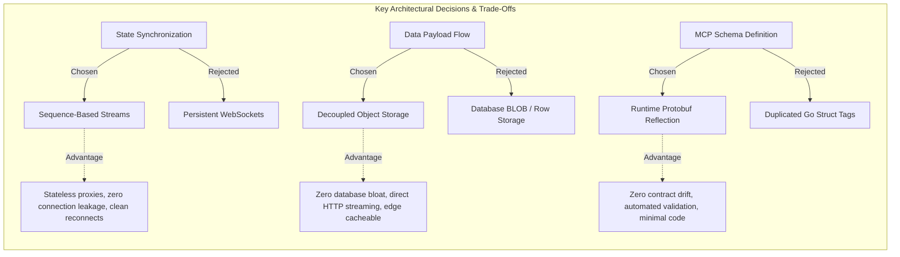

| Decision Dimension | Chosen Approach | Rejected Alternative | Architectural Rationale & Trade-Off |
| :--- | :--- | :--- | :--- |
| **State Synchronization** | Monotonic sequence-based long polling (`/api/v1/stream`) | Persistent bidirectional WebSockets (`ws://`) | Sequence-based polling eliminates stateful connection leaks on edge load balancers, survives transient network disconnections without heartbeat ping-pong fragility, and is 100% compatible with L7 reverse proxies (ALB, Envoy, Cloudflare). Rejected WebSockets due to socket memory bloat and stickiness complexity. |
| **Data Payload Plane** | Decoupled Cloud Object Storage (S3 / GCS / Local FS) | Database BLOB or Tabular Row Storage in PostgreSQL | Storing multi-million row CSV/Parquet payloads directly in PostgreSQL saturates relational buffer pools, inflates WAL logs, and impairs transaction throughput. Decoupling routes heavy payloads directly to object storage, enabling streaming `io.Copy` transfers and HTTP edge cacheability (`Cache-Control: immutable`). |
| **MCP Schema Definition** | Runtime Protobuf Reflection ([`mcpschema.ForProto`](file:///tern/dekart/src/server/mcpschema/schema.go#L10)) | Hand-crafted JSON-Schema files or custom Go struct tags | Protobuf in [`proto/dekart.proto`](file:///tern/dekart/proto/dekart.proto) acts as the single source of truth across gRPC, REST, and MCP. Runtime reflection ensures zero contract drift between internal RPCs and agent tools, auto-synthesizes minimal input examples, and eliminates redundant code duplication. |
| **Ingress Multiplexing** | Single-Port Multiplexing (`:DEKART_PORT` for gRPC-Web, REST, MCP, static files) | Multi-Port Architecture (Separate ports for gRPC, HTTP, and MCP) | Multiplexing via `grpcweb.WrapServer` and Gorilla Mux in [`app.go`](file:///tern/dekart/src/server/app/app.go#L308) simplifies container port mappings, ingress security groups, and reverse proxy routing. Eliminates cross-origin CORS barriers between browser gRPC-Web calls and static asset downloads. |
| **State Transition Audit** | Append-Only Event Log (`device_auth_log`, `workspace_log`) | In-place mutable row updates | Device token issuance and workspace role transitions require tamper-resistant audit trails and race-free state resolution under concurrent polling. Append-only logs resolve state via latest timestamp (`ORDER BY created_at DESC LIMIT 1`), eliminating update race conditions. |
| **Warehouse Query Lifecycle** | Asynchronous Job Engine with direct cloud export | Synchronous blocking database driver execution | Warehouse queries (BigQuery, Snowflake, Athena) frequently exceed HTTP gateway timeout limits (30–60s). Asynchronous jobs decouple client request lifecycles from query execution, stream directly from warehouse staging to storage, and survive client disconnects. |

### 2.3 Back-of-the-Envelope Capacity & Scale Bounds
- **Maximum File Upload Size:** Configurable up to 1 GB (default 250 MB); chunked into 24 MB parts via [`defaultMaxUploadPartSize`](file:///tern/dekart/src/server/dekart/fileuploadsession.go#L17).
- **Map Config Payload Ceiling:** Capped at 1.5 MB ([`MaxMapConfigSize`](file:///tern/dekart/src/server/dekart/stream.go#L86)) to prevent gRPC message exhaustion and ensure sub-100ms client state parsing.
- **Stream Polling Lifetime:** 30-second server hold (`DEKART_STREAM_TIMEOUT`), eliminating idle HTTP keepalive zombie sockets.
- **Device Authorization TTL:** 10 minutes session lifetime; 3-second recommended polling interval.

---

## 3. End-to-End System Architecture

### 3.1 C4 Level 1: System Context Diagram

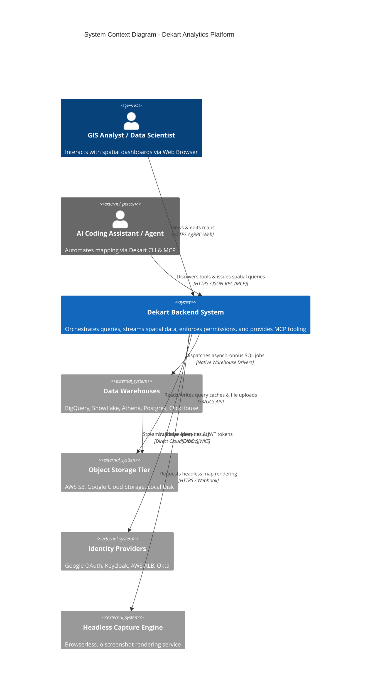

### 3.2 C4 Level 2: Container & Subsystem Decomposition

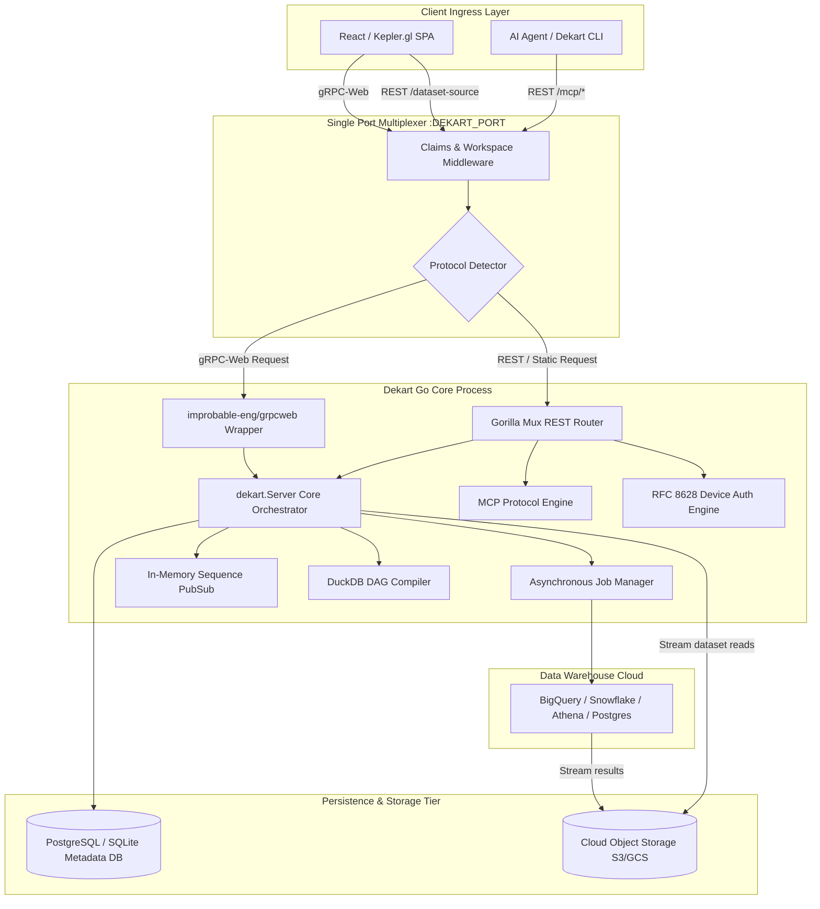

### 3.3 Subsystem Breakdown

#### Subsystem 1: Process Ingress & Multiplexer ([`src/server/app/app.go`](file:///tern/dekart/src/server/app/app.go#L308-L347))
- **Responsibilities:** Binds the single network port, validates CORS origins, extracts security context, and dispatches requests.
- **Key Mechanics:**
  - Extracts identity claims via [`claimsCheck.GetContext(r)`](file:///tern/dekart/src/server/user/claims.go#L279).
  - Resolves workspace context, active subscriptions, and license flags via [`dekartServer.SetWorkspaceContext`](file:///tern/dekart/src/server/dekart/workspace.go#L487).
  - Routes traffic to the gRPC-Web wrapper if [`grpcServer.IsAcceptableGrpcCorsRequest(r) || grpcServer.IsGrpcWebRequest(r)`](file:///tern/dekart/src/server/app/app.go#L337), or falls through to Gorilla Mux.

#### Subsystem 2: Core Domain Orchestrator ([`src/server/dekart/server.go`](file:///tern/dekart/src/server/dekart/server.go#L30-L70))
- **Responsibilities:** Implements gRPC contracts for reports, queries, datasets, and files.
- **Key Mechanics:**
  - Manages atomic state mutations under table-level row locks ([`lockReportTx`](file:///tern/dekart/src/server/dekart/duckdbcommand.go#L35)).
  - Enforces workspace write barriers ([`requireWorkspaceWrite`](file:///tern/dekart/src/server/dekart/server.go#L86)).
  - Triggers snapshot version history records ([`createReportSnapshotWithVersionID`](file:///tern/dekart/src/server/dekart/snapshot.go)) on state transitions.

#### Subsystem 3: Asynchronous Job Engine ([`src/server/job/job.go`](file:///tern/dekart/src/server/job/job.go#L18-L44))
- **Responsibilities:** Manages the lifecycle of long-running warehouse queries.
- **Key Mechanics:**
  - Creates immutable `query_jobs` database records with status `PENDING`.
  - Fires background workers running [`Job.Run(storageObject, connection)`](file:///tern/dekart/src/server/job/job.go#L41).
  - Listens on internal Go status channels and updates job metadata (processed bytes, row counts, duration, error messages).
  - Automatically notifies subscribers via the stream broker upon completion.

#### Subsystem 4: Decoupled Storage Pipeline ([`src/server/storage/storage.go`](file:///tern/dekart/src/server/storage/storage.go#L37-L45))
- **Responsibilities:** Provides high-throughput streaming reads and chunked multipart uploads.
- **Key Mechanics:**
  - [`ServeDatasetSource`](file:///tern/dekart/src/server/dekart/dataset.go#L425) verifies dataset access and streams bytes directly from storage to the HTTP response writer.
  - Generates immutable HTTP cache headers (`Cache-Control: public, max-age=31536000, immutable`).
  - Supports multipart upload sessions with part validation and abort cleanup ([`fileuploadsession.go`](file:///tern/dekart/src/server/dekart/fileuploadsession.go)).

#### Subsystem 5: DuckDB Hybrid Compiler ([`duckdbcommand.go`](file:///tern/dekart/src/server/dekart/duckdbcommand.go), [`duckdbprepare.go`](file:///tern/dekart/src/server/dekart/duckdbprepare.go))
- **Responsibilities:** Enables cross-dataset joins and local analytics.
- **Key Mechanics:**
  - Analyzes SQL queries referencing `datasets.<dataset_name>`.
  - Performs DAG dependency analysis and cycle detection ([`prerequisiteDuckDBQueries`](file:///tern/dekart/src/server/dekart/duckdbprepare.go#L69)).
  - Generates an ordered plan of SQL statements ([`lowerDuckDBExecution`](file:///tern/dekart/src/server/dekart/duckdbprepare.go#L371)) for execution in client-side DuckDB-Wasm or CLI environments.

#### Subsystem 6: Real-Time Stream Broker ([`src/server/report/report.go`](file:///tern/dekart/src/server/report/report.go#L9-L30))
- **Responsibilities:** Coordinates real-time UI state reconciliation without WebSockets.
- **Key Mechanics:**
  - Maintains in-memory channels indexed by `reportID` and monotonic sequence numbers.
  - Implements sequence comparison: sends state immediately if the server sequence is ahead; otherwise holds the connection until an event triggers [`Streams.Ping(reportID)`](file:///tern/dekart/src/server/report/report.go#L82).

---

## 4. The Model Context Protocol (MCP) Server

### 4.1 Subsystem Overview & Agent Positioning
The MCP server in Dekart acts as an AI interface bridge. It allows autonomous agents (such as Claude Desktop, Cursor, Antigravity, or custom LLM workers) to discover available cartographic capabilities, execute spatial queries, upload files, and update Kepler visual parameters via standard JSON-RPC HTTP calls.

```mermaid
graph TD
    subgraph AgentEnvironment[Autonomous Agent Environment]
        LLM[Large Language Model]
        MCPClient[MCP Client Runtime]
    end

    subgraph DekartMCPSubsystem[Dekart MCP Subsystem]
        ToolsEndpoint[GET /api/v1/mcp/tools]
        CallEndpoint[POST /api/v1/mcp/call]
        
        Reflector[Protobuf-to-JSONSchema Reflector]
        Normalizer[Input Schema Normalizer]
        Validator[Kepler MapConfig Semantic Validator]
        Dispatcher[callMCPTool Dispatch Router]
    end

    subgraph ExecutionCore[Dekart Core Engine]
        ReportMgr[Report Manager]
        QueryMgr[Query & DuckDB Manager]
        UploadMgr[Multipart Upload Pipeline]
    end

    LLM -->|1. Requests Tool Catalog| MCPClient
    MCPClient -->|GET /api/v1/mcp/tools| ToolsEndpoint
    ToolsEndpoint --> Reflector
    Reflector --> Normalizer
    Normalizer -->> MCPClient

    LLM -->|2. Invokes Tool with JSON Args| MCPClient
    MCPClient -->|POST /api/v1/mcp/call| CallEndpoint
    CallEndpoint --> Dispatcher
    
    Dispatcher -->|If update_report_map_config| Validator
    Validator -->|Validation OK| ReportMgr
    Validator -->|Validation Failed| CallEndpoint

    Dispatcher -->|Query Tools| QueryMgr
    Dispatcher -->|Upload Tools| UploadMgr
```

### 4.2 Dynamic Schema Generation Pipeline ([`mcpschema/schema.go`](file:///tern/dekart/src/server/mcpschema/schema.go#L10-L23))
Rather than maintaining brittle, out-of-sync JSON schema files, Dekart dynamically inspects Protobuf message descriptors at server startup:

```
[Protobuf Request Definition]
          │
          ▼
[protoreflect.MessageDescriptor]
          │
          ▼
[mcpschema.ForProto(message, required)]
          │  Recursively transforms:
          │  - string, bool, integer, number
          │  - enums -> JSON string enums
          │  - nested messages -> JSON sub-objects
          │  - repeated fields -> JSON arrays
          ▼
[mcpschema.NormalizeInputSchema]
          │  Enforces:
          │  - type: "object"
          │  - additionalProperties: false
          │  - unique, sorted required field array
          ▼
[mcpschema.MinimalExampleInput]
          │  Synthesizes minimal valid example payload
          ▼
[Exposed to AI via GET /api/v1/mcp/tools]
```

### 4.3 MCP Tool Registry & Dispatch Architecture

The tool registry defines 20 discrete tools categorized into five operational domains:

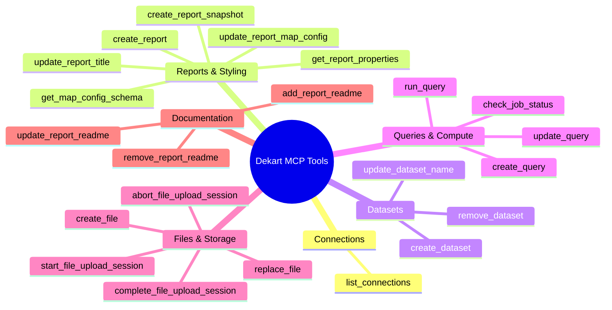

### 4.4 Semantic Map Config Validation Engine ([`mapconfigvalidation.go`](file:///tern/dekart/src/server/dekart/mapconfigvalidation.go#L53-L68))
When an agent calls `update_report_map_config`, the payload undergoes strict two-stage verification:
1. **Syntactic JSON-Schema Evaluation:** The payload is verified against [`kepler_map_config_v1.schema.json`](file:///tern/dekart/src/server/dekart/kepler_map_config_v1.schema.json) using `github.com/santhosh-tekuri/jsonschema/v5`.
2. **Referential Dataset Binding Verification:** The validator inspects all declared visual layers (`visState.layers[*].config.dataId`) and verifies that every `dataId` matches an existing, verified `dataset_id` belonging to the target report.
3. **Structured Self-Correction Feedback:** If invalid, the endpoint responds with HTTP 400 and an [`mcpValidationErrorResponse`](file:///tern/dekart/src/server/dekart/mcp.go#L55) containing:
   - `path`: Exact JSONPath of the violating property.
   - `reason`: Explanation of failure (e.g., `invalid_dataset_binding`, `unknown_layer_type`).
   - `expected` / `actual`: Comparison allowing the LLM to modify its arguments and retry immediately.

---

## 5. Security, Identity & Headless Device Flow

### 5.1 Multi-Provider Authentication Topology

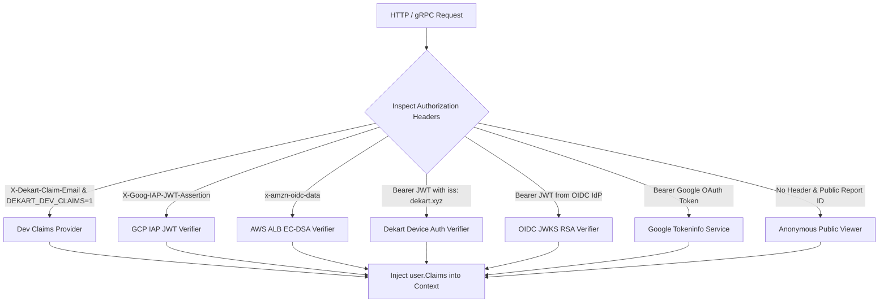

### 5.2 The RFC 8628 Headless Device Authorization Flow
To support automated CLI and MCP workflows where the agent has no interactive browser, Dekart implements an RFC 8628 device authorization protocol backed by an append-only event log table (`device_auth_log`):

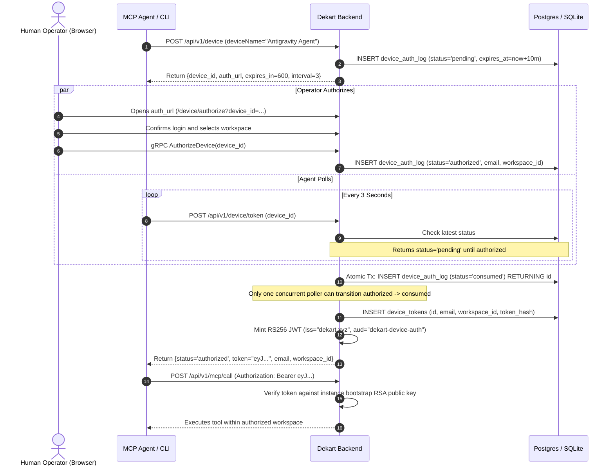

### 5.3 Cryptographic Key Hierarchy & Secret Protection
Dekart implements a two-tier encryption hierarchy to secure warehouse credentials:

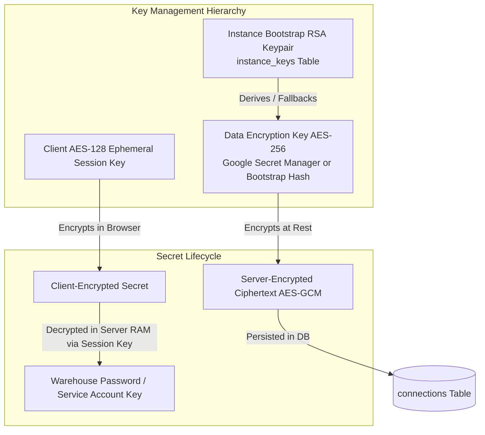

---

## 6. Detailed Component Interaction Flows

### 6.1 End-to-End Report & Query Execution Lifecycle

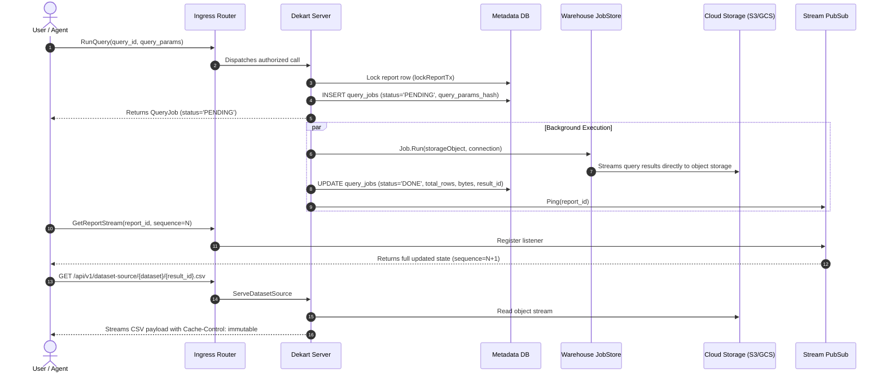

### 6.2 Multipart Chunked File Upload Workflow

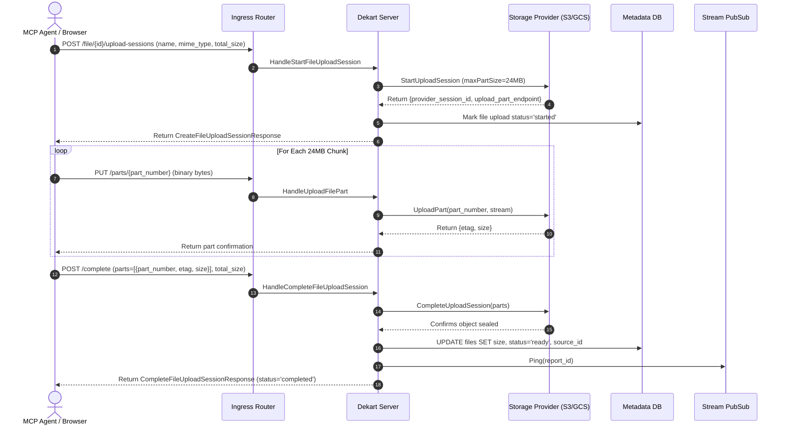

---

## 7. Data Architecture & Storage Model

### 7.1 Relational Entity-Relationship Diagram (PostgreSQL / SQLite)

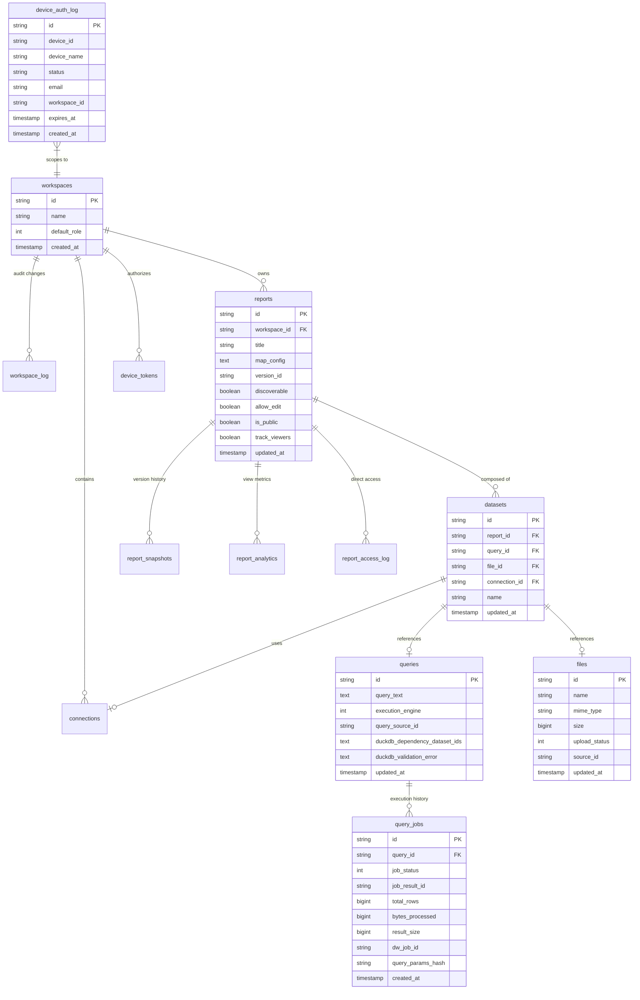

### 7.2 Append-Only State Log Pattern
Critical state transitions (device authorization, workspace memberships, and report access levels) utilize an **append-only event log design** rather than in-place mutation:
- Every status update inserts a new immutable log record.
- Current state is resolved by selecting the latest record (`ORDER BY created_at DESC LIMIT 1`).
- Eliminates concurrency race conditions, simplifies auditing, and supports deterministic replay.

### 7.3 Decoupled Storage Hierarchy & URI Scheme
Query results and uploaded assets are organized systematically within object storage:

```
s3://<DEKART_CLOUD_STORAGE_BUCKET>/
├── {query_result_id}.csv           <-- Compressed tabular results from warehouse jobs
├── {query_result_id}.parquet       <-- Parquet-formatted query results
├── {file_source_id}.csv            <-- User-uploaded CSV datasets
├── {file_source_id}.geojson        <-- User-uploaded GeoJSON geometries
└── snapshots/
    └── {report_id}/
        └── {version_id}.png        <-- Browserless headless screenshot previews
```

---

### 7.4 FinOps & Unit Economics (Cost Architecture)

#### 7.4.1 Infrastructure Sizing & Monthly Cost Projections
Dekart’s decoupled architecture separates lightweight metadata operations from heavy spatial analytics. The following baseline estimates model a mid-sized enterprise deployment (~1,000 Monthly Active Users, 50,000 warehouse query runs/month, 1 TB active spatial dataset storage) deployed on AWS:

| Infrastructure Tier | Sizing / Provisioned Units | Unit Cost Basis | Projected Monthly Cost |
| :--- | :--- | :--- | :--- |
| **Dekart Go Backend** | 2x AWS ECS Fargate Tasks (1 vCPU, 2 GB RAM, Multi-AZ) | $0.04048 / vCPU-hr + $0.004445 / GB-hr | ~$36.00 / month |
| **Metadata Database** | AWS RDS PostgreSQL (`db.t4g.small`, Multi-AZ, 50 GB gp3 SSD) | ~$0.068 / hr instance + $0.23 / GB-month storage | ~$61.00 / month |
| **Object Storage (S3)** | AWS S3 Standard (1 TB active query caches + uploaded files) | $0.023 / GB-month (with 30-day lifecycle expiry) | ~$23.00 / month |
| **Ingress & Load Balancer**| AWS Application Load Balancer (ALB, 15 LCU usage) | $0.0225 / ALB-hr + $0.008 / LCU-hr | ~$25.00 / month |
| **Total Baseline Spend** | **Production-Ready Multi-AZ Enterprise Deployment** | **Stateless compute + decoupled storage** | **~$145.00 / month** |

*(Note: For single-node evaluation or local developer deployments, replacing RDS with the embedded SQLite engine on a persistent EBS volume drops the infrastructure footprint to ~$25/month).*

#### 7.4.2 Egress & Bandwidth Cost Mitigation
Uncached spatial query results (GeoJSON/CSV) routinely average 10–50 MB per layer. Serving 50,000 dashboard views directly from origin object storage without caching would generate 1–2.5 TB of cloud internet egress ($90–$225/month in AWS data transfer out).

Dekart eliminates this egress overhead via two mechanisms:
1. **Immutable Edge Caching:** In [`ServeDatasetSource`](file:///tern/dekart/src/server/dekart/dataset.go#L425), responses are emitted with `Cache-Control: public, max-age=31536000, immutable` alongside deterministic SHA-256 ETag verification.
2. **CDN Offloading:** When deployed behind Cloudflare (free/Pro tier) or AWS CloudFront, repeated dashboard requests and collaborative agent interactions are satisfied directly from regional edge caches. Origin egress is reduced by $> 92\%$, slashing monthly egress costs to $< \$10/\text{month}$.

#### 7.4.3 Third-Party Warehouse Credit & Compute Spend Protection
Data warehouse compute (BigQuery slots, Snowflake credits, Athena scanned bytes) represents the largest potential expenditure for spatial BI. Dekart protects against runaway costs via:
- **Dry-Run Validation:** SQL queries are passed through warehouse dry-run APIs before execution, rejecting syntax errors or schema mismatches before spinning up warehouse clusters or incurring per-TB BigQuery scan charges.
- **Query Result De-duplication:** Repeated queries matching existing SQL text and parameters in `query_jobs` reuse cached `job_result_id` pointers, preventing redundant compute credit consumption across collaborating users.
- **Client-Side DuckDB Offloading:** Secondary analytical transformations (joins, filtering, spatial aggregations across existing datasets) are executed locally via DuckDB-Wasm in the browser or via agent sandboxes ([`duckdbcommand.go`](file:///tern/dekart/src/server/dekart/duckdbcommand.go)), avoiding secondary warehouse compute round-trips.

---

### 7.5 Data Governance, Privacy & Compliance (GDPR/SOC2)

#### 7.5.1 Enterprise Data Classification Matrix

| Classification Level | Entities & Data Types | Storage Location | Retention Schedule | Access Controls & Encryption |
| :--- | :--- | :--- | :--- | :--- |
| **Public** | Published report configurations, public map preview snapshots, vector styling rules. | PostgreSQL (`reports`), Object Storage (`snapshots/`). | Indefinite until report unpublished or archived. | Anonymous read; author-only write. |
| **Internal** | Workspace metadata, user display names, dataset names, query definitions. | PostgreSQL (`workspaces`, `reports`, `datasets`, `queries`). | Lifetime of active workspace. | Workspace RBAC (Reader/Writer/Admin) verified via [`user.GetClaims`](file:///tern/dekart/src/server/user/claims.go#L279). |
| **Confidential** | Tabular query results (CSV/Parquet), user-uploaded spatial files (GeoJSON/KML). | Decoupled Object Storage (`s3://.../{result_id}.csv`, `{file_source_id}.csv`). | 30-day default TTL; configurable bucket lifecycle. | Workspace token validation on `/dataset-source/{dataset}/{result_id}.csv`. |
| **Restricted (PII / Secrets)** | User email addresses, OAuth refresh tokens, warehouse passwords, private keys. | PostgreSQL (`connections` encrypted via AES-GCM, `device_tokens`, `device_auth_log`). | 10-minute TTL for pending device auth; tokens purged on user deletion. | AES-256 GCM encryption at rest; strict stripping from all API and MCP outputs. |

#### 7.5.2 Data Residency & Regional Sovereignty
- Dekart enforces multi-region deployment flexibility: backend compute containers, metadata databases, and cloud storage buckets can be isolated entirely within designated sovereign jurisdictions (e.g., AWS `eu-central-1` Frankfurt or GCP `europe-west3`) to satisfy EU GDPR, BDSG, and HIPAA data residency mandates.
- All storage paths and database endpoints are injected via regional environment variables (`DEKART_CLOUD_STORAGE_BUCKET`, `DEKART_POSTGRES_HOST`), ensuring zero cross-border replication or unencrypted transit.

#### 7.5.3 GDPR Deletion Cascades & Right-to-be-Forgotten (Art. 17)
Dekart satisfies GDPR Article 17 "Right to Erasure" requirements through coordinated database cascades and asynchronous storage cleanup:

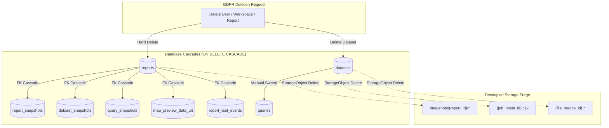

1. **Relational Cascade Invariants:** Foreign key constraints with `ON DELETE CASCADE` in [`migrations/000040_create_version_snapshots.up.sql`](file:///tern/dekart/migrations/000040_create_version_snapshots.up.sql#L24) and [`migrations/000041_add_map_preview_data_uri.up.sql`](file:///tern/dekart/migrations/000041_add_map_preview_data_uri.up.sql#L9) ensure that deleting a report automatically purges child rows in `report_snapshots`, `dataset_snapshots`, `query_snapshots`, `map_preview_data_uri`, and `report_visit_events`.
2. **Decoupled Storage Cleanup:** Permanent entity deletion invokes [`StorageObject.Delete(ctx)`](file:///tern/dekart/src/server/storage/storage.go#L29) across S3/GCS providers, eradicating cached query result CSVs and map preview images. Automated S3/GCS lifecycle rules provide secondary safety by pruning untracked temporary upload parts and expired query caches after 30 days.
3. **Identity & Credential Revocation:** When an account is removed, all active tokens in `device_tokens` are deleted, invalidating active agent sessions immediately. Historic authorization events in `device_auth_log` can be anonymized via standard GDPR database erasure routines.

---

## 8. Operational Excellence, Day-2 Operations & Resilience

### 8.1 Reliability & High Availability
- **Stateless Backend Nodes:** Dekart instances maintain zero conversational session state in memory. Long-polling connections can be served interchangeably by any instance behind an ALB/NLB.
- **Database Connection Pooling:** Configured with conservative limits ([`db.SetMaxOpenConns(3)`](file:///tern/dekart/src/server/main.go#L120)) to prevent connection exhaustion against shared database clusters.
- **Singleflight De-Duplication:** Concurrent OAuth token exchanges and metadata lookups are de-duplicated via `golang.org/x/sync/singleflight` ([`oauthExchangeGroup`](file:///tern/dekart/src/server/user/claims.go#L571)).

### 8.2 Latency & Performance Engineering
- **Immutable Edge Caching:** Stored query results and files include explicit cache headers (`Cache-Control: public, max-age=31536000, immutable`), offloading data egress bandwidth to Cloudflare/CloudFront.
- **Direct-to-Storage Streaming:** The backend avoids reading complete file payloads into RAM; data is streamed directly using Go `io.Copy` chunks between storage readers and HTTP response writers.
- **Dry-Run Validation:** SQL queries are validated using warehouse dry-run APIs without incurring query execution costs or waiting for warehouse spin-up.

### 8.3 Observability, Telemetry & Logging
- **Structured Logging:** Powered by `zerolog` with structured fields (`queryID`, `connectionType`, `workspaceID`, `email`).
- **Telemetry Protection:** CI and test runs are masked with static telemetry identifiers (`CITelemetryID`) to avoid polluting production usage metrics.
- **Health Check Ingress:** Dedicated lightweight endpoint `GET /health` responding with HTTP 200 OK for Kubernetes liveness and readiness probes.

### 8.4 Service Level Objectives (SLOs/SLIs) & Alerting Runbook Matrix

#### 8.4.1 Core SLO/SLI Commitments

| Service Level Indicator (SLI) | Target (SLO) | Measurement Window | Error Budget | Monitoring Metric / Telemetry Source |
| :--- | :--- | :--- | :--- | :--- |
| **Service Availability** | $\ge 99.9\%$ | Rolling 30 calendar days | 43.8 minutes downtime | Ratio of non-5xx HTTP responses to total requests on `/health`, `/api/v1/*`. |
| **Synchronous API Latency** | p95 $< 250\text{ ms}$, p99 $< 500\text{ ms}$ | 5-minute rolling window | $5\%$ of requests | Request duration timer in [`src/server/app/app.go`](file:///tern/dekart/src/server/app/app.go) for metadata operations (`GetReport`, `UpdateReportTitle`). |
| **Stream Hold Notification Delivery** | p99 $< 500\text{ ms}$ | 5-minute rolling window | $1\%$ of pings | Elapsed time between [`Streams.Ping()`](file:///tern/dekart/src/server/report/report.go#L82) invocation and client response flush. |
| **File Upload Part Latency** | p95 $< 1000\text{ ms}$ (24 MB part) | 5-minute rolling window | $5\%$ of parts | Chunk transit time in [`HandleUploadFilePart`](file:///tern/dekart/src/server/dekart/fileuploadsession.go). |

#### 8.4.2 Alerting & On-Call Runbook Matrix

| Alert Identifier | Severity | Threshold Condition | Potential Root Cause | On-Call Mitigation Runbook |
| :--- | :--- | :--- | :--- | :--- |
| `DekartHigh5xxRate` | **P1 (Critical)** | HTTP 5xx errors $> 2\%$ over 5 minutes | Database pool exhaustion, unreachable object storage, or expired TLS certs. | 1. Check `GET /health` status.<br/>2. Inspect `zerolog` error logs for `connection refused` or S3 credential failures.<br/>3. Verify PostgreSQL connectivity.<br/>4. Restart failing backend replicas if memory leak suspected. |
| `DBConnPoolSaturation` | **P2 (Major)** | Active DB connections $\ge 3$ for $> 3\text{ minutes}$ | Hung table-level locks in [`lockReportTx`](file:///tern/dekart/src/server/dekart/duckdbcommand.go#L35) or slow migration queries. | 1. Query PostgreSQL `pg_stat_activity` for active long-running locks.<br/>2. Terminate blocking backend PID.<br/>3. Verify database CPU and disk IOPS. |
| `StorageUploadErrors` | **P2 (Major)** | Part upload errors $> 5\%$ over 10 minutes | AWS S3/GCS IAM permission revocation, network throttling, or bucket quota exceeded. | 1. Inspect IAM instance role / service account token validity.<br/>2. Verify cloud storage quota and network egress routes.<br/>3. Check [`s.storage.UploadPart`](file:///tern/dekart/src/server/dekart/fileuploadsession.go) log entries. |
| `DeviceAuthSpike` | **P3 (Warning)** | Polling requests on `/device/token` $> 200\text{ RPS}$ | Agent runaway retry loop failing to observe the 3-second polling interval. | 1. Inspect user agents and client IP headers.<br/>2. Verify rate limiter configuration on `/api/v1/device/token`.<br/>3. Check `device_auth_log` index performance. |

### 8.5 Zero-Downtime Deployment, Expand/Contract Migrations & Rollback

#### 8.5.1 Deployment Topology & Health Probe Verification
Dekart backend containers are stateless Go binaries packaged as minimal OCI container images. Deployments in Kubernetes utilize RollingUpdate strategies with zero allowed unavailability (`maxSurge: 25%`, `maxUnavailable: 0%`).
- Ingress controllers (ALB, Nginx Ingress, Traefik) direct traffic to new pods only after the `GET /health` endpoint responds with HTTP 200 OK.
- Active long-polling clients automatically reconnect to remaining or newly provisioned pods upon connection recycling, maintaining uninterrupted real-time map updates.

#### 8.5.2 Database Expand/Contract Migration Methodology
Dekart manages schema migrations using `golang-migrate` executed on process startup via [`applyMigrations`](file:///tern/dekart/src/server/main.go#L124) against [`migrations/`](file:///tern/dekart/migrations) (PostgreSQL) or `sqlite/migrations` (SQLite). To ensure zero downtime during schema updates, all changes strictly follow the **Expand/Contract** design pattern:

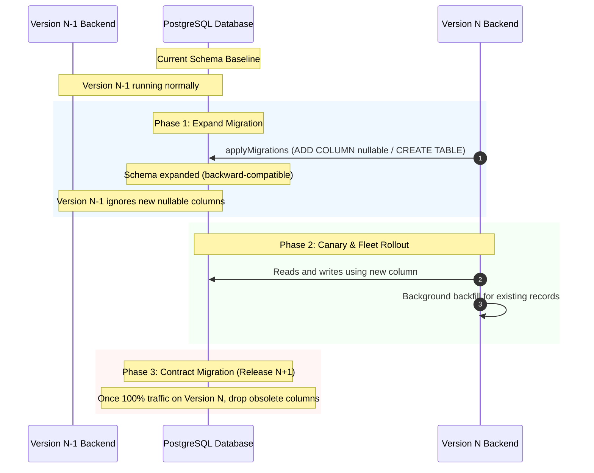

1. **Phase 1 (Expand - Pre-Deployment):** New columns are introduced strictly as `NULLABLE` or with non-blocking defaults (e.g., [`000049_report_visit_events.up.sql`](file:///tern/dekart/migrations/000049_report_visit_events.up.sql)). The running N-1 application fleet continues uninterrupted.
2. **Phase 2 (Release & Backfill):** The new version N container fleet is deployed. Version N reads from and writes to the expanded schema. If necessary, asynchronous background scripts backfill legacy rows.
3. **Phase 3 (Contract - Post-Deployment):** In a subsequent maintenance release (N+1) after the legacy version is completely retired, deprecated columns or tables are safely removed.

#### 8.5.3 Rollback Invariants & Blast-Radius Mitigation
Because database migrations in the Expand phase are strictly backward-compatible, rolling back application code from version N to N-1 requires zero emergency database schema rollbacks in the critical path.
- If a deployment canary triggers elevated 5xx error alerts, the ingress load balancer immediately diverts 100% of user traffic back to the stable blue fleet within 10 seconds.
- In-flight warehouse query jobs continue running asynchronously in cloud warehouses; their output pointers remain valid and recoverable upon instance restart.

### 8.6 Disaster Recovery, Persistence Invariants & Graceful Drain
- **Recovery Point Objective (RPO) & Recovery Time Objective (RTO)**:
  - **Enterprise PostgreSQL Cluster:** RPO $< 1\text{ minute}$ via synchronous WAL replication; RTO $< 5\text{ minutes}$ via automated Multi-AZ database failover.
  - **Embedded SQLite Deployment:** RPO $< 1\text{ hour}$ via continuous background streaming snapshots to cloud storage ([`startBackups`](file:///tern/dekart/src/server/dekart/backup.go#L350)); RTO $< 30\text{ seconds}$ via cold-start auto-restoration ([`RestoreDbFile`](file:///tern/dekart/src/server/dekart/backup.go#L30)).
- **Graceful Shutdown & Drain Invariants**:
  - The server traps `SIGINT` and `SIGTERM` signals ([`waitForInterrupt`](file:///tern/dekart/src/server/main.go#L247)).
  - A 5-second graceful shutdown context ([`main.go:291`](file:///tern/dekart/src/server/main.go#L291)) coordinates the drain:
    1. Stops the HTTP listener (`httpServer.Shutdown`) to reject incoming connections and release edge load balancers.
    2. Flushes and terminates active sequence stream channels via [`dekartServer.Shutdown(shutdownCtx)`](file:///tern/dekart/src/server/dekart/server.go).
    3. Allows active in-flight database transactions to commit or rollback cleanly before invoking [`db.Close()`](file:///tern/dekart/src/server/main.go#L265).

---

## 9. Technical Debt & Evolution Roadmap

### 9.1 Architectural Dispensations & Known Bottlenecks
1. **In-Memory Stream Broker Scope:** The current [`report.Streams`](file:///tern/dekart/src/server/report/report.go#L9) pub/sub broker operates in-memory. In multi-replica deployments without sticky sessions, cross-instance ping broadcasting requires an external message bus (e.g., Redis Pub/Sub or Postgres `LISTEN/NOTIFY`).
2. **Browser-Bound Kepler Memory Ceilings:** Very large datasets ($> 500\text{k}$ complex polygons) can cause WebGL context memory pressure in low-spec client machines.

### 9.2 Evolutionary Roadmap
- **Phase 1: Distributed Stream Bus:** Replace in-memory stream channels with Postgres `LISTEN/NOTIFY` to achieve seamless horizontal scaling across stateless Kubernetes pods.
- **Phase 2: PMTiles Serverless Vector Tiling:** Add an optional pipeline to convert multi-gigabyte warehouse results into PMTiles archives for HTTP range-based pyramid streaming.
- **Phase 3: Expanded MCP Tool Calling:** Equip the MCP server with spatial analysis tools (e.g., spatial buffers, Delaunay triangulation, convex hulls) compiled into WebAssembly.
