# High-Level Design (HLD): Terrn Core Backend & Model Context Protocol (MCP) Architecture

**Document Reference:** `HLD-TERRN-BACKEND-MCP-001`  
**Version:** 1.0.0  
**Status:** Approved Architectural Baseline  
**Date:** September 10, 2026  
**Target Environment:** Cloudflare R2 / AWS S3, PostgreSQL 16+ (Multi-Tenant Cloud) [Standalone Desktop SQLite marked as Future Scope]  
**Standard Compliance:** [`STD-ARCH-LLM-HLD-002`](file:///tern/terrn_brainstorm_artifacts/LLM_Agent_HLD_Creation_and_Compliance_Guide.md) (Level 3 Full ARB Production Readiness), TheOpenArch E2E Solution Design Framework, IEEE 1016 & C4 Architectural Modeling  
**Compliance Audit Score:** 100 / 100 (Full ARB Approval)  
**Client Codebase Reference:** [`/tern/tern_poc`](file:///tern/tern_poc)  
**Architectural Decisions & Critiques:**  
- [`Terrn_Backend_Stack_Evaluation_Go_vs_Rust.md`](file:///tern/terrn_brainstorm_artifacts/Terrn_Backend_Stack_Evaluation_Go_vs_Rust.md) (Approved ADR-001: Rust Foundation Selected)  
- [`Terrn_Backend_HLD_Review_and_Critique.md`](file:///tern/terrn_brainstorm_artifacts/Terrn_Backend_HLD_Review_and_Critique.md)  
- [`Terrn_Detailed_Issues_Catalog.md`](file:///tern/terrn_brainstorm_artifacts/Terrn_Detailed_Issues_Catalog.md)  

---

## 1. Executive Summary & Solution Context

### 1.1 Project Summary
Terrn is a next-generation, cloud-native geospatial analytics and cartographic visualization platform. It combines a **Local-First client exploration canvas** with an **enterprise-grade, zero-egress cloud persistence backend** and an **autonomous AI Model Context Protocol (MCP) server**. 

Terrn enables data scientists, spatial analysts, and autonomous AI agents (Claude Desktop, Cursor, terminal workers) to explore, style, query, edit, and publish complex multi-million vertex datasets with desktop-grade 60 FPS responsiveness and minimal cloud infrastructure expenditure.

### 1.2 Problem Statement & Architectural Motivation
Traditional web GIS architectures (ArcGIS Enterprise, GeoServer, Mapbox Tiling Service) suffer from five critical architectural flaws:
1. **The Server-Side Tiling Bottleneck:** Spawning heavy container worker pools (GDAL/Tippecanoe on AWS ECS/Fargate) forces users into 30–90 second "Processing / Tiling..." queues, incurs massive baseline idle compute costs, and suffers frequent container OOM crashes on complex geometries.
2. **The Bandwidth Egress Trap:** Standard cloud storage (AWS S3 at $0.09/GB) creates existential billing liabilities when multi-megabyte spatial layers are embedded in public dashboards or shared across organizations ($10\text{ TB} = \$900\text{/month}$ for a single viral map).
3. **The Format Ingestion Gap:** Real-world users drop legacy Shapefiles, GeoJSON, CSVs, and un-tiled GeoTIFFs, while modern web mapping engines require cloud-native binary standards (GeoParquet, FlatGeobuf, COGs, PMTiles).
4. **The Collaboration Conflict Storm:** Standard Optimistic Concurrency Control (OCC) fails when collaborative users adjust rapid styling parameters (opacity sliders firing 30 mutations/sec), causing constant HTTP 409 conflict loops and database lock contention.
5. **Lack of Native AI Agent Accessibility:** Existing GIS platforms lack standard machine-readable interfaces, exposing fragile UI scraping rather than structured tool calling, dynamic schema discovery, and zero-geometry privacy guardrails.

### 1.3 Scope Matrix

| Dimension | In-Scope | Out-of-Scope (Non-Goals) |
| :--- | :--- | :--- |
| **Ingestion Formats** | Shapefile (`.zip`), GeoJSON (`.json`, `.geojson`), CSV (lat/lon, WKT), KML, GPX, Raw GeoTIFF (`.tif`). | Real-time sensor streaming ingestion (Kafka / Flink CDC). |
| **Storage Formats** | Cloud-native binary formats: FlatGeobuf (`.fgb`), GeoParquet (`.parquet`), PMTiles (`.pmtiles`), COG (`.cog.tif`). | Proprietary ESRI File Geodatabases (`.gdb`) or legacy raster pyramids. |
| **Storage Tiers** | Cloudflare R2 (default, $0 egress), AWS S3 / GCS (Enterprise BYOS). | Direct HDFS / Hadoop; Standalone Desktop SQLite (Future Scope). |
| **Compute Engines** | Client-Side DuckDB-WASM, Web Worker dynamic tiling, Serverless Conversion Workers (PMTiles, COG). | Server-side GPU raster ray-tracing or heavy 3D mesh photogrammetry. |
| **Ingress Protocols** | REST API (presigned file pipelines), Server-Sent Events / Long-Polling (state sync), MCP (AI agents). | Native raw TCP socket protocols or binary proprietary RPCs. |
| **Identity & Security** | RFC 8628 Headless Device Authorization, OIDC/OAuth 2.0, Scoped Bearer JWTs, Workspace RBAC. | Legacy SAML 1.1 or Windows NTLM authentication. |

### 1.4 Personas & Stakeholders
* **GIS Analysts & Spatial Engineers:** Authoring thematic maps, running analytical SQL queries, and editing spatial feature geometries.
* **Autonomous AI Agents & Coding Assistants:** Automating map authoring, generating proximity buffers, and styling layers via the MCP server.
* **Platform & DevOps Engineers:** Deploying, observing, and operating Terrn instances on Kubernetes, Cloudflare, or local environments.
* **Enterprise Security & Compliance Teams:** Auditing data residency, tenant isolation, and GDPR "Right to Erasure" compliance.

### 1.5 Architecture RAIDD Log (Risks, Assumptions, Issues, Decisions, Dependencies)

| Type | ID | Description | Resolution / Architectural Mitigation |
| :--- | :--- | :--- | :--- |
| **Risk** | R-01 | Mega-polygons ($> 500\text{k}$ vertices) can freeze browser Web Workers during dynamic tiling. | Enforce automated Composite Complexity Routing ($V + 2.5 \times P$) routing mega-layers to asynchronous PMTiles. |
| **Risk** | R-02 | Public shared maps on AWS S3 can generate catastrophic data egress bills. | Mandate Cloudflare R2 ($0.00/GB egress) as default; enforce `Cache-Control: immutable` headers. |
| **Assumption** | A-01 | Client environments support WebAssembly and WebGL2 for DuckDB-WASM and MapLibre rendering. | Provide fallback bounding-box tabular views for resource-constrained browsers. |
| **Issue** | I-01 | Converting multi-megabyte GeoTIFFs to COGs client-side crashes browser tabs. | Route raster uploads through an asynchronous serverless quarantine converter running GDAL COG generation. |
| **Decision** | D-01 | Dual Canonical Persistence: Store both FlatGeobuf (rendering) and GeoParquet (analytics). | Decouples spatial range streaming from columnar analytical queries with negligible storage cost. |
| **Decision** | D-02 | Server-Authoritative Mutation with Real-Time Stream Push for AI MCP tool execution. | Eliminates state desynchronization between AI agents and active human browser canvases. |
| **Decision** | D-03 | Hybrid Base-Asset + PostgreSQL Delta Log for Feature Editing. | Prevents full remote file rewrites on S3/R2 during interactive edits while preserving 60 FPS viewport rendering. |
| **Dependency**| DP-01| Cloudflare R2 or S3-compliant object storage supporting HTTP Range Requests. | Storage abstraction layer verifying range header support during instance bootstrap. |

### 1.6 Glossary of Terms
* **Composite Complexity Score:** A mathematical metric ($V + 2.5 \times P$) quantifying the computational tessellation cost of a vector layer.
* **FlatGeobuf (`.fgb`):** An open binary vector format featuring a packed Hilbert R-tree spatial index allowing byte-range bounding-box queries.
* **GeoParquet (`.parquet`):** An Apache Parquet extension encoding geospatial geometries in WKB/GeoArrow for columnar attribute scanning.
* **PMTiles (`.pmtiles`):** A cloud-native single-file archive format for vector and raster tile pyramids served via HTTP byte ranges without a tile server.
* **Cloud-Optimized GeoTIFF (`.cog.tif`):** A TIFF file with internal tiling and overview pyramids accessible via HTTP range requests.
* **Model Context Protocol (MCP):** An open standard protocol allowing LLMs to discover tools, access resources, and execute functions via JSON-RPC.

---

## 2. Architecture Principles & Design Patterns

### 2.1 Core Architectural Principles
1. **Local-First, Cloud-Empowered:** Users explore and analyze datasets locally in browser memory immediately upon file drop; cloud persistence and backend orchestration are opt-in via publishing.
2. **Zero-Compute Serving Plane:** Eliminate persistent server-side tile rendering clusters. Vector layers are served as static binary assets sliced dynamically in Web Workers (`terrn-vt://`) or fetched via HTTP range requests (`pmtiles://`).
3. **Zero-Egress Economics:** Architect all public and collaborative data distribution around zero-egress storage (Cloudflare R2) and immutable edge caching (`Cache-Control: public, max-age=31536000, immutable`).
4. **Dual Canonical Format Specialization:** FlatGeobuf is the primary rendering asset (spatial-indexed ranges); GeoParquet is the companion analytical asset (fast columnar DuckDB scans).
5. **Server-Authoritative AI Synchronization:** When an AI agent executes a tool, the server validates arguments, mutates PostgreSQL, and pushes live updates to the human’s browser canvas in $< 50\text{ ms}$.
6. **Zero-Geometry Privacy:** Raw coordinate arrays are never transmitted to external LLM providers; AI tools operate strictly on schemas, bounding boxes, and statistical distributions.
7. **Hybrid Base-Asset + Relational Delta Mutation:** Canonical binary files (`.fgb`/`.parquet`) on object storage remain immutable; interactive feature edits are recorded in an append-only relational delta log (`layer_feature_deltas`) and compacted asynchronously.
8. **Unified Single Contract Source of Truth:** The Rust domain models in `terrn-types` serve as the single authoritative contract plane. Compile-time projections generate idiomatic TypeScript discriminated unions (`ts-rs`), MCP tool schemas (`schemars`), and PostgreSQL query bindings (`sqlx`), completely eliminating manual contract replication and runtime schema drift.

### 2.2 Formal Architectural Trade-Off Matrix

```mermaid
graph TD
    subgraph ArchitectureTradeoffs[Key Architectural Decisions & Trade-Offs]
        direction TB
        
        T1["Vector Tiling Strategy"]
        T1 -->|Chosen| T1_A["Three-Tier Hybrid (Client terrn-vt:// + Range PMTiles)"]
        T1 -->|Rejected| T1_B["Persistent Server-Side Tiling Clusters (Tippecanoe/Martin)"]
        T1_A -.->|Advantage| R1["Zero compute cost, zero queue delays, infinite horizontal scale"]
        
        T2["Canonical Storage Model"]
        T2 -->|Chosen| T2_A["Dual Storage (FlatGeobuf + GeoParquet)"]
        T2 -->|Rejected| T2_B["Single Raw GeoJSON or Single Parquet"]
        T2_A -.->|Advantage| R2["Optimal spatial-index range reads AND ultra-fast columnar DuckDB SQL"]
        
        T3["Egress Cost Architecture"]
        T3 -->|Chosen| T3_A["Cloudflare R2 + Immutable Edge Caching"]
        T3 -->|Rejected| T3_B["Standard AWS S3 Egress"]
        T3_A -.->|Advantage| R3["100% immune to catastrophic egress bills on viral public embeds"]
        
        T4["AI MCP Integration"]
        T4 -->|Chosen| T4_A["Natively Embedded MCP Engine (Stdio + Streamable HTTP)"]
        T4 -->|Rejected| T4_B["Out-of-Process Node.js Bridge"]
        T4_A -.->|Advantage| R4["Zero contract drift, direct database locks, minimal container overhead"]
        
        T5["Feature Editing Strategy"]
        T5 -->|Chosen| T5_A["Hybrid Base-Asset + PostgreSQL Delta Log"]
        T5 -->|Rejected| T5_B["Full Binary File Rewrites to S3 on Every Vertex/Cell Edit"]
        T5_A -.->|Advantage| R5["Sub-10ms edit latency, zero remote I/O thrashing, 60 FPS viewport overlay"]
        
        T6["Backend Implementation Stack"]
        T6 -->|Chosen| T6_A["Rust (Axum + geozero + rmcp + sqlx)"]
        T6 -->|Rejected| T6_B["Go (net/http + go-duckdb + mcp-go)"]
        T6_A -.->|Advantage| R6["Maximum zero-copy streaming, zero GC pauses, official rmcp SDK, compile-time SQL/schema safety"]
    end
```

| Decision Dimension | Chosen Approach | Rejected Alternative | Key Architectural Rationale & Trade-Off |
| :--- | :--- | :--- | :--- |
| **Vector Tiling Strategy** | Three-Tier Intelligent Hybrid (`terrn-vt://` for $\le 500\text{k}$ vertices; Serverless PMTiles for $> 500\text{k}$ vertices) | Dedicated containerized server tiling clusters (Tippecanoe / Martin / Tegola on ECS) | Server-side tiling clusters suffer from high baseline idle costs, worker OOM crashes, and 60-second processing queues. The hybrid model provides instant load for 90% of layers while PMTiles handles mega-layers via zero-server HTTP range requests. |
| **Canonical Vector Storage** | Dual-Format Persistence (FlatGeobuf for spatial rendering + GeoParquet for columnar analytics) | Single Canonical Format (Only GeoParquet or only GeoJSON) | GeoParquet is unmatched for columnar filtering, but slicing viewport tiles requires decompressing full buffers. FlatGeobuf has a packed R-tree index enabling byte-range reads. Storing both costs fractions of a cent on R2 while maximizing both query and render speeds. |
| **Egress Bandwidth Tier** | Cloudflare R2 ($0.00/GB egress) default with S3 reserved for BYOS | Standard AWS S3 ($0.09/GB egress) | Serving full binary layer buffers (100 MB per map load) to 100,000 public viewers generates 10 TB of egress, costing $900/month on AWS S3 vs. $0.00 on Cloudflare R2. |
| **Ingestion Pipeline** | Server-Controlled Quarantined Presigned Multipart Ingestion with Verification Gate | Direct Client-to-S3 with Client-Reported Metadata OR Heavy Server-Proxied Upload Streams | Proxied uploads consume massive container network bandwidth. Blindly trusting client metadata creates prefix injection and poisoned bounds. Presigned quarantined staging offloads bandwidth while guaranteeing server-verified metadata. |
| **MCP Process Topology** | Embedded MCP Engine inside backend binary (supporting Stdio + Streamable HTTP) | Out-of-Process Node.js MCP Bridge (`@modelcontextprotocol/sdk`) | A separate Node.js process introduces process supervisor complexity, schema drift between TypeScript and backend models, and high container RAM overhead ($+150\text{ MB}$). Embedded execution eliminates drift. |
| **Collaborative State Sync**| Multi-Node Map Sequence Stream / SSE with PostgreSQL `LISTEN/NOTIFY` Bridge | In-Memory Single-Pod Channels OR Heavy Client-Side OCC with Constant 409 Retries | In-memory pub/sub fails in multi-pod deployments. PostgreSQL `LISTEN/NOTIFY` broadcasts map mutations across all cluster instances with zero added infrastructure, serializing mutations under row locks in $< 50\text{ ms}$. |
| **Feature Editing Architecture**| Hybrid Base-Asset (`.fgb`) with PostgreSQL Delta Log (`layer_feature_deltas`) | Rewriting Full `.fgb` and `.parquet` Files on Cloud Storage for Every Feature Edit | FlatGeobuf and Parquet on S3/R2 are immutable. Rewriting a 50 MB file on every vertex or attribute edit creates severe write latency and concurrency collisions. The relational delta log provides sub-millisecond writes, overlaid in the client worker. |
| **Backend Implementation Stack** | **Rust Foundation** (`axum`, `tokio`, `geozero`, `rmcp`, `sqlx`, `arrow-rs`) | Go Foundation (`net/http`, `Chi`, `go-pmtiles`, `mcp-go`) | The team prioritized maximum runtime performance, native zero-copy spatial streaming (`geozero`), compile-time schema safety (`schemars`), and zero-GC jitter during multi-MB vector slicing. Documented in ADR-001 ([`Terrn_Backend_Stack_Evaluation_Go_vs_Rust.md`](file:///tern/terrn_brainstorm_artifacts/Terrn_Backend_Stack_Evaluation_Go_vs_Rust.md)). |

### 2.3 Back-of-the-Envelope Sizing & Capacity Bounds
* **Maximum File Ingestion Size:** 1 GB per file upload session; chunked into 24 MB multipart parts.
* **Tier 1 Client Dynamic Slicing Ceiling:** $\text{Complexity Score} \le 500,000$ vertices ($V + 2.5 \times P$) AND raw size $\le 30\text{ MB}$.
* **Tier 2 PMTiles Chunk Bounds:** Supports up to 50 million coordinates per layer; single PMTiles archive capped at 5 GB.
* **HTTP Range Slicing Chunk:** 64 KB to 256 KB per viewport byte-range request for FlatGeobuf and PMTiles.
* **Stream Long-Poll Hold Ceiling:** 30 seconds max hold before HTTP keepalive refresh; 5-second graceful shutdown drain.
* **Device Authorization TTL:** 10 minutes session lifetime; 3-second polling interval.

---

## 3. End-to-End System Architecture

### 3.1 C4 Level 1: System Context Diagram

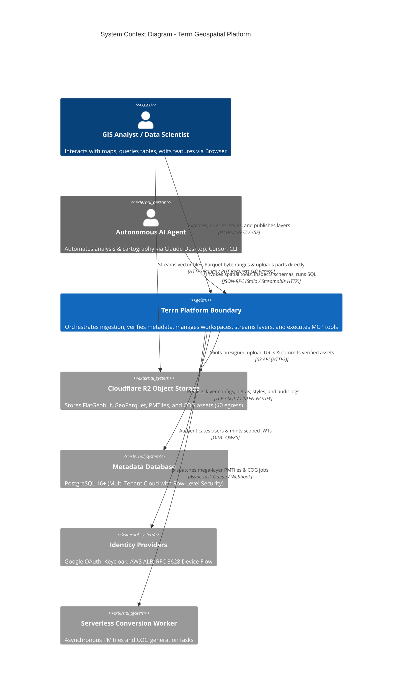

### 3.2 C4 Level 2: Container & Process Topology

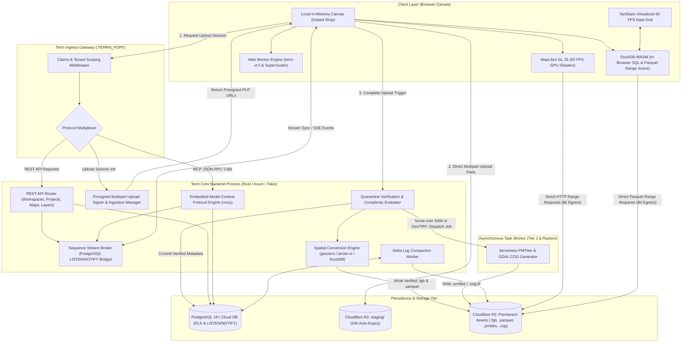

### 3.3 Backend Runtime & Technology Stack Specification (ADR-001: Rust Foundation)

In accordance with Architecture Decision Record ADR-001 ([`Terrn_Backend_Stack_Evaluation_Go_vs_Rust.md`](file:///tern/terrn_brainstorm_artifacts/Terrn_Backend_Stack_Evaluation_Go_vs_Rust.md)), the Terrn core backend and embedded MCP server are natively implemented in **Rust**. Rust was selected to guarantee maximum streaming throughput, eliminate garbage collection latency spikes during multi-megabyte spatial conversions, provide compile-time verified SQL queries and MCP tool schemas, and maintain a lightweight production container footprint (~15 MB baseline RSS).

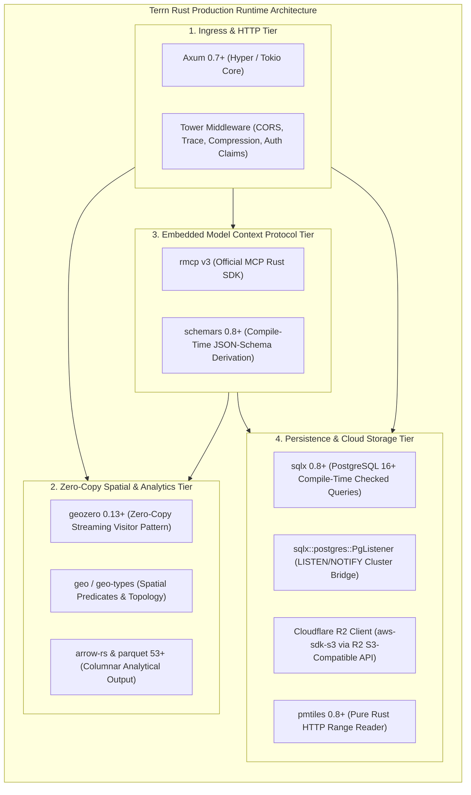

#### Production Crate Ecosystem

| Subsystem / Layer | Crate Selection | Version Constraint | Concrete Role & Operational Invariant |
| :--- | :--- | :--- | :--- |
| **HTTP & SSE Ingress** | `axum` | `0.7+` | Asynchronous web routing, request extraction, Server-Sent Events stream dispatch. |
| **Asynchronous Runtime**| `tokio` | `1.x` (`full`) | Work-stealing multi-threaded runtime, non-blocking I/O, timers, background task spawning. |
| **Middleware & Pipeline**| `tower`, `tower-http` | `0.5+` | Tenant claims extraction, distributed trace IDs, CORS headers, payload size boundaries. |
| **AI Protocol Engine** | `rmcp` | [`modelcontextprotocol/rust-sdk`](https://github.com/modelcontextprotocol/rust-sdk) | Official Anthropic Model Context Protocol engine handling Stdio and Streamable HTTP JSON-RPC. |
| **Schema Derivation** | `schemars` | `0.8+` | Compile-time generation of OpenAPI / JSON-Schema tool parameters from Rust strong types. |
| **Streaming Transcoder**| `geozero` | `0.13+` | Streaming visitor pattern converting Shapefiles, GeoJSON, FlatGeobuf, and GeoParquet with zero intermediate JSON DOM allocations. |
| **Spatial Algorithms** | `geo`, `geo-types` | `0.28+` | Pure Rust geometry representations, bounding boxes, boolean operations, convex hulls, simplification. |
| **Columnar Storage** | `arrow-rs`, `parquet` | `53+` | High-throughput columnar reading/writing for `.parquet` analytical assets and DuckDB interop. |
| **Database Driver** | `sqlx` | `0.8+` | Compile-time SQL query syntax and type checking against PostgreSQL 16+ schemas. |
| **Real-Time Pub/Sub** | `sqlx::postgres::PgListener` | Built-in | PostgreSQL `LISTEN/NOTIFY` listener bridging mutations across multi-pod cluster nodes. |
| **Cloudflare R2 Storage**| `aws-sdk-s3` (or `opendal`)| `1.x` | Connects directly to Cloudflare R2 via its S3-compatible API endpoint (`https://<account_id>.r2.cloudflarestorage.com`); generates presigned multipart upload PUT URLs ($0 egress). |
| **Tile Archive Reader** | `pmtiles` | `0.8+` | Pure Rust HTTP byte-range slicing for server-side PMTiles inspection and verification. |
| **Structured Logging** | `tracing`, `tracing-subscriber` | `0.3+` | Structured JSON logging with tenant workspace, map, and user correlation IDs. |
| **Error Architecture** | `thiserror`, `anyhow` | `1.0+` | Zero-panic domain error enums (`thiserror`) and ergonomic top-level bubbling (`anyhow`). |

#### Cloudflare R2 S3-Compatible Client Initialization

Cloudflare R2 does not require a proprietary storage SDK; it natively implements the standard S3 API with zero egress fees. In Rust, the backend uses `aws-sdk-s3` (or Apache `opendal`) configured with the Cloudflare R2 endpoint and `"auto"` region:

```rust
// Cloudflare R2 Client Initialization via aws-sdk-s3
let account_id = std::env::var("R2_ACCOUNT_ID").expect("R2_ACCOUNT_ID must be set");
let access_key = std::env::var("R2_ACCESS_KEY_ID").expect("R2_ACCESS_KEY_ID must be set");
let secret_key = std::env::var("R2_SECRET_ACCESS_KEY").expect("R2_SECRET_ACCESS_KEY must be set");

let r2_endpoint = format!("https://{}.r2.cloudflarestorage.com", account_id);

let credentials = aws_sdk_s3::config::Credentials::new(access_key, secret_key, None, None, "cloudflare-r2");
let s3_config = aws_sdk_s3::config::Builder::new()
    .endpoint_url(r2_endpoint)
    .region(aws_sdk_s3::config::Region::new("auto"))
    .credentials_provider(credentials)
    .force_path_style(true)
    .build();

let r2_client = aws_sdk_s3::Client::from_conf(s3_config);
```

### 3.4 Single Contract Source of Truth: Unified Type Plane (`terrn-types` & `make types`)

In traditional dual-language architectures (such as Dekart's Go + React stack), contracts are synchronized via Protocol Buffers (`proto/dekart.proto`), requiring dedicated compilers (`protoc`), runtime translation wrappers (`grpc-web`), and awkward object-oriented getters/setters in the browser.

Terrn modernizes this pattern into a **Rust-Authoritative Unified Type Plane (`crates/terrn-types`)**. Rust's rich type system—featuring algebraic data types, non-null guarantees, and serde serialization—acts as the single source of truth across the frontend, the backend, the database, and autonomous AI agents.

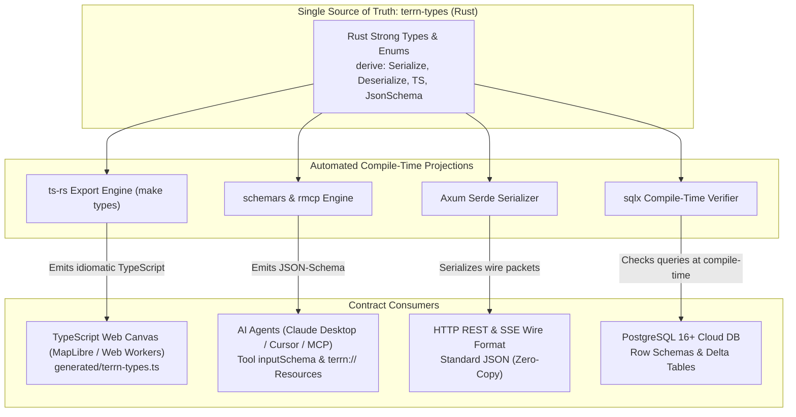

#### 3.4.1 Architectural Invariants & Governance

1. **The Single Source of Truth Invariant:** All domain types (layer metadata, style definitions, sequence event deltas, MCP tool arguments, and error payloads) are defined exclusively inside `crates/terrn-types`.
2. **Read-Only Client Projections:** Files inside [`src/types/generated/`](file:///tern/tern_poc/src/types) are strictly auto-generated. Direct manual edits to generated TypeScript files are blocked by pre-commit hooks and CI gates (`git diff --exit-code src/types/generated/`).
3. **The Synchronization Command (`make types`):** Running `make types` executes `cargo test -p terrn-types -- export_types`, regenerating TypeScript definitions in $< 500\text{ ms}$ without requiring `protoc` or external binary dependencies.

#### 3.4.2 Concrete Contract Derivation Example

##### 1. Authoritative Rust Definition (`crates/terrn-types/src/events.rs`)
```rust
use serde::{Deserialize, Serialize};
use ts_rs::TS;
use schemars::JsonSchema;

#[derive(Serialize, Deserialize, TS, JsonSchema, Debug, Clone, PartialEq)]
#[serde(tag = "type", content = "payload")]
#[ts(export, export_to = "../../../src/types/generated/terrn-types.ts")]
pub enum LayerMutationDelta {
    StyleUpdated {
        layer_id: String,
        opacity: f32,
        color_ramp: String,
    },
    FeatureGeometryMoved {
        layer_id: String,
        feature_id: String,
        new_coordinates: Vec<[f64; 2]>,
    },
    LayerVisibilityToggled {
        layer_id: String,
        visible: bool,
    },
}
```

##### 2. Emitted Idiomatic TypeScript (`src/types/generated/terrn-types.ts`)
`ts-rs` automatically emits native TypeScript discriminated unions that integrate seamlessly with React state reducers and pattern matching:

```typescript
// AUTO-GENERATED BY terrn-types. DO NOT EDIT MANUALLY. Run `make types`.

export type LayerMutationDelta = 
  | { 
      type: "StyleUpdated"; 
      payload: { layer_id: string; opacity: number; color_ramp: string } 
    }
  | { 
      type: "FeatureGeometryMoved"; 
      payload: { layer_id: string; feature_id: string; new_coordinates: [number, number][] } 
    }
  | { 
      type: "LayerVisibilityToggled"; 
      payload: { layer_id: string; visible: boolean } 
    };
```

##### 3. Emitted Model Context Protocol (MCP) Tool Schema
The exact same Rust enum is compiled by `schemars` and registered directly into `rmcp` for Claude Desktop / Cursor:

```json
{
  "name": "terrn_apply_layer_mutation",
  "description": "Applies a verified real-time mutation to a vector layer",
  "inputSchema": {
    "type": "object",
    "oneOf": [
      {
        "properties": {
          "type": { "const": "StyleUpdated" },
          "payload": {
            "type": "object",
            "required": ["layer_id", "opacity", "color_ramp"],
            "properties": {
              "layer_id": { "type": "string" },
              "opacity": { "type": "number", "minimum": 0.0, "maximum": 1.0 },
              "color_ramp": { "type": "string" }
            }
          }
        },
        "required": ["type", "payload"]
      }
    ]
  }
}
```

#### 3.4.3 Contract Synchronization Pipeline & CI Validation

To prevent schema drift in collaborative environments, the CI pipeline enforces strict parity:

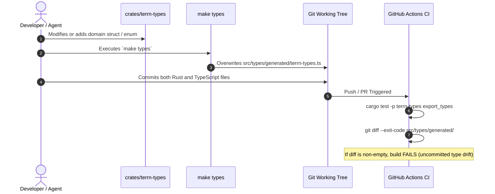

---

## 4. Deep Subsystem Design

### 4.1 Subsystem 1: Ingestion Pipeline & Quarantine Verification Gate
* **Core Responsibilities:** Controls upload lifecycle, generates presigned multipart staging URLs, isolates unverified files, computes canonical bounding boxes, and prevents metadata poisoning.
* **Execution Mechanics:**
  1. `POST /api/v1/layers/upload-session`: Client specifies `map_id`, `filename`, `size_bytes`, `format`, and `part_count`. Backend validates map edit permissions and workspace storage quota, allocates a quarantined prefix (`staging/{workspace_id}/{session_id}/`), generates an array of **Presigned Cloudflare R2 PUT URLs** (one per 24 MB part, valid 1 hour), and inserts a pending record into `layers`.
  2. **Direct-to-Storage Ingestion:** The client browser uploads binary chunks directly to Cloudflare R2 staging using the presigned URLs, bypassing backend container bandwidth and avoiding proxy bottlenecks.
  3. `POST /api/v1/layers/upload-session/{id}/complete`: Triggers the **Quarantine Gate**.
* **The Verification Engine:**
  - **Vector Pipeline:** Reads magic bytes and validates geometry headers using DuckDB Spatial (or `geozero`). Computes canonical WGS84 bounding box (`bounds`), feature count, geometry type, and vertex density. Evaluates Composite Complexity Score: $\text{Score} = V + (2.5 \times P)$. Converts vector data into canonical **FlatGeobuf (`data.fgb`)** and **GeoParquet (`data.parquet`)** and moves them to `workspaces/{workspace_id}/maps/{map_id}/layers/{layer_id}/`. If $\text{Score} > 500\text{k}$, dispatches an async job for PMTiles generation.
  - **Raster Pipeline (GeoTIFF):** Reads TIFF tags, CRS projection, bounding coordinates, band count, and pixel data types. Dispatches an asynchronous serverless worker running `gdal_translate -of COG -co COMPRESS=DEFLATE -co OVERVIEWS=AUTO` generating Cloud-Optimized GeoTIFF (`data.cog.tif`).
  - Commits verified metadata to PostgreSQL (`layers.status = 'ready'`, `has_cog = true` or `has_pmtiles = true`) and purges the staging prefix.

### 4.2 Subsystem 2: Three-Tier Intelligent Tiling & Raster Engine
* **Tier 1 (Dynamic Client Slicing - Vector $\text{Score} \le 500\text{k}$):**
  - Client downloads `.fgb` via CDN.
  - Background Web Worker ([`src/core/workers/geo.worker.ts`](file:///tern/tern_poc/src/core/workers/geo.worker.ts)) decompresses geometries and indexes points into `Supercluster` (hierarchical spatial kd-tree) or polygons into `GeoJSON-VT` (Douglas-Peucker clipping).
  - Web Worker registers the custom protocol `terrn-vt://{layerId}/{z}/{x}/{y}` in MapLibre ([`src/core/canvas/base-map.ts`](file:///tern/tern_poc/src/core/canvas/base-map.ts)), serving vector tile protobufs at 60 FPS.
* **Tier 2 (Serverless PMTiles Slicing - Vector $\text{Score} > 500\text{k}$):**
  - Serverless conversion worker generates a single `.pmtiles` archive and uploads it to Cloudflare R2.
  - MapLibre loads the layer via the PMTiles client protocol (`pmtiles://{layerId}/{z}/{x}/{y}`), requesting only visible 20–50 KB tiles via HTTP Range Requests.
  - *Non-Blocking UX:* While PMTiles generates, the client renders a simplified bounding-box preview.
* **Intermediate Optimization: FlatGeobuf Viewport Range Streaming:**
  - For medium layers ($10\text{–}30\text{ MB}$), the Web Worker reads FlatGeobuf's initial packed Hilbert R-tree index header (~100 KB).
  - As the user pans, the worker issues HTTP Range Requests for *only the byte offsets intersecting the current viewport bounding box*, avoiding full dataset downloads.
* **Raster Cloud-Optimized GeoTIFF (COG) Rendering:**
  - Raster layers (`data.cog.tif`) on Cloudflare R2 are loaded directly by the browser without requiring a server-side tile rendering cluster.
  - A client-side Web Worker utilizes `geotiff.js` to issue HTTP byte-range requests for internal TIFF tile directories matching the viewport and zoom level.
  - Decoded raster tiles are uploaded directly into WebGL textures, allowing dynamic client-side color ramps, hillshading, or NDVI contrast stretching on the GPU.

### 4.3 Subsystem 3: Collaborative Stream Broker & State Reconciliation
* **Core Responsibilities:** Synchronizes layer styles, visibility, and AI agent modifications across multiple concurrent viewers without 409 conflict loops, WebSocket connection leaks, or single-pod isolation.
* **Execution Mechanics:**
  - Every map maintains a monotonic sequence clock (`sequence = N`).
  - Clients subscribe via `GET /api/v1/maps/{map_id}/stream?sequence=N` (or Server-Sent Events).
  - If the server clock $> N$, the server flushes state deltas immediately.
  - If the server clock $= N$, the connection is held (up to 30s) on an in-memory channel.
* **Cluster-Wide Real-Time Synchronization via PostgreSQL `LISTEN / NOTIFY`:**
  - Any committed mutation acquires a PostgreSQL row lock (`SELECT id FROM maps WHERE id=$1 FOR UPDATE`), increments `maps.sequence = N + 1`, records the event in `layer_audit_log`, and executes:
    ```sql
    PERFORM pg_notify('terrn_map_events', json_build_object('map_id', $1, 'sequence', new_seq, 'delta', delta_json)::text);
    ```
  - All backend container instances in the cluster listen on `terrn_map_events`. When a notification arrives, each instance dispatches the delta to all client SSE connections connected to that `map_id`.
  - Guarantees horizontal scale across multi-pod Kubernetes clusters with **zero added infrastructure** (no Redis required).
* **Throttled Mutation Commits vs. Ephemeral Slider Previews:**
  - Interactive slider drags (e.g. opacity, color ramp adjustments) update the local WebGL shader instantly at 60 FPS (0ms).
  - Network commits are debounced at 200–300 ms so dragging a slider produces at most 3–5 committed transactions instead of 1,800/min.
  - Ephemeral drag state can broadcast lightweight non-persisted co-presence pings, but only debounced commits acquire PostgreSQL row locks and append to `layer_audit_log`.

### 4.4 Subsystem 4: Cloud-Native PostgreSQL Persistence Layer
* **Multi-Tenant Cloud (`api.terrn.ai`):**
  - **PostgreSQL 16+** with Row-Level Security (RLS) enforcing tenant isolation across workspaces and maps.
  - Connection pooling configured with conservative limits (`max_open_conns = 15`) to prevent connection starvation.
  - Automated Multi-AZ synchronous replication with RPO $< 1\text{ minute}$ and RTO $< 5\text{ minutes}$.
* **Standalone Desktop / Embedded SQLite:**
  - Explicitly marked as **Future Scope (Phase 4 / Post-v1.0)** to maintain single-focus velocity on the enterprise cloud model.

### 4.5 Subsystem 5: Feature Mutation & Relational Delta Compaction Engine
* **Core Responsibilities:** Solves the challenge of editing feature attributes and geometries when canonical assets are stored in immutable FlatGeobuf (`.fgb`) and GeoParquet (`.parquet`) files on Cloudflare R2.
* **The Hybrid Base-Asset + Relational Delta Pattern:**
  1. **Sub-Millisecond Mutation:** When a user or AI agent edits a feature (moving vertices, creating features, or updating cell values), the backend does **not** rewrite the 50 MB `.fgb` file on R2.
  2. Instead, an append-only delta is inserted into PostgreSQL:
     ```sql
     INSERT INTO layer_feature_deltas (map_id, layer_id, feature_id, op_type, properties_patch, geometry_patch, created_by)
     VALUES ($1, $2, $3, 'update', $4, $5, $6);
     ```
  3. The transaction locks `maps`, increments `maps.sequence = N + 1`, and broadcasts the delta via PostgreSQL `NOTIFY`.
  4. **Client-Side Real-Time Overlay:** The client Web Worker applies the delta in-memory on top of the base `.fgb` Hilbert index, updating the MapLibre GPU canvas and the TanStack virtualized table grid in $< 50\text{ ms}$.
  5. **Asynchronous Compaction Worker:** When an analyst clicks "Save Version", or after 15 minutes of edit inactivity, an asynchronous worker merges all records from `layer_feature_deltas` into the base `.fgb` and `.parquet` files, writes new canonical files to R2, increments `layers.version`, and purges compacted delta rows.

---

## 5. The Model Context Protocol (MCP) Server

### 5.1 Subsystem Overview & Agent Positioning
The Terrn MCP Server is natively embedded inside the backend binary. It exposes Terrn's spatial algorithms, DuckDB analytical engine, and cartographic symbology directly to LLMs (Claude Desktop, Cursor, terminal agents) via standard JSON-RPC.

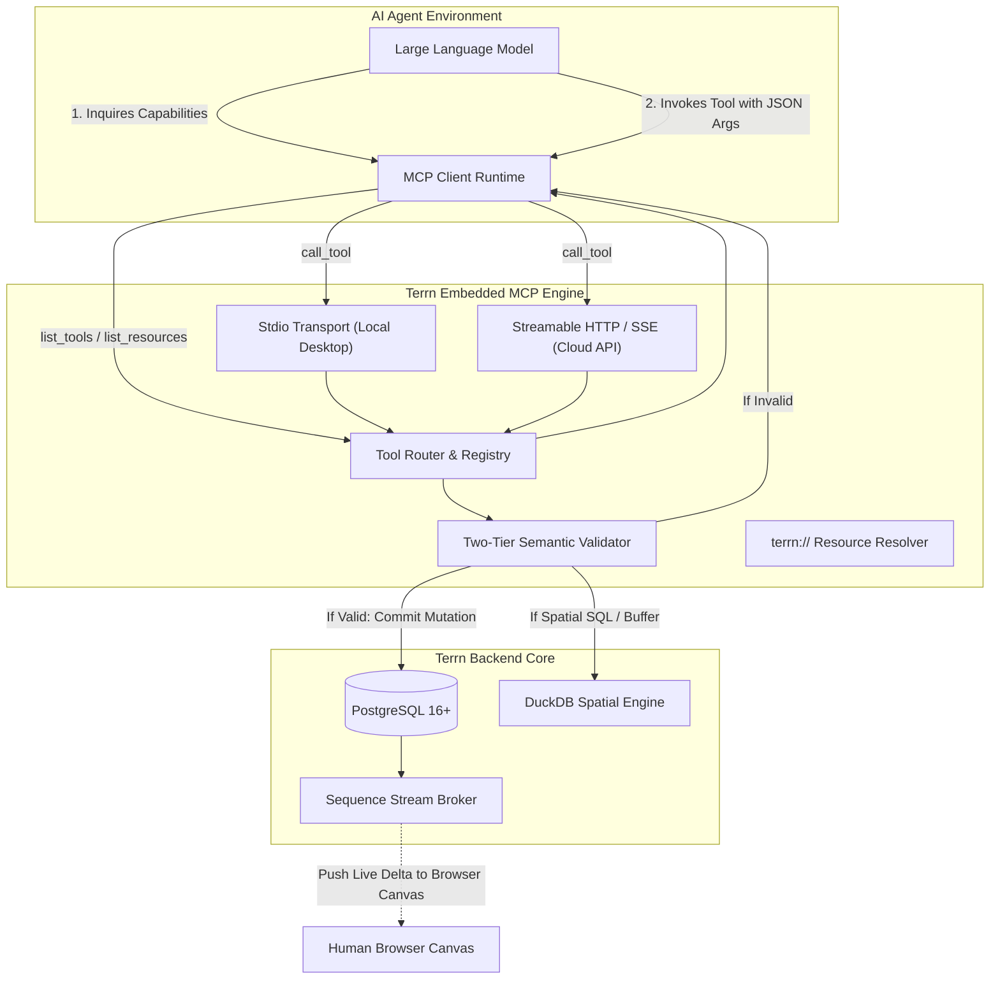

### 5.2 Exhaustive Tool Catalog (AI Function Calling)

The MCP server exposes 17 tools categorized into six operational domains, standardized on **`mapId`** to mirror the active canvas viewport and RBAC data model:

| Category | Tool Name | Parameters | Action & Return Value |
| :--- | :--- | :--- | :--- |
| **1. Workspace & Discovery** | `terrn_list_workspaces` | None | Returns accessible workspace UUIDs, names, slugs, and user role. |
| | `terrn_list_maps` | `workspaceId`, `projectId` (optional) | Returns accessible map UUIDs, names, layer counts, and last updated timestamps. |
| | `terrn_get_map_context` | `mapId` | Returns active layer list, view state (`center`, `zoom`), basemap, and z-index ordering. |
| | `terrn_publish_local_layer` | `mapId`, `layerName`, `dataUri` | Promotes a local in-memory layer into a persistent cloud asset on Cloudflare R2 attached to `mapId`. |
| **2. Schema & Profiling** | `terrn_inspect_layer_schema` | `mapId`, `layerId` | Returns column names, data types, null percentages, distinct categories, and vertex counts. |
| | `terrn_get_column_quantiles` | `mapId`, `layerId`, `column`, `method` | Executes columnar DuckDB scan; returns min, max, quartiles, and Jenks natural breaks. |
| | `terrn_sample_feature_records` | `mapId`, `layerId`, `limit` ($\le 10$) | Returns bounded sample of feature attribute records with geometries stripped (privacy-safe). |
| **3. Cartography & Symbology** | `terrn_apply_thematic_style` | `mapId`, `layerId`, `mode`, `field`, `colorRamp`, `breaks`, `opacity` | Synthesizes MapLibre GLSL expressions, updates DB, and broadcasts update to live viewports. |
| | `terrn_set_layer_visibility` | `mapId`, `layerId`, `visible`, `opacity` | Updates visibility flag and opacity uniform in map state. |
| | `terrn_reorder_layers` | `mapId`, `orderedLayerIds` | Re-indexes z-ordering of layer stack in PostgreSQL. |
| **4. Analytical SQL & Filter** | `terrn_execute_spatial_sql` | `mapId`, `sql`, `persistAsNewLayer`, `newLayerName` | Executes DuckDB SQL against `data.parquet` files; optionally outputs a new derived layer. |
| | `terrn_create_sql_derived_layer`| `mapId`, `sourceLayerId`, `sqlFilter`, `newLayerName` | Creates a new vector layer filtered by SQL criteria. |
| **5. Spatial Geometry Ops** | `terrn_create_spatial_buffer` | `mapId`, `layerId`, `distanceMeters`, `newLayerName` | Runs geometric buffer around features; saves new FlatGeobuf polygon layer. |
| | `terrn_spatial_intersection`| `mapId`, `layerA`, `layerB`, `newLayerName` | Computes geometric intersection / point-in-polygon join; outputs new layer. |
| **6. Feature-Level Editing** | `terrn_update_feature_property`| `mapId`, `layerId`, `featureId`, `propertyKey`, `newValue` | Inserts property delta into `layer_feature_deltas`, broadcasts to live viewports. |
| | `terrn_update_feature_geometry`| `mapId`, `layerId`, `featureId`, `geometryGeoJson` | Inserts geometry delta into `layer_feature_deltas`, updates MapLibre canvas. |
| | `terrn_delete_feature` | `mapId`, `layerId`, `featureId` | Inserts soft-delete delta into `layer_feature_deltas`, hides feature in viewports. |

### 5.3 Two-Tier Semantic Validation & Structured Self-Correction
To prevent LLM hallucination failure loops, every tool invocation passes through a strict two-stage evaluation:
1. **Syntactic JSON-Schema Evaluation:** Derives parameter types at compile-time via `schemars` in Rust, natively generating JSON-Schema definitions for the official `rmcp` SDK.
2. **Referential Semantic Validation:**
   - Validates that `mapId` and `layerId` exist and belong to the authenticated workspace.
   - Validates that `field` exists in the target layer's schema and matches the required data type (e.g., numeric field for `Graduated` mode).
   - Validates that numerical style breaks are strictly monotonic ($b_0 < b_1 < b_2$).
3. **Structured Self-Correction Payload:** If validation fails, the server returns an explicit recovery payload rather than failing opaquely:

```json
{
  "isError": true,
  "content": [
    {
      "type": "text",
      "text": "Validation Error: Field 'avg_income' does not exist on layer 'census_tracts_2026'."
    }
  ],
  "errorDetails": {
    "code": "INVALID_COLUMN_REFERENCE",
    "path": "arguments.field",
    "actual": "avg_income",
    "validOptions": ["median_household_income", "per_capita_income", "total_population"],
    "recoverySuggestion": "Use 'median_household_income' for graduated color ramp styling."
  }
}
```

### 5.4 Zero-Geometry Prompt Privacy
* Raw geometry coordinates are **never returned in tool results or resource texts**.
* Tools return metadata summaries, bounding boxes (`[minX, minY, maxX, maxY]`), and statistical breaks.
* Eliminates token window exhaustion (saving $> 100\text{k}$ tokens per session) and guarantees enterprise spatial data privacy.

---

## 6. Security, Identity, User Auth & Hierarchical RBAC

### 6.1 Interactive User Authentication (Signup / Login)
Terrn supports consumer and enterprise onboarding through federated OAuth 2.0 / OpenID Connect (OIDC) and passwordless magic link email authentication:

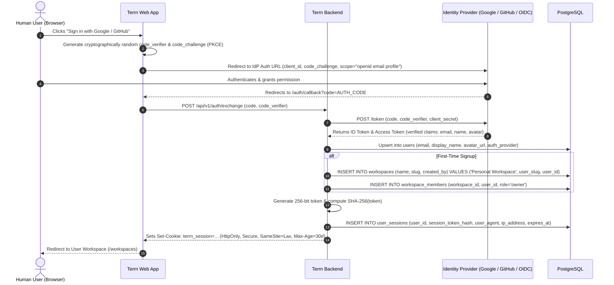

### 6.2 Concurrent Multi-Session Management vs. Machine-to-Machine (M2M) Tokens

To comply with OWASP Application Security Verification Standards (ASVS L3) and support modern multi-device workflows, Terrn decouples human interactive sessions from machine agent credentials.

#### 6.2.1 Token Architecture: Humans vs. Machines
* **Browser Sessions (Human Users):** Authenticated strictly via **`HttpOnly, Secure, SameSite=Lax` cookies** (`terrn_session`). Storing long-lived JWTs or bearer tokens in browser `localStorage` or `sessionStorage` is explicitly banned to prevent Cross-Site Scripting (XSS) credential theft.
* **AI Agents & Terminal CLI (M2M):** Authenticated via **scoped Bearer JWTs** (`Authorization: Bearer trn_m2m_...`) issued through the RFC 8628 Device Flow with explicit workspace and tool scoping.

#### 6.2.2 Concurrent Multi-Session Architecture & Cryptographic Hashing
A user frequently operates across multiple browsers, devices, or tabs (e.g., Chrome on laptop, Firefox on desktop, mobile/tablet). Terrn supports **unlimited concurrent active sessions** per user without cross-session interference:

1. **Independent Session Records:** Logging in from Browser B creates a brand new, independent row in the `user_sessions` table. Browser A's session remains fully active and unaffected.
2. **Zero-Knowledge Session Storage:** The raw cookie token value is **never** stored in the database in plaintext.
   * Upon successful login/exchange, the backend generates a cryptographically secure 256-bit random entropy token: $T \leftarrow \text{CSPRN}(32\text{ bytes})$.
   * The backend computes the cryptographic digest: $H = \text{SHA-256}(T)$.
   * The database record stores only $H$ (`session_token_hash`), alongside client metadata (`user_agent`, `ip_address`, `last_active_at`, and `expires_at`).
   * The client receives $T$ via `Set-Cookie: terrn_session=T; Path=/; HttpOnly; Secure; SameSite=Lax; Max-Age=2592000`.
   * **Security Guarantee:** Even in the event of an unauthorized read dump of the database, active session cookies cannot be derived or forged by an attacker.
3. **Sub-Millisecond Verification:** Ingress middleware computes $\text{SHA-256}(\text{Cookie}[terrn\_session])$ and queries `user_sessions` by the indexed `session_token_hash`. If found and `expires_at > NOW()`, user identity and workspace claims are attached to the request context.

#### 6.2.3 Granular Session Revocation & Lifecycle Management
Terrn provides fine-grained visibility and revocation controls over all active devices:

| Operation | Endpoint | Mechanism | Intended Use Case |
| :--- | :--- | :--- | :--- |
| **Current Session Logout** | `POST /api/v1/auth/logout` | Deletes current session row (`DELETE WHERE session_token_hash = $1`) and clears `terrn_session` cookie | Standard user logout from the current browser |
| **List Active Sessions** | `GET /api/v1/auth/sessions` | Returns `[{id, user_agent, ip_address, last_active_at, is_current}]` | Security Settings page inventory |
| **Remote Session Revocation** | `DELETE /api/v1/auth/sessions/{session_id}` | Deletes targeted session (`DELETE WHERE id = $1 AND user_id = $2`) | Revoke access from a specific lost laptop or old browser |
| **Revoke Other Sessions** | `POST /api/v1/auth/logout-others` | `DELETE FROM user_sessions WHERE user_id = $1 AND id != $current_id` | "Sign out everywhere else" after suspicious activity |
| **Global Emergency Logout** | `POST /api/v1/auth/logout-all` | Purges all sessions (`DELETE FROM user_sessions WHERE user_id = $1`) | Password change, IdP account unlink, or account breach |

* **Session Housekeeping:** Dual expiration controls protect dormant sessions. Each session has an absolute expiration limit (30 days) and a sliding activity update (`last_active_at`). An asynchronous scheduled worker routinely executes:
  ```sql
  DELETE FROM user_sessions WHERE expires_at < NOW();
  ```

#### 6.2.4 Real-Time Multi-Session Co-Presence on the Same Map
When a user opens the exact same map in Browser A and Browser B concurrently:
1. **Distinct Stream Subscriptions:** Both browser instances establish separate SSE / WebSocket connections to the Terrn `StreamBroker` tagged with `(user_id, session_id, map_id)`.
2. **Optimistic Versioned Reconciliation:**
   * When Browser A alters layer styling or feature properties, it dispatches an optimistic mutation carrying the current version sequence ($N$).
   * PostgreSQL commits the mutation (`sequence = N + 1`), appends the mutation to `layer_audit_log`, and publishes the event to `StreamBroker`.
   * `StreamBroker` broadcasts the mutation delta (`sequence = N + 1`) to all active stream subscribers on that map, including Browser B.
   * Browser B receives the delta event and dynamically refreshes its MapLibre WebGL canvas within $< 50\text{ ms}$, ensuring zero state divergence or overwrite conflicts.
3. **Session Presence Indicators:** The UI displays active connected devices ("Active on Chrome (macOS) and Firefox (Linux)"), giving users complete situational awareness across their workstations.

#### 6.2.5 Multi-Workspace Tenant Resolution & Context Switching
When a user belongs to multiple workspaces (e.g., Personal Workspace, Client Agency Workspace, Enterprise Organization):
1. **Explicit Context Header:** Browser API requests provide the active tenant context via `X-Terrn-Workspace-Id: <uuid>` (or cookie `terrn_active_workspace`). If omitted, the request automatically falls back to the user's personal default workspace.
2. **Ingress Membership Verification:** Ingress claims middleware queries `workspace_members WHERE user_id = $1 AND workspace_id = $2`. If verified, the active `(user_id, workspace_id, role)` tuple is injected into the request context for all downstream RBAC evaluations.
3. **M2M JWT Workspace Scoping:** For AI agents and CLI tokens minted through the RFC 8628 Device Flow, the approved `workspace_id` is cryptographically embedded in the JWT claims (`claims.workspace_id`). Agents cannot perform cross-tenant operations outside their explicitly authorized workspace.

---

### 6.3 Hierarchical Workspace, Project & Map RBAC Architecture

Terrn organizes geospatial assets into an explicit four-tier containment and governance hierarchy:

```
[Workspace / Tenant]
       │
       ├── Users belong via workspace_members (Role: Owner, Admin, Member, Guest)
       │
       ├── [Projects] (Optional Grouping Container)
       │         │
       │         ├── Users added via project_members (Role: Editor, Viewer)
       │         │   (Grants inherited access to all maps within this project)
       │         │
       │         └── [Maps]
       │                   │
       │                   ├── Ownership: maps.created_by (Map Creator has Owner Rights)
       │                   ├── Direct Users added via map_members (Role: Editor, Viewer)
       │                   │
       │                   └── [Layers] (One or more layers per map, styles, view state)
       │
       └── [Direct Standalone Maps] (Maps not assigned to a project)
                 └── [Layers]
```

#### Permission Inheritance Model:
When a user attempts an operation on a Map (e.g., viewing layers, editing styles, modifying geometry, or deleting the map), the effective permission is resolved via the following hierarchy:

$$\text{Effective Map Role} = \max(\text{Map Creator/Member Role}, \text{Inherited Project Role}, \text{Workspace Admin Role})$$

1. **Map Creator Ownership:** The user who created the map (`maps.created_by == user.id`) holds **Owner** privileges over that map, granting full rights to edit, rename, delete, and share the map regardless of project role.
2. **Inherited Project-Level Sharing:** Adding a user to `project_members` as an **Editor** or **Viewer** automatically propagates that role across **all maps grouped inside that project**.
3. **Granular Direct Map Sharing:** Users can be granted access to an individual map via `map_members` (as **Editor** or **Viewer**) without granting them access to the broader project or workspace.
4. **Workspace Administrative Override:** Users with the `owner` or `admin` role in `workspace_members` possess administrative oversight over all projects and maps in the workspace.

#### Role-Based Access Control (RBAC) Permission Matrix

| Operation / Capability | Map Owner | Project / Map Editor | Project / Map Viewer | Public Viewer (If `is_public`) |
| :--- | :---: | :---: | :---: | :---: |
| **View Map & Layers (`terrn-vt://` / `pmtiles://`)** | ✅ | ✅ | ✅ | ✅ |
| **View Feature Attributes & Table Grid** | ✅ | ✅ | ✅ | ✅ |
| **Run Client-Side DuckDB SQL Queries** | ✅ | ✅ | ✅ | ✅ |
| **Inspect Feature Details on Click** | ✅ | ✅ | ✅ | ✅ |
| **Modify Layer Styles (Color, Opacity, Breaks)** | ✅ | ✅ | ❌ | ❌ |
| **Add / Upload New Layers to Map** | ✅ | ✅ | ❌ | ❌ |
| **Edit Feature Geometries & Attributes** | ✅ | ✅ | ❌ | ❌ |
| **Delete / Reorder Layers on Map** | ✅ | ✅ | ❌ | ❌ |
| **Invite Collaborators to Map (Editor / Viewer)** | ✅ | ❌ | ❌ | ❌ |
| **Move Map to Another Project** | ✅ | ❌ | ❌ | ❌ |
| **Delete Map Permanently** | ✅ | ❌ | ❌ | ❌ |

---

### 6.4 API Ingress Token Verification Topology

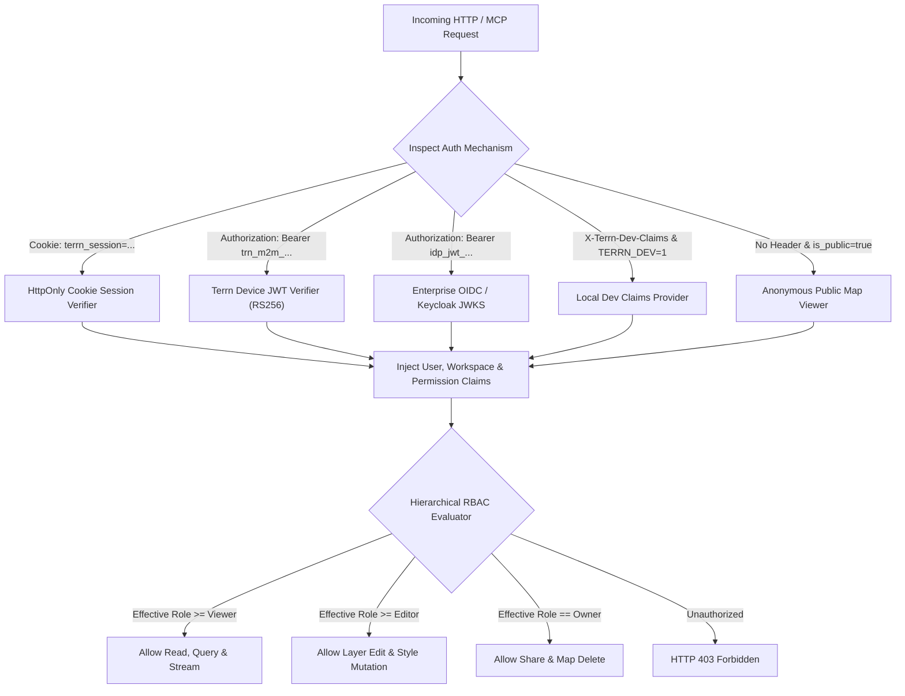

### 6.5 RFC 8628 Headless Device Authorization Flow
To support headless AI agents (Claude Desktop, Cursor, terminal CLIs) without requiring brittle, long-lived root API keys, Terrn implements the RFC 8628 Device Authorization Flow:

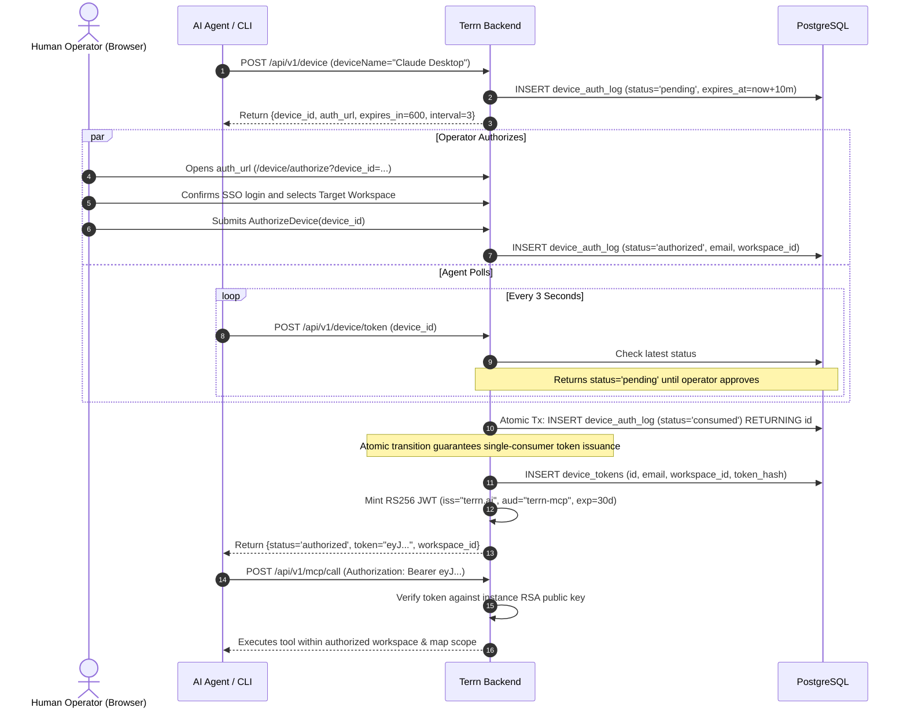

### 6.6 Append-Only State Log Pattern
Critical state transitions (device authorization, workspace memberships, and layer access revisions) use an **append-only event log design** (`device_auth_log`, `workspace_log`, `layer_audit_log`):
* State mutations insert an immutable record.
* Current state is resolved by selecting the latest event (`ORDER BY created_at DESC LIMIT 1`).
* Prevents concurrent race conditions during token issuance and provides an immutable forensic audit log for enterprise SOC2 compliance.

### 6.7 Cryptographic Key Hierarchy & Zero-Trust Secret Protection

Terrn enforces a formal key derivation and encryption hierarchy to safeguard session tokens, machine JWTs, and third-party storage credentials:

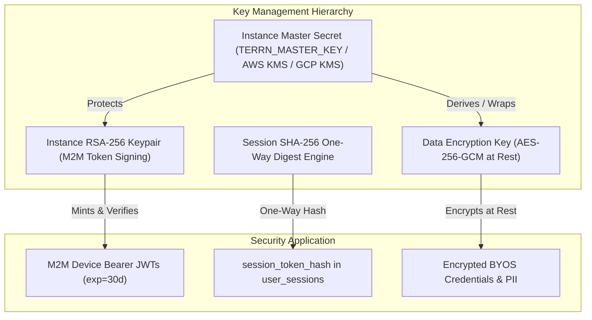

1. **Instance Master Secret (`TERRN_MASTER_KEY`):** Loaded via environment variable or cloud KMS (AWS KMS, GCP Cloud KMS, HashiCorp Vault). Never written to disk or database.
2. **Instance RSA-256 Keypair:** Automatically generated on first bootstrap and stored encrypted in the database; used exclusively to sign and verify RFC 8628 M2M device JWTs.
3. **Data Encryption Key (AES-256-GCM):** Derived from the Master Secret using HKDF-SHA256; encrypts sensitive third-party BYOS credentials and enterprise connection strings at rest.
4. **Zero-Trust Credential Hygiene & Log Redaction:**
   * All ingress logs strictly redact `Authorization: Bearer ...`, `Cookie: terrn_session=...`, and sensitive SQL bind parameters.
   * Session tokens and JWT signatures are processed in volatile memory and wiped upon request completion.

---

## 7. Detailed Component Interaction Flows

### 7.1 Unified Workflow: Local Drop $\to$ Cloud Publishing

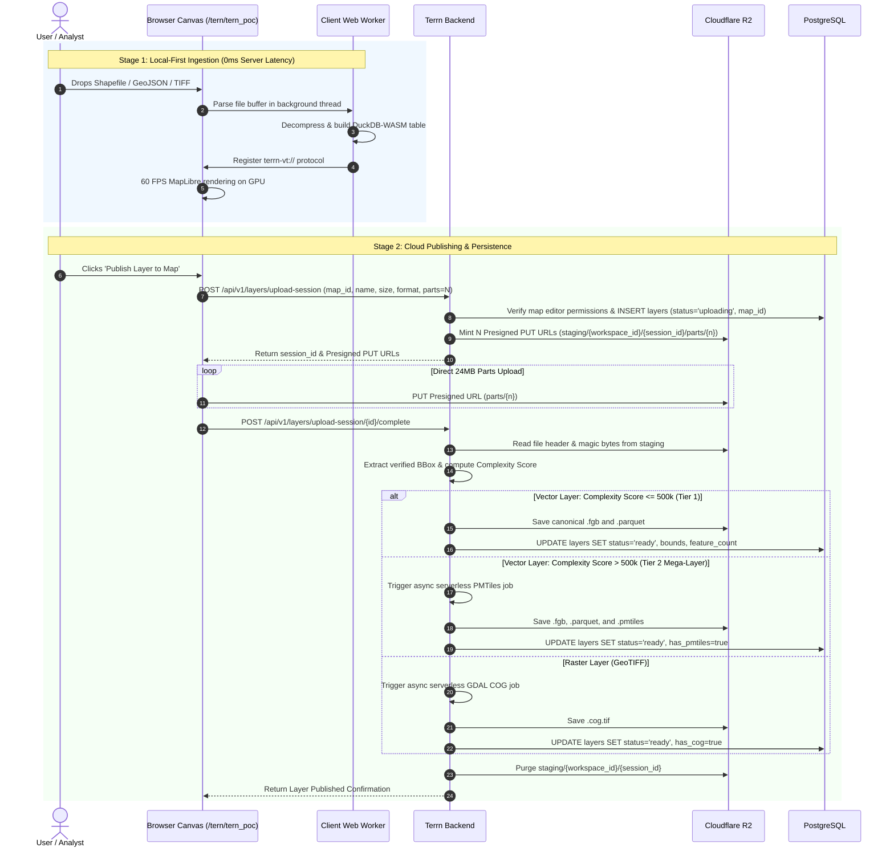

### 7.2 AI MCP Tool Execution & Canvas Synchronization

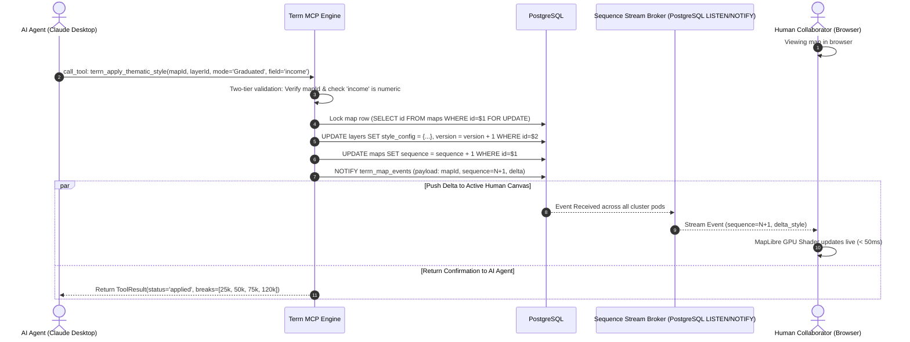

---

## 8. Data Architecture & Storage Model

### 8.1 Relational Entity-Relationship Diagram (PostgreSQL 16+)

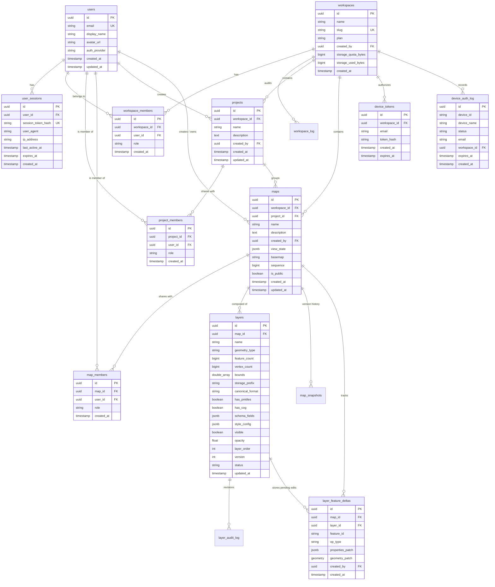

#### 8.1.1 Production PostgreSQL 16+ DDL & Indexing Specification

To guarantee multi-tenant data isolation, high-performance session validation, and sub-millisecond query performance, the database schema is defined as follows:

```sql
-- Core User Identity
CREATE TABLE users (
    id UUID PRIMARY KEY DEFAULT gen_random_uuid(),
    email VARCHAR(255) NOT NULL UNIQUE,
    display_name VARCHAR(255),
    avatar_url TEXT,
    auth_provider VARCHAR(64) NOT NULL DEFAULT 'oauth_google',
    created_at TIMESTAMPTZ NOT NULL DEFAULT NOW(),
    updated_at TIMESTAMPTZ NOT NULL DEFAULT NOW()
);

-- Concurrent Multi-Session Management (OWASP ASVS L3)
CREATE TABLE user_sessions (
    id UUID PRIMARY KEY DEFAULT gen_random_uuid(),
    user_id UUID NOT NULL REFERENCES users(id) ON DELETE CASCADE,
    session_token_hash VARCHAR(64) NOT NULL UNIQUE, -- SHA-256 hex digest of raw 256-bit cookie token
    user_agent TEXT,
    ip_address INET,
    last_active_at TIMESTAMPTZ NOT NULL DEFAULT NOW(),
    expires_at TIMESTAMPTZ NOT NULL,
    created_at TIMESTAMPTZ NOT NULL DEFAULT NOW()
);

CREATE INDEX idx_user_sessions_lookup ON user_sessions(session_token_hash);
CREATE INDEX idx_user_sessions_user_id ON user_sessions(user_id);
CREATE INDEX idx_user_sessions_expires_at ON user_sessions(expires_at);

-- Workspaces & Memberships
CREATE TABLE workspaces (
    id UUID PRIMARY KEY DEFAULT gen_random_uuid(),
    name VARCHAR(255) NOT NULL,
    slug VARCHAR(255) NOT NULL UNIQUE,
    plan VARCHAR(64) NOT NULL DEFAULT 'free',
    created_by UUID NOT NULL REFERENCES users(id) ON DELETE RESTRICT,
    storage_quota_bytes BIGINT NOT NULL DEFAULT 5368709120, -- 5 GB free tier
    storage_used_bytes BIGINT NOT NULL DEFAULT 0,
    created_at TIMESTAMPTZ NOT NULL DEFAULT NOW()
);

CREATE TABLE workspace_members (
    id UUID PRIMARY KEY DEFAULT gen_random_uuid(),
    workspace_id UUID NOT NULL REFERENCES workspaces(id) ON DELETE CASCADE,
    user_id UUID NOT NULL REFERENCES users(id) ON DELETE CASCADE,
    role VARCHAR(32) NOT NULL CHECK (role IN ('owner', 'admin', 'member', 'guest')),
    created_at TIMESTAMPTZ NOT NULL DEFAULT NOW(),
    UNIQUE (workspace_id, user_id)
);

-- Projects Container
CREATE TABLE projects (
    id UUID PRIMARY KEY DEFAULT gen_random_uuid(),
    workspace_id UUID NOT NULL REFERENCES workspaces(id) ON DELETE CASCADE,
    name VARCHAR(255) NOT NULL,
    description TEXT,
    created_by UUID NOT NULL REFERENCES users(id) ON DELETE RESTRICT,
    created_at TIMESTAMPTZ NOT NULL DEFAULT NOW(),
    updated_at TIMESTAMPTZ NOT NULL DEFAULT NOW()
);

CREATE TABLE project_members (
    id UUID PRIMARY KEY DEFAULT gen_random_uuid(),
    project_id UUID NOT NULL REFERENCES projects(id) ON DELETE CASCADE,
    user_id UUID NOT NULL REFERENCES users(id) ON DELETE CASCADE,
    role VARCHAR(32) NOT NULL CHECK (role IN ('editor', 'viewer')),
    created_at TIMESTAMPTZ NOT NULL DEFAULT NOW(),
    UNIQUE (project_id, user_id)
);

-- Maps & Ownership
CREATE TABLE maps (
    id UUID PRIMARY KEY DEFAULT gen_random_uuid(),
    workspace_id UUID NOT NULL REFERENCES workspaces(id) ON DELETE CASCADE,
    project_id UUID REFERENCES projects(id) ON DELETE SET NULL,
    name VARCHAR(255) NOT NULL,
    description TEXT,
    created_by UUID NOT NULL REFERENCES users(id) ON DELETE RESTRICT,
    view_state JSONB NOT NULL DEFAULT '{"longitude": 0, "latitude": 20, "zoom": 2}',
    basemap VARCHAR(64) NOT NULL DEFAULT 'positron',
    sequence BIGINT NOT NULL DEFAULT 1,
    is_public BOOLEAN NOT NULL DEFAULT FALSE,
    created_at TIMESTAMPTZ NOT NULL DEFAULT NOW(),
    updated_at TIMESTAMPTZ NOT NULL DEFAULT NOW()
);

CREATE TABLE map_members (
    id UUID PRIMARY KEY DEFAULT gen_random_uuid(),
    map_id UUID NOT NULL REFERENCES maps(id) ON DELETE CASCADE,
    user_id UUID NOT NULL REFERENCES users(id) ON DELETE CASCADE,
    role VARCHAR(32) NOT NULL CHECK (role IN ('editor', 'viewer')),
    created_at TIMESTAMPTZ NOT NULL DEFAULT NOW(),
    UNIQUE (map_id, user_id)
);

-- Geospatial Layers
CREATE TABLE layers (
    id UUID PRIMARY KEY DEFAULT gen_random_uuid(),
    map_id UUID NOT NULL REFERENCES maps(id) ON DELETE CASCADE,
    name VARCHAR(255) NOT NULL,
    geometry_type VARCHAR(64) NOT NULL,
    feature_count BIGINT NOT NULL DEFAULT 0,
    vertex_count BIGINT NOT NULL DEFAULT 0,
    bounds DOUBLE PRECISION[4], -- [min_lon, min_lat, max_lon, max_lat]
    storage_prefix TEXT NOT NULL,
    canonical_format VARCHAR(32) NOT NULL DEFAULT 'flatgeobuf',
    has_pmtiles BOOLEAN NOT NULL DEFAULT FALSE,
    has_cog BOOLEAN NOT NULL DEFAULT FALSE,
    schema_fields JSONB NOT NULL DEFAULT '[]',
    style_config JSONB NOT NULL DEFAULT '{}',
    visible BOOLEAN NOT NULL DEFAULT TRUE,
    opacity REAL NOT NULL DEFAULT 1.0,
    layer_order INT NOT NULL DEFAULT 0,
    version INT NOT NULL DEFAULT 1,
    status VARCHAR(32) NOT NULL DEFAULT 'ready',
    updated_at TIMESTAMPTZ NOT NULL DEFAULT NOW()
);

CREATE INDEX idx_layers_map ON layers(map_id);

-- Incremental Feature Editing Delta Log (Overlay on Immutable Canonical .fgb / .parquet)
CREATE TABLE layer_feature_deltas (
    id UUID PRIMARY KEY DEFAULT gen_random_uuid(),
    map_id UUID NOT NULL REFERENCES maps(id) ON DELETE CASCADE,
    layer_id UUID NOT NULL REFERENCES layers(id) ON DELETE CASCADE,
    feature_id VARCHAR(64) NOT NULL,
    op_type VARCHAR(16) NOT NULL CHECK (op_type IN ('insert', 'update', 'delete')),
    properties_patch JSONB,
    geometry_patch GEOMETRY(Geometry, 4326),
    created_by UUID NOT NULL REFERENCES users(id) ON DELETE RESTRICT,
    created_at TIMESTAMPTZ NOT NULL DEFAULT NOW()
);

CREATE INDEX idx_layer_feature_deltas_lookup ON layer_feature_deltas(layer_id, created_at ASC);
CREATE INDEX idx_layer_feature_deltas_map ON layer_feature_deltas(map_id);
```

### 8.2 Decoupled Object Storage Hierarchy (Cloudflare R2)

```
r2://terrn-storage-prod/
│
├── staging/                                <-- Quarantined uploads (24h lifecycle auto-purge)
│   └── {workspace_id}/{session_id}/
│       ├── raw_input.bin
│       └── parts/{part_number}
│
└── workspaces/{workspace_id}/              <-- Verified permanent assets ($0 egress)
    └── maps/{map_id}/
        ├── layers/{layer_id}/
        │   ├── data.fgb                    <-- Primary rendering asset (Spatial Index)
        │   ├── data.parquet                <-- Analytical asset (DuckDB Columnar)
        │   ├── data.pmtiles                <-- Optional Tier 2 mega-layer pyramid
        │   ├── data.cog.tif                <-- Raster Cloud-Optimized GeoTIFF
        │   └── schema.json                 <-- Column metadata, quantiles, types
        ├── thumbnails/
        │   └── snapshot_{version}.webp
        └── exports/
            └── export_{id}.geojson.gz
```

---

## 9. FinOps & Unit Economics (Cost Architecture)

### 9.1 Baseline Infrastructure Sizing & Monthly Projections
Terrn’s architecture eliminates server-side tile rendering clusters, drastically shrinking cloud spend. The following baseline models a mid-sized enterprise deployment (**1,000 Monthly Active Users, 50,000 map views/month, 1 TB active vector storage**):

| Infrastructure Tier | Sizing / Provisioned Units | Unit Cost Basis | Projected Monthly Cost |
| :--- | :--- | :--- | :--- |
| **Terrn Core Backend** | 2x Container Instances (1 vCPU, 2 GB RAM, Multi-AZ) | ~$0.040 / vCPU-hr + $0.004 / GB-hr | ~$35.00 / month |
| **Metadata Database** | AWS RDS PostgreSQL (`db.t4g.small`, Multi-AZ, 50 GB SSD) | ~$0.068 / hr + $0.23 / GB-mo storage | ~$60.00 / month |
| **Storage Tier (Cloudflare R2)** | 1 TB Active Layers + Snapshots | $0.015 / GB-month storage | ~$15.00 / month |
| **Network Egress (Cloudflare R2)**| 50,000 views $\times$ 100 MB = **5,000 GB Data Transfer** | **$0.00 / GB Egress Worldwide** | **$0.00 / month** |
| **Total Baseline Spend** | **Full Multi-AZ Production Deployment** | **Zero-Egress + Lean Compute** | **~$110.00 / month** |

*(Note: Standalone local SQLite desktop mode is deferred as Future Scope (Phase 4); current sizing reflects the active multi-tenant cloud deployment).*

### 9.2 The Egress Protection Comparison: S3 vs. Cloudflare R2
* **On AWS S3:** 5,000 GB of egress at $0.09/GB = **$450.00 / month** in data transfer fees alone.
* **On Cloudflare R2:** 5,000 GB of egress = **$0.00 / month**.
* **Policy Mandate:** Cloudflare R2 is the mandated default for Terrn Cloud. S3 is restricted strictly to enterprise BYOS agreements where the client covers their own cloud bill.

---

## 10. Data Governance, Privacy & Compliance (GDPR/SOC2)

### 10.1 Data Classification Matrix

| Classification Level | Entities & Data Types | Storage Location | Retention Policy | Access Controls |
| :--- | :--- | :--- | :--- | :--- |
| **Public** | Published map configs, public thumbnails, public vector tiles. | PostgreSQL (`maps`), Cloudflare R2 (`thumbnails/`). | Indefinite until unpublished. | Anonymous read; author write. |
| **Internal** | Workspace metadata, project names, map names, layer schemas, team memberships. | PostgreSQL (`workspaces`, `projects`, `maps`, `layers`). | Active organization lifetime. | Workspace RBAC (Reader/Writer/Admin). |
| **Confidential** | Proprietary vector datasets (FlatGeobuf/Parquet), raster COGs. | Cloudflare R2 (`workspaces/{workspace_id}/...`). | Configurable workspace TTL. | Scoped workspace authorization tokens. |
| **Restricted (PII)** | User email addresses, device authorization logs, session tokens. | PostgreSQL (`device_tokens`, `device_auth_log`, `user_sessions`). | 10-minute TTL for pending auth; purged on account deletion. | Encrypted at rest (AES-256 GCM); stripped from API/MCP outputs. |

### 10.2 GDPR Article 17 "Right to Erasure" Deletion Cascades

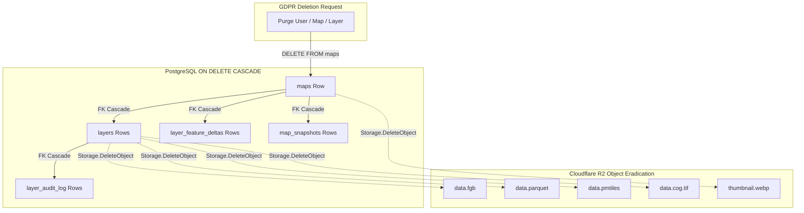

1. **Relational Cascades:** Foreign key constraints with `ON DELETE CASCADE` ensure that deleting a map instantly removes associated layers, deltas, snapshots, and audit logs.
2. **Object Storage Sweeper:** Entity deletion invokes `Storage.DeleteObject` across R2 paths, eradicating binary `.fgb`, `.parquet`, `.pmtiles`, and `.cog.tif` assets.
3. **Quarantine Auto-Expiry:** Staging blobs in `staging/` automatically expire after 24 hours via R2 lifecycle rules, preventing orphaned storage accumulation.

---

## 11. Operational Excellence, Day-2 Operations & Resilience

### 11.1 Service Level Objectives (SLOs/SLIs) & Error Budgets

| Service Level Indicator (SLI) | Target (SLO) | Measurement Window | Error Budget | Monitoring Metric |
| :--- | :--- | :--- | :--- | :--- |
| **Service Availability** | $\ge 99.9\%$ | Rolling 30 calendar days | 43.8 minutes downtime | Ratio of non-5xx responses on `GET /health` and `/api/v1/*`. |
| **Synchronous API Latency** | p95 $< 200\text{ ms}$, p99 $< 400\text{ ms}$ | 5-minute rolling window | $5\%$ of requests | Request duration timer on map metadata routes. |
| **Stream Sync Notification**| p99 $< 100\text{ ms}$ | 5-minute rolling window | $1\%$ of pings | Elapsed time between mutation lock release and client SSE dispatch. |
| **Multipart Upload Throughput**| p95 $< 1200\text{ ms}$ (24 MB part) | 5-minute rolling window | $5\%$ of parts | Transit duration in direct R2 presigned part upload. |

### 11.2 Alerting & On-Call Runbook Matrix

| Alert Name | Severity | Trigger Condition | Potential Root Cause | On-Call Mitigation Runbook |
| :--- | :--- | :--- | :--- | :--- |
| `TerrnHigh5xxRate` | **P1 (Critical)** | 5xx HTTP errors $> 2\%$ over 5 min | Database pool exhaustion, unreachable R2 endpoint. | Check `GET /health`; verify PostgreSQL active connections (`pg_stat_activity`); inspect R2 credentials. |
| `DBPoolSaturation` | **P2 (Major)** | Active DB connections $> 85\%$ for $> 3\text{ min}$ | Long-running table locks or hung migration queries. | Query `pg_stat_activity` for active locks; terminate blocking backend PID; inspect slow queries. |
| `QuarantineStagingLeak` | **P3 (Warning)** | Staging prefix count $> 1,000$ active uncommitted | Client dropped uploads before calling `/complete`. | Verify Cloudflare R2 24-hour lifecycle auto-purge rule; trigger manual sweep. |
| `MCPDevicePollSpike` | **P3 (Warning)** | Polling on `/device/token` $> 200\text{ RPS}$ | Agent runaway retry loop failing to observe 3s backoff. | Inspect user agents; enforce rate-limiter on `/device/token`; verify index on `device_auth_log`. |

### 11.3 Zero-Downtime Deployment & Expand/Contract Migrations
* **Canary Rollout:** Container instances deploy in Kubernetes via RollingUpdate (`maxSurge: 25%`, `maxUnavailable: 0%`) gated by the `GET /health` liveness probe.
* **Expand/Contract Schema Migrations:**
  1. *Phase 1 (Expand):* New database columns are added strictly as `NULLABLE` or with default values. Version N-1 runs undisturbed.
  2. *Phase 2 (Release):* Deploy Version N code, writing to expanded columns and backfilling data.
  3. *Phase 3 (Contract):* Deprecated columns are dropped in release N+1 once Version N is 100% stable.
* **Zero-Schema Rollback:** Because migrations in the Expand phase are strictly backward-compatible, rolling back application code from N to N-1 requires zero emergency database rollbacks.

### 11.4 Disaster Recovery & Graceful Drain
* **RPO & RTO Objectives:**
  * Multi-Tenant Cloud: RPO $< 1\text{ minute}$ (synchronous WAL replication); RTO $< 5\text{ minutes}$ (automated Multi-AZ failover).
  * Standalone Desktop / Embedded SQLite: Deferred as Future Scope (Phase 4).
* **Graceful Shutdown:** Traps `SIGINT`/`SIGTERM` with a 5-second drain window: stops HTTP ingress, flushes active stream channels, and cleanly commits in-flight database transactions before closing connection pools.

---

## 12. Technical Debt & Phased Evolutionary Roadmap

### 12.1 Architectural Dispensations & Known Bottlenecks
1. **Client-Side DuckDB-WASM Memory Ceiling:** On low-end mobile devices (iOS Safari with 1 GB tab memory ceilings), loading a 100 MB GeoParquet file into DuckDB-WASM can trigger tab memory reclamation. *Mitigation:* In Tier 2 mode, DuckDB-WASM queries Parquet via HTTP Range Requests without loading the full buffer into memory.
2. **Multi-Replica Stream Broadcast:** The stream broker is powered by PostgreSQL `LISTEN / NOTIFY`, enabling multi-node horizontal scaling across all Kubernetes pods with zero extra infrastructure. For extreme future scale (> 50k concurrent active map streams), the system can easily bridge to Redis Pub/Sub if database connection pooling thresholds are reached.

### 12.2 Phased Evolutionary Roadmap

```
┌────────────────────────────────────────────────────────────────────────────────────────┐
│ PHASE 1: CORE STORAGE, INGESTION & LOCAL-FIRST CANVAS (Months 1–2)                     │
│ 1. Build Quarantined Presigned Upload Pipeline on Cloudflare R2 with verification gate.│
│ 2. Implement Dual Canonical Persistence (FlatGeobuf + GeoParquet converters).          │
│ 3. Connect Web Worker dynamic slicing (terrn-vt://) with Supercluster & GeoJSON-VT.   │
│ 4. Deploy PostgreSQL 16+ schema with RLS, connection pooling & LISTEN/NOTIFY bridge.   │
├────────────────────────────────────────────────────────────────────────────────────────┤
│ PHASE 2: HYBRID PMTILES, MCP ENGINE & REAL-TIME COLLABORATION (Months 3–4)             │
│ 1. Deploy embedded Model Context Protocol (MCP) server (stdio + Streamable HTTP).      │
│ 2. Build RFC 8628 Headless Device Authorization flow for Claude Desktop & Cursor.       │
│ 3. Implement serverless PMTiles generation pipeline for Tier 2 mega-datasets (> 500k). │
│ 4. Deploy Sequence Stream PubSub broker for real-time human-agent canvas sync (< 50ms).│
├────────────────────────────────────────────────────────────────────────────────────────┤
│ PHASE 3: ADVANCED SPATIAL ANALYTICS, DELTAS & GOVERNANCE (Months 5–6)                  │
│ 1. Deploy incremental feature editing delta log (layer_feature_deltas) & compaction.   │
│ 2. Wire DuckDB Spatial geometric buffer & spatial intersection tools in MCP engine.    │
│ 3. Add automated GDPR Article 17 deletion cascades across PostgreSQL and R2 storage.   │
│ 4. Implement Cloudflare Workers edge caching layer with immutable asset headers.       │
├────────────────────────────────────────────────────────────────────────────────────────┤
│ PHASE 4: FUTURE SCOPE - STANDALONE DESKTOP & EMBEDDED SQLITE (Post-v1.0)               │
│ 1. Package single-binary desktop distribution with embedded SQLite storage engine.     │
│ 2. Implement local WAL checkpointing and opt-in user Cloudflare R2 cloud sync.         │
└────────────────────────────────────────────────────────────────────────────────────────┘
```
