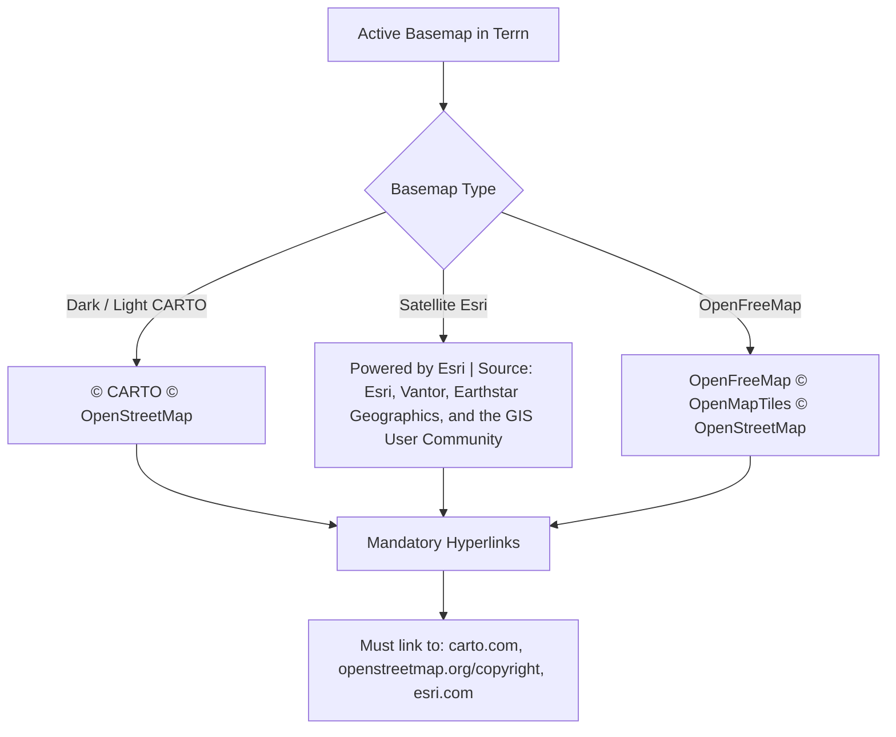

# Terrn: Basemap Attribution — Competitive Benchmark, Legal Compliance, and Sleek Implementation Design

**Document Version:** 2.2.0  
**Date:** 2026-09-25 (v2.0.0: 2026-09-18)  
**Status:** Specification. Verified against the codebase at `597c0bf`, `maplibre-gl@6.11.2`, and the vendors' published terms. Ships as its own PR after R7 (MapLibre 6), not inside it (R7 plan D5).  
**Addresses:** `TODOS.md` Item `L13 — Map attribution is hidden`  
**Target Codebase:** [`/tern/tern_poc`](file:///tern/tern_poc)  

> **v2.1.0 revision note (2026-09-25).** Both vendors' terms were fetched and
> read, not paraphrased. They reverse v2.0.0's central behavioral decision.
>
> 1. **The credit stays visible: `compact: false`.** v2.0.0's §5.3 collapsed
>    it to the (i) on load. That breaches both vendors' terms. OSMF allows a
>    collapse only *after* the credit has been shown (on dismiss, on map
>    interaction, or after five seconds). Esri requires the data source names
>    "directly on or at the bottom of the map where it is always visible". So
>    MapLibre's own default, collapsing on the first drag, still breaches
>    Esri's terms on the satellite basemap. v2.0.0's C3 is deleted. §3.2,
>    §3.3 and §5.3 are rewritten.
> 2. **The Esri credit is wrong too (L13c).** It lacks the required "Powered by
>    Esri" linked to esri.com, and it names providers that the service's own
>    `copyrightText` no longer lists.
> 3. **With no (i) button, the mask token isn't needed.** MapLibre renders the
>    button only in compact mode. v2.1.0 adds no token to `variables.css`.
> 4. **Design corrections.** Link hover uses `--electric`, the documented
>    inline-link color (`icons-and-buttons.md` §7), not `--arc-blue`. Text is
>    12 px "Body small" (`DESIGN.md` type scale), not 11 px. 11 px is the
>    uppercase eyebrow style, and 12 px also meets Esri's suggestion. The
>    narrowest canvas is 60 px, not 572 px.
> 5. **Facts that went stale since 2026-09-18:** line numbers, the adapter
>    name (`MapLibreOverlay`), and the shape of the `base-map.spec.ts` mock
>    after R7. The MapLibre 6.11.2 attribution control's code and CSS match
>    5.24's apart from property order and encoding, so §5.1–§5.2's MapLibre
>    facts still hold.
>
> Superseded text is kept where it explains a decision, and marked
> **Superseded (v2.1.0)**.

> **v2.2.0 revision note (2026-09-25).**
> 1. **CARTO's terms were fetched (§3.1).** "Not hidden, faded or behind a
>    click" rules out any collapse on the default basemaps. Always visible is
>    now required by three of the four sources, not merely chosen.
> 2. **The pill is replaced by unboxed text with a halo (§5.4),** at the
>    owner's request for a Felt-style credit. It stays 12px and at full
>    opacity, because CARTO forbids a faded credit. The halo is a new visual
>    pattern and awaits the owner's approval by eye (§7 C3). The contrast
>    test (§6.4 test 6) is dropped in favor of that check.
> 3. **A left-edge docking rule was added (§5.4).** Without it, a long credit
>    ran on under the left panel instead of wrapping.

> **v2.0.0 revision note.** v1.0.0 was written against the codebase as described
> rather than as built. Its architectural choice (§5.1, native MapLibre control)
> survived verification intact and is unchanged. Its CSS (§5.2) and test plan
> (§6) did not, and have been rewritten. The competitive benchmark (§2) and the
> license analysis (§3) stand, with two corrections folded in. Everything below
> was checked against `maplibre-gl@5.24.0` in `node_modules`, the live
> stylesheets, and `index.html` — §9 lists each claim and how it was verified.

---

## 1. Executive Summary & Problem Statement

Terrn is a high-density, web-first geospatial analytics workspace. It pairs WebGL/Deck.gl data overlays with MapLibre GL raster and vector basemaps (primarily CARTO Dark Matter/Voyager, Esri World Imagery, and OpenFreeMap).

Currently, basemap attribution is explicitly disabled in [`src/core/canvas/base-map.ts`](file:///tern/tern_poc/src/core/canvas/base-map.ts#L99) (l.99 at `597c0bf`):
```typescript
attributionControl: false // Custom control adds sleek styling
```

This suppression leaves Terrn in violation of third-party licensing agreements, flagged as technical debt in [`TODOS.md`](file:///tern/tern_poc/TODOS.md#L393) (l.393 at `597c0bf`; its "compact" wording is superseded by §5.3):
> `- [ ] **L13 — Map attribution is hidden.** Carto/OSM/Esri licenses require visible attribution. Enable MapLibre's compact attribution control. *Compliance, and cheap.*`

### The Core Design Challenge
1. **Strict Legal Compliance:** OpenStreetMap (ODbL 1.0), CARTO, and Esri require visible attribution with active hyperlinks.
2. **Minimal Visual Clutter:** Standard map attribution controls default to high-contrast white boxes or long text strips that compete visually with thematic geospatial data, disrupt dark-mode aesthetics, and cover vital UI chrome.
3. **Complex Viewport Dynamics:** Terrn features dynamic surrounding panels (collapsible 300px Left Panel, collapsible 408px Right Panel + Rail, and a 320px bottom-docked Tabular Attribute Table). A static corner attribution control risks being completely obscured by docked panels.

This document establishes a competitive benchmark of modern mapping platforms, breaks down provider legal guidelines, and delivers an engineering-ready specification for Terrn.

---

## 2. Competitive Benchmark

To determine modern best practices, we examined how leading geospatial analysis tools, consumer mapping platforms, and outdoor apps balance compliance against UI elegance.

| Platform | Format / Mechanism | Visual Weight | Expandable / Interactive | Theme Adaptability | Benchmark Takeaway |
| :--- | :--- | :--- | :--- | :--- | :--- |
| **Felt** | Micro-pill in bottom corner | Extremely low; 10–11px typography, muted contrast | Expands on hover/click | Frosted glass adapts to dark & light modes | **Gold Standard GIS UX:** Seamlessly integrated, respects canvas, meets OSM requirements. |
| **Mapbox GL JS** | Compact `(i)` badge or inline pill | Low in compact mode (24×24px circle) | Collapses into an `(i)` icon by default on small viewports | Standard white pill; requires CSS overrides for dark UI | **Industry Standard Interaction:** Universally recognized `(i)` icon; vetted by OSM legal counsel. |
| **Kepler.gl (Unfolded)** | Semi-transparent bottom-right overlay | Low; subdued text opacity (0.5–0.7) | Collapsible info badge | Inherits Kepler dark/light themes | Designed for dense multi-layer analytics without occluding legends or filters. |
| **ArcGIS Online / StoryMaps** | Dynamic bottom attribution strip | Medium to high; long provider strings | Collapses into an expandable modal/drawer on mobile | Standard neutral grey strip | Automatically aggregates dynamic source lists for satellite imagery. |
| **Google Maps** | Pinned micro-text beside scale bar | Very low; 10px `#5f6368` inline text, no background box | Static inline links | Light/dark mode styling | Flat, unboxed, minimal DOM presence. |
| **Apple Maps (MapKit JS)** | Single `Legal` link in bottom corner | Minimal (single 5-letter word) | Clicking triggers a native legal modal sheet | Minimalist monochrome | Ultra-clean, but requires custom proprietary licensing agreements not available under pure OSM ODbL. |
| **Strava / AllTrails** | Corner text with faint drop shadow | Very low; text-shadow over satellite/streets | Static inline text | Semi-transparent white/black | Prevents vector tracks and POIs from being obscured. |

### Key Benchmark Takeaways
1. **The Collapsible Information Badge `(i)` is the web standard:** Pioneered by Mapbox and standardized in MapLibre GL JS, the compact `(i)` badge satisfies OSM ODbL compliance while reducing the permanent visual footprint from ~240px of text to a 24px circle.
   > **Correction (v2.0.0):** v1.0.0 assumed `compact: true` *delivers* that 24px circle on load. It does not — see §5.3. MapLibre boots the compact control **expanded** and collapses it only after the user first drags the map. Reaching the benchmark's target state takes one extra line, which §5.3 specifies.
   >
   > **Superseded (v2.1.0):** the benchmark shows what other platforms do, not what Terrn's licences allow. Those platforms either own their data or have their own agreements, as §2 notes for Apple. Terrn's basemaps come under OSMF's and Esri's published terms, and together they rule out a credit that starts collapsed or collapses for good (§3.2, §3.3, §5.3). Terrn keeps the "micro-typography, muted tokens" half of this takeaway and drops the badge.
2. **Micro-typography is mandatory:** Basemap attribution is legal metadata, not primary UI. Typography should be sized at 10–11px with muted color tokens (`var(--text-secondary)`), transitioning to brighter contrast only on hover or focus.
   > **Corrected (v2.1.0):** 12px, not 10–11px. `DESIGN.md`'s type scale defines 11px only as the uppercase eyebrow style in `--electric`. Plain secondary text is "Body small", 12px in `--text-secondary`. Esri also suggests "12px or larger" (§3.3).
3. **Low contrast, not blur.** v1.0.0's second takeaway called for frosted glass (`backdrop-filter: blur(12px)`). That is the right instinct for platforms whose surfaces are translucent; it is inert in Terrn. `--surface` resolves to `#0A1628` (dark) and `#F3F6FB` (light) — **fully opaque in both themes**, so `backdrop-filter` has nothing to blur and composites to nothing. `.map-tool-group` (`utilities.css:224`) already carries a dead `blur(12px)` for the same reason. Terrn gets its recessive quality from muted tokens and a hairline `1px solid var(--border)`, not from translucency. The word "frosted" is struck from this document.

---

## 3. Legal & License Compliance Analysis

Terrn centralizes its tile providers in [`src/services/basemap-providers.ts`](file:///tern/tern_poc/src/services/basemap-providers.ts). Each provider imposes specific contractual and copyright requirements:



### 3.1 CARTO (Default `dark` and `light` Basemaps)

*Verified 2026-09-25 from CARTO's attribution page (`carto.com/attribution/`)
and Basemap Terms (`carto.com/legal/basemap-terms/`, §13), checked against the
raw page text. Quotes are verbatim. v2.0.0's wording is replaced.*

* **The rule:** "Visible on the map, legible, in any corner. **Not hidden, faded
  or behind a click.**" And from the terms: "Attributions must be prominent and
  conspicuous to Persons viewing each CARTO basemap." CARTO may act "if CARTO
  reasonably determines that Customer is obscuring the required attribution",
  and "Maps without the credit can have their basemap key suspended".
* **The line to paste:**
  `© <a href="https://www.openstreetmap.org/copyright">OpenStreetMap</a> contributors, © <a href="https://carto.com/attribution/">CARTO</a>`.
  "The word CARTO links to this page" (`carto.com/attribution/`), not the home
  page. "A text credit is enough. We do not ask for our logo on your map."
* **For MapLibre and deck.gl:** "Keep the attribution control visible."

**Consequence: on the CARTO basemaps, which are Terrn's defaults, the credit
can never collapse.** That is stricter than OSMF's rules, and it applies
whenever a CARTO basemap is showing. Any fade, (i) badge or 5-second collapse
on dark or light breaches CARTO's terms, even though OSMF would allow it.

**Separate from attribution, and for the owner:** the terms define
"Commercial Use" to include a service "operated by or on behalf of a business
in the course of its trade or profession". The free commercial tier is
1,000,000 tile requests a month (§12.d), against 5,000,000 for non-commercial
use. Keys issued before 23 September 2026 keep their current use until
30 November 2026, and "From 1 December 2026, Section 12.d applies to all
Customers" (§3.f). Whether Terrn counts as commercial use is not an
attribution question, but it has a deadline.

### 3.2 OpenStreetMap (ODbL 1.0 & OSMF Guidelines)
*Rewritten in v2.1.0 from the OSMF Attribution Guidelines
(`osmfoundation.org/wiki/Licence/Attribution_Guidelines`, fetched 2026-09-25).
Quotes are verbatim. v2.0.0 quoted a passage that isn't on the page, and
concluded from it that `compact: true` is "100% compliant". That conclusion is
withdrawn.*

* **Wording:** "Attribution must be to 'OpenStreetMap'." And: "The historical
  forms of attribution '© OpenStreetMap contributors' or '© OpenStreetMap' are
  acceptable." Both forms are compliant. "contributors" is optional.
* **Link:** "making the text 'OpenStreetMap' a link to openstreetmap.org/copyright".
* **Placement:** "For a browsable map … the credit should typically appear in a
  corner of the map." "While the lower right corner is traditional, any corner
  of the map is acceptable."
* **Collapsing is allowed only after the credit has been shown:**
  > "You may use a mechanism to fade/collapse the attribution under certain conditions:
  > - immediately with a dismiss interaction, for example clicking an 'x' in the corner of a dialog
  > - automatically on map interaction such as panning, clicking, or zooming
  > - automatically after five seconds."
  >
  > "If the attribution has been collapsed, the user must still be able to find
  > the licence information if they look for it, for example from an '(i)'
  > button in the corner of the map or an 'About' option in a menu."

  Every condition starts from a credit that was visible. Collapsing before the
  user has seen it (v2.0.0 §5.3) is not on the list. MapLibre's default
  (shown on load, collapsed on the first drag) is compliant for OSM, but not
  for Esri (§3.3).

### 3.3 Esri World Imagery (`satellite` Basemap)
*Rewritten in v2.1.0 from Esri's "Esri and data attribution: Interactive maps"
(`developers.arcgis.com/documentation/esri-and-data-attribution/interactive-maps/`)
and the World Imagery service's metadata
(`server.arcgisonline.com/ArcGIS/rest/services/World_Imagery/MapServer?f=json`),
both fetched 2026-09-25. Quotes are verbatim.*

Esri has **two** requirements, and Terrn meets neither today.

**1. "Powered by Esri."** "the requirement to display the text _**Powered by
Esri**_" when using Esri technology, APIs, SDKs, services, or data.
* "The _text_ must be clearly displayed on the map, application, or in a window that is accessible from a menu or button."
* "The _text_ must not be covered or obstructed by other UI elements."
* "The _text_ must be easily discoverable."
* Recommended: "Position _text_ at the bottom-right of the main application." "The word _Esri_ should be linked to https://www.esri.com"
* Suggested styling includes "Font size: 12px or larger". The suggested
  colors (`#323232` on 65%-white) are suggestions, and Terrn's tokens replace
  them.

**2. Data attribution.** It must show "the names of all data source providers
for the data used in an ArcGIS basemap and/or data services".
* "Display _names_ directly on or at the bottom of the map where it is always visible."
* "Provide an expandable UI to display all _names_ when they can not be displayed on small screens."

**The data names must always be visible.** This is the clause that rules out
MapLibre's compact mode. The default collapses on the first drag, so it hides
the names on a desktop screen where they fit. An expandable UI is allowed only
where the names can't fit. Terrn blocks screens below 768px (ADR-010), so it
has no such case by design.

**The current source names.** The service's `copyrightText` is
`"Source: Esri, Vantor, Earthstar Geographics, and the GIS User Community"`.
Terrn's `ESRI_ATTRIBUTION` (`basemap-providers.ts:47-48`) still carries the old
Leaflet-providers list (i-cubed, USDA, USGS, AEX, GeoEye, …). Esri's page says a
MapLibre app should read `copyrightText` from the service metadata. v2.1.0
keeps the string hard-coded rather than fetching it at boot, which would add a
request and a failure mode. The date it was copied goes in a comment beside it.
The required credit becomes:

```
Powered by <a href="https://www.esri.com">Esri</a> | Source: Esri, Vantor, Earthstar Geographics, and the GIS User Community
```

* **Handling length:** it wraps. See §5.4 on the narrowest canvas.

### 3.4 OpenFreeMap (`openfreemap` Alternative)
* **Wording:**
  `<a href="https://openfreemap.org">OpenFreeMap</a> © <a href="https://openmaptiles.org">OpenMapTiles</a> © <a href="https://openstreetmap.org/copyright">OpenStreetMap</a>`
* **Terms:** CC-BY for OpenMapTiles and ODbL for OSM.

### 3.5 A second, separate defect: the OSM links already point to the wrong page

v1.0.0 states the `/copyright` requirement in §3.2 and then does not check whether
Terrn meets it. It does not. The attribution strings that ship today
(`basemap-providers.ts:45–50`) link OSM to its **home page**:

```typescript
const CARTO_ATTRIBUTION =
  '© <a href="https://carto.com/">CARTO</a> © <a href="https://openstreetmap.org">OpenStreetMap</a>';
const OFM_ATTRIBUTION =
  '<a href="https://openfreemap.org">OpenFreeMap</a> © <a href="https://openmaptiles.org">OpenMapTiles</a> © <a href="https://openstreetmap.org">OpenStreetMap</a>';
```

So `L13` is two defects wearing one label:

| | Defect | Fix |
|---|---|---|
| **L13a** | Attribution is rendered nowhere — `attributionControl: false` | §5 |
| **L13b** | The OSM link, once rendered, points at `openstreetmap.org` instead of `openstreetmap.org/copyright`. *(v2.1.0)* The CARTO link points at `carto.com/` instead of `carto.com/attribution/`, and the CARTO line should be CARTO's own paste line (§3.1) | Two string literals |
| **L13c** *(v2.1.0)* | The Esri credit lacks "Powered by Esri" and names out-of-date sources (§3.3) | One string literal |

L13b matters *because* we are fixing L13a. Today the wrong link is invisible and
harms nobody. The moment §5 lands, Terrn begins publishing a non-conforming
credit — strictly worse than publishing none, because it is now an assertion of
compliance that is wrong. **The two must land together.** The OSMF guidance is
specific that the link is to the copyright page, not the project.

~~Both strings should also gain `© OpenStreetMap contributors` …~~
**Superseded (v2.1.0):** OSMF accepts "© OpenStreetMap" and "© OpenStreetMap
contributors" alike (§3.2). The current wording is compliant. Only the link
target is wrong. L13c joins L13a and L13b under the same rule: all three land
together.

### What Constitutes "Overstating" vs "Understating"
* **Overstated (Anti-Pattern):** A permanent, high-contrast, multi-line banner stretching across the bottom of the map that overlaps analytics controls or table headers.
* **Understated (Non-Compliant Anti-Pattern):** Setting `attributionControl: false`, hiding attribution inside a nested Settings modal, or using unclickable plaintext.
* ~~**The Sweet Spot (Terrn Target):** A 24px circular `(i)` button …~~
* ~~**The Sweet Spot (Terrn Target, v2.1.0):** a slim, always-visible pill …~~
* **The Sweet Spot (Terrn Target, v2.2.0):** an always-visible, unboxed line of
  12px `--text-secondary` text in the bottom-right corner of the *visible*
  canvas. A thin `--surface` halo keeps it legible over any basemap. It
  brightens to `--text-primary` under the pointer, and its links underline in
  `--electric`. It is docked clear of every panel. It is one line for CARTO
  and wraps for Esri. It is compliant under §3.1–§3.3, and it stays quiet
  because it has no box and uses muted type, not because it fades or
  collapses.

---

## 4. Terrn Viewport Layout & Collision Analysis

Unlike static map applications, Terrn has dynamic chrome that shifts during analytical workflows:

```
┌────────────────────────────────────────────────────────────────────────┐
│ Topbar (44px)                                                          │
├──────────────┬──────────────────────────────────────────┬──────────────┤
│              │                                          │ [Rail: 48px] │
│ Left Panel   │             Active Canvas Area           │ Right Panel  │
│ (300px)      │                                          │ (360px)      │
│              │                                          │              │
│              │                                    [Tools]              │
│              ├──────────────────────────────────────────┤              │
│              │ Tabular Attribute Table                  │              │
│              │ (320px open / 40px minimized / 0px closed)│              │
│              │ [Attribution must dock cleanly above!]   │              │
└──────────────┴──────────────────────────────────────────┴──────────────┘
```

### Collision Risks:
1. **Right Panel & Rail Collision:**
   - The Right Panel has three states: Fully Open (`360px + 48px rail = 408px`), Collapsed (`48px rail visible`), or Hidden (`0px`).
   - If attribution is fixed at `right: 8px`, it is trapped behind the collapsed 48px rail.
2. **Bottom Tabular Panel Collision:**
   - The attribute table ([`grid.css`](file:///tern/tern_poc/src/features/tabular/components/grid.css)) docks to the bottom viewport edge with `z-index: 85`.
   - Open height: `320px`. Minimized height: `40px`.
   - If attribution is fixed at `bottom: 8px`, it is completely covered whenever a user opens the table.

3. **The stacking-context trap (missed by v1.0.0, and the most consequential fact in this document).**
   `#map` is declared in [`reset.css:27`](file:///tern/tern_poc/src/core/styles/reset.css#L27) as:
   ```css
   #map { position: fixed; inset: 0; width: 100%; height: 100%; z-index: 1; }
   ```
   `position: fixed` with a numeric `z-index` **creates a stacking context.**
   MapLibre mounts its controls inside that container, and `maplibre-gl.css`
   gives `.maplibregl-ctrl-bottom-right` `z-index: 2` — which is 2 *within
   `#map`'s context*, i.e. pinned to layer 1 of the document. Terrn's chrome
   lives outside `#map`: `.map-tools` at 80, `.tabular-panel` at 85, topbar at 100.

   **A natively-mounted attribution control therefore cannot be raised above any
   panel by any z-index.** v1.0.0's `z-index: 80` is inert, and its
   `position: fixed !important` is redundant (an `absolute` child of a
   full-viewport `fixed` parent is already viewport-positioned).

   *v2.1.0:* Esri's terms now say so outright: the text "must not be covered or
   obstructed by other UI elements" (§3.3). A docking miss is a licence
   breach, not an inference from one.

   The consequence is not cosmetic. For `.map-tools`, a docking miss means a
   button renders on top of a panel — ugly, and instantly obvious. For
   attribution, a docking miss means the credit is painted *underneath* an opaque
   panel and **silently disappears** — which is precisely the compliance failure
   L13 exists to fix, reintroduced in a form no one will notice. Docking accuracy
   is load-bearing for legality here, not for polish.

   This is why §6's browser guard is a **hit test** (`elementFromPoint`) rather
   than v1.0.0's assertion on computed `bottom`/`right` values. A computed-offset
   check confirms the CSS we wrote is the CSS that applied; it cannot tell us
   whether a human can see the thing.

### Solution: Dynamic Layout-Aware Docking
The attribution container must participate in Terrn's layout transitions, using CSS transitions identical to `.map-tools` ([`utilities.css#L213`](file:///tern/tern_poc/src/core/styles/utilities.css#L213)):
- `transition: right 0.28s cubic-bezier(0.16, 1, 0.3, 1), bottom 0.28s cubic-bezier(0.16, 1, 0.3, 1)`

…and it must be added to the `prefers-reduced-motion: reduce` block at
[`utilities.css:433`](file:///tern/tern_poc/src/core/styles/utilities.css#L433),
which enumerates every non-component piece of chrome that transitions.

---

## 5. Architectural Specification

### 5.1 Technology Choice: Native MapLibre Compact Attribution — **confirmed**

Instead of constructing a bespoke DOM component and manually syncing basemap change events, Terrn will leverage MapLibre's built-in `maplibregl.AttributionControl({ compact: true })`.

> **v2.1.0:** `AttributionControl({ compact: false })`. The constructor's
> default is `{ compact: true, customAttribution: '<a …>MapLibre</a>' }`
> (`attribution_control.ts:23-26`, 6.11.2). Passing an options object replaces
> the whole default, so `{ compact: false }` also drops the MapLibre
> self-credit, as v2.0.0 intended. With `compact: false`, `_updateCompact` sets
> `open` on every resize and never adds `maplibregl-compact`. The vendor CSS
> shows the (i) button only under `.maplibregl-compact`, so no button is
> rendered.

This was v1.0.0's call and it survives verification. The evidence is stronger than
v1.0.0 claimed, because the work is already done:

1. **The attribution data already exists.** `basemap-providers.ts` stamps an
   `attribution` string onto every source it authors — lines 132, 139, 166, 177,
   185. Nothing needs to be written, wired or passed in. Switching the control on
   makes strings that are already in the style object visible.
2. **Automatic lifecycle synchronization is real.** `AttributionControl.onAdd()`
   subscribes to `styledata`, `sourcedata` and `terrain`. `setBasemap()` calls
   `map.setStyle()`, which fires `styledata`; the control re-reads and re-renders.
   Controls are attached to the map, not the style, so they survive `setStyle`
   without re-registration.
3. **Deduplication is handled.** CARTO declares two sources (base + labels)
   carrying an identical string. `_updateAttributions()` drops exact duplicates,
   then sorts by length and drops any entry that is a substring of another. One
   pill, no repetition — including across a raster/label pair.
4. **Zero bundle overhead.** `maplibre-gl` is already imported, and
   `maplibre-gl/dist/maplibre-gl.css` is already imported at `base-map.ts:9`, so
   the classes we override are already in the bundle either way.
5. **Accessibility is built in.** `_setElementTitle()` sets both `title` and
   `aria-label` from MapLibre's i18n table (`AttributionControl.ToggleAttribution`).

The alternative — a custom control fed by `getBasemapAttribution()` — was
reconsidered in light of §4's stacking-context finding, which is the one real
argument for it (a custom element could live outside `#map` and above the panels).
It was rejected: the native control's synchronization is the legally load-bearing
part, and hand-maintaining "which sources are live right now" is exactly the code
that rots into non-compliance. The stacking constraint is instead answered by a
test that can actually detect occlusion (§6.3).

**Consequence:** `getBasemapAttribution()` (`basemap-providers.ts:226`) is the
vestige of the custom control that never shipped. It is exported and called from
nowhere. Choosing the native control means deleting it, not leaving it.

---

### 5.2 Three MapLibre facts that determine the CSS

v1.0.0's stylesheet was written against an imagined DOM. The real one, from
`maplibre-gl@5.24.0`:

> **v2.1.0:** rechecked against 6.11.2. The control's code is the same, and its
> CSS differs from 5.24's only in property order and data-URI encoding. With
> `compact: false`, Fact 2 (the button and its mask) and the `:focus` ring note
> no longer apply: there is no button. Fact 1 (`<details>`, now always `open`)
> and Fact 3 (margins and `pointer-events`) still do. Note also that the
> vendor's *expanded* padding is `2px 28px 2px 8px`, not 24px: a 24px icon
> plus a 4px gap. Anyone who brings compact mode back should keep ≥ 28px.

**Fact 1 — it is a `<details>`/`<summary>`, not a div and a button.**
```
<details class="maplibregl-ctrl maplibregl-ctrl-attrib maplibregl-compact maplibregl-compact-show">
  <summary class="maplibregl-ctrl-attrib-button"></summary>
  <div class="maplibregl-ctrl-attrib-inner">© CARTO © OpenStreetMap contributors</div>
</details>
```
MapLibre already suppresses the disclosure triangle
(`summary.maplibregl-ctrl-attrib-button { appearance: none; list-style: none }`
plus a `::-webkit-details-marker` rule), so that needs no handling from us.

**Fact 2 — the `(i)` is an absolutely-positioned 24×24 square with an SVG
background-image**, sitting in a padding gutter its parent reserves:
```css
.maplibregl-ctrl-attrib-button        { position:absolute; right:0; top:0; width:24px; height:24px;
                                        border-radius:12px; background-image:url("…circle-i…"); }
.maplibregl-ctrl-attrib.maplibregl-compact { padding: 2px 24px 2px 0; }   /* ← the gutter */
```
v1.0.0's `padding: 3px 8px !important` **destroys that gutter**, so the icon
would overlap the credit text whenever the pill is expanded. Any padding
override must keep ≥24px on the right.

The background SVG has no `fill` attribute, so it renders **black** — invisible
on `#0A1628`. It must be recolored, and a `background-image` cannot be. The fix
is `mask-image` + `background-color: var(--text-secondary)`, which recolors
MapLibre's own glyph in both themes. This is deliberately *not* v1.0.0's
`::before { content: "i"; font-family: var(--mono) }`: a monospace letter is not
the circle-i the benchmark identified as the recognized standard, and it would
sit beside 33 Lucide icons drawn on a 24×24 grid at stroke 2. It is also not
Terrn's own `info` icon (`icons.ts:204`), because duplicating that path into CSS
would put a second copy of a registry glyph outside the registry — the exact
drift `icons.spec.ts` exists to prevent. Masking the vendor's own asset adds no
icon to Terrn's vocabulary at all.

**Fact 3 — margins and pointer-events live on the child, not the container.**
```css
.maplibregl-ctrl-bottom-left, .maplibregl-ctrl-bottom-right, … { pointer-events:none; position:absolute; z-index:2 }
.maplibregl-ctrl                                    { pointer-events:auto; transform:translate(0); clear:both }
.maplibregl-ctrl-bottom-right .maplibregl-ctrl      { float:right; margin:0 10px 10px 0 }
```
Two errors in v1.0.0 follow from this:
- `margin: 0 !important` is applied to `.maplibregl-ctrl-bottom-right`, but the
  10px margin is on the `.maplibregl-ctrl` **child**. It survives, so every
  offset v1.0.0 computes is 10px off.
- `pointer-events: auto` is applied to the container, undoing a deliberate
  MapLibre design: `none` on the container and `auto` on the control means the
  empty corner region does not swallow map drags. Restoring `auto` there gives
  the invisible container a hit area over the canvas. Leave it alone.

There is also a hardcoded vendor focus ring to override — and it is on `:focus`,
not `:focus-visible`:
```css
.maplibregl-ctrl-attrib-button:focus { box-shadow: 0 0 2px 2px #0096ff }
```
v1.0.0 styles only `:focus-visible`, so a mouse click would leave MapLibre's blue
ring visible next to Terrn's `--focus-ring-inset`.

---

### 5.3 The boot-state problem: `compact: true` does not start compact

This is the single behavioral fact that changes what ships. From
`attribution_control.ts`:

```typescript
_updateCompact = () => {
    if (this._map.getCanvasContainer().offsetWidth <= 640 || this._compact) {
        if (this._compact === false) { … }
        else if (!this._container.classList.contains('maplibregl-compact') && …) {
            this._container.setAttribute('open', '');
            this._container.classList.add('maplibregl-compact', 'maplibregl-compact-show');
        }                                          //  ↑ both classes
    } …
};

_updateCompactMinimize = () => {                   // bound to the map's `drag` event
    if (this._container.classList.contains('maplibregl-compact')) {
        this._container.classList.remove('maplibregl-compact-show');
    }
};
```

`maplibregl-compact-show` is the **expanded** state
(`.maplibregl-compact-show .maplibregl-ctrl-attrib-inner { display: block }`).
So a control constructed with `compact: true` renders with the **full credit
string visible**, and collapses to the `(i)` only after the user first drags the
map.

Two claims in v1.0.0 are wrong as a result: the benchmark's "reduce the permanent
footprint to a circle" (§2) describes a state the app never boots into, and
§6.2's "verify the button is visible on boot" would assert the opposite of what
happens. On the satellite basemap the boot state is the ~200-character Esri
string stretched across the bottom-right corner — the "overstated anti-pattern"
§3 defines, shipped by default.

~~**Resolution.** Collapse once on `load` …~~

**Superseded (v2.1.0): no collapse at all. Use `compact: false`.**

v2.0.0 resolved this by collapsing on `load`, on the strength of an OSMF quote
that isn't in the guidelines. Against the real terms (§3.1, §3.2, §3.3) there
are three options:

| Option | CARTO (§3.1) | OSM (§3.2) | Esri (§3.3) |
|---|---|---|---|
| v2.0.0: collapse on `load` | ✗ "behind a click" | ✗ never shown before collapsing | ✗ names not always visible |
| MapLibre default: `compact: true` (shown on load, collapses on first drag) | ✗ "behind a click" | ✓ "on map interaction" | ✗ names hidden on a screen where they fit |
| **`compact: false`: always visible** | ✓ | ✓ | ✓ |

Per-basemap switching (compact for CARTO and OpenFreeMap, full for satellite)
would also comply. But MapLibre fixes `_compact` in `onAdd`, so a basemap
switch would have to remove and re-add the control inside `setBasemap`. That
means more code on the path R3 already had to fix, and all it buys is a
smaller CARTO credit, which is one short line anyway. Not taken.
*Updated after the CARTO check:* this option no longer complies either. CARTO
forbids a credit that is "hidden, faded or behind a click" (§3.1), so only
the OpenFreeMap provider could collapse. **Always visible is not a choice
between options any more. Three of the four sources require it.**

```typescript
// base-map.ts, initializeMap(). The Map keeps `attributionControl: false`,
// so the control is created once and explicitly.
mapInstance.addControl(
  new maplibregl.AttributionControl({ compact: false }),
  'bottom-right',
);
```

The "overstated anti-pattern" §3 worried about, the Esri string across the
corner, is answered by type and tokens (§5.4). It stays visible, as Esri
requires.

---

### 5.4 Docking: `:has()`, corrected

v1.0.0's approach is sound and my first review was wrong to call it unprecedented
— `consent-banner.css:31` already uses `body:has(#left-panel:not(.collapsed))`
for exactly this problem, with a comment noting that `<768px` is blocked so
`:has()` support is safe to assume. Every Lit host in Terrn returns `this` from
`createRenderRoot()`, so all panel state is in the light DOM and reachable.

The JS mirror-class alternative (`.map-tools` gets `right-collapsed` /
`tabular-open` toggled by `right-panel-controller.ts` and
`attribute-table-element.ts`) is *not* available here anyway: those controllers
write to `.map-tools`, a sibling of `#map`, and CSS cannot select a sibling's
descendant. Using it would mean editing both controllers to also target the
MapLibre container. `:has()` keeps the change to one stylesheet.

What v1.0.0 got wrong is the selectors. The real DOM:

| Element | Markup | States |
|---|---|---|
| Right panel | `<aside class="right-panel collapsed panel-hidden" id="right-panel">` | `.panel-hidden` → `display:none` (0px); `.collapsed` → rail only (48px); neither → 408px |
| Table | `<terrn-attribute-table id="tabular-panel" class="tabular-panel collapsed">` | `.collapsed` → 0px; `.minimized` → 40px; neither → 320px |

Both boot in their *hidden* state, and both are always present in the DOM — so
absence-of-element is never the signal; the class is. Corrected rules:

```css
/* ============================================================
   MAP ATTRIBUTION — unboxed credit with a halo, and layout-aware docking
   Overrides maplibre-gl.css. Selector specificity is matched to
   the vendor rule being replaced so `!important` stays rare;
   where the vendor ships `!important`-free 0,2,0 selectors we
   match 0,2,0 rather than escalating.
   ============================================================ */

/* Docking. Base case is the boot state: right panel hidden, table closed.
   `position`/`z-index` are deliberately NOT set — see §4 risk 3; the control
   is confined to #map's stacking context and cannot be lifted out of it. */
.maplibregl-ctrl-bottom-right {
  left: 0;
  right: 0;
  bottom: 0;
  transition: left 0.28s cubic-bezier(0.16, 1, 0.3, 1),
              right 0.28s cubic-bezier(0.16, 1, 0.3, 1),
              bottom 0.28s cubic-bezier(0.16, 1, 0.3, 1);
}

/* The 10px vendor margin lives on the child and is what actually spaces the
   credit off the corner. Normalize it to Terrn's 12px rhythm here, once, so the
   docking offsets can be read as pure panel widths. */
.maplibregl-ctrl-bottom-right .maplibregl-ctrl {
  margin: 0 12px 12px 12px;
}

/* Left panel open (v2.2.0). Without a left edge the corner container spans
   the whole #map, so a credit too long for the visible canvas runs on under
   the left panel instead of wrapping. With it, the credit wraps inside the
   canvas the user can see. */
body:has(#left-panel:not(.collapsed)) .maplibregl-ctrl-bottom-right {
  left: var(--left-panel-w);
}

/* Right panel: rail only */
body:has(#right-panel.collapsed:not(.panel-hidden)) .maplibregl-ctrl-bottom-right {
  right: var(--right-rail-w);
}
/* Right panel: fully open (rail + pane) */
body:has(#right-panel:not(.collapsed):not(.panel-hidden)) .maplibregl-ctrl-bottom-right {
  right: calc(var(--right-rail-w) + var(--right-panel-w));
}

/* Table: minimized (40px tab) / open (320px) */
body:has(#tabular-panel.minimized) .maplibregl-ctrl-bottom-right {
  bottom: 40px;
}
body:has(#tabular-panel:not(.collapsed):not(.minimized)) .maplibregl-ctrl-bottom-right {
  bottom: 320px;
}

/* ── The credit (v2.2.0: unboxed text with a halo) ────────────
   No box, border or fill. The halo does the pill's job: it keeps the text
   legible over any basemap, satellite photos included, the way map labels
   stay legible. It is drawn in --surface, the color the pill would have
   been, so it follows the theme. Full opacity, because CARTO forbids a
   "faded" credit and requires a "legible" one (§3.1).
   0,2,0 matches the vendor's `.maplibregl-ctrl.maplibregl-ctrl-attrib`. */
.maplibregl-ctrl.maplibregl-ctrl-attrib {
  background: transparent;
  border: 0;
  padding: 0;
  color: var(--text-secondary);
  font-family: var(--sans);
  font-size: 12px;              /* DESIGN.md "Body small"; Esri: 12px or larger */
  line-height: 16px;
  text-align: right;
  text-shadow:
    -1px -1px 0 var(--surface),
     1px -1px 0 var(--surface),
    -1px  1px 0 var(--surface),
     1px  1px 0 var(--surface),
     0    0   3px var(--surface);
  transition: color 0.15s ease;
}

/* Recessive until looked at: the whole credit brightens under the pointer. */
.maplibregl-ctrl.maplibregl-ctrl-attrib:hover {
  color: var(--text-primary);
}

/* ── Links ── the documented inline-link recipe (icons-and-buttons.md §7:
   underline, --electric). They inherit the credit's color at rest, so the
   credit reads as one line of text rather than a row of links. */
.maplibregl-ctrl-attrib a {
  color: inherit;
  text-decoration: none;
  transition: color 0.15s ease;
}
.maplibregl-ctrl-attrib a:hover,
.maplibregl-ctrl-attrib a:focus-visible {
  color: var(--electric);
  text-decoration: underline;
}
.maplibregl-ctrl-attrib a:focus-visible {
  outline: none;
  box-shadow: var(--focus-ring);
  border-radius: 2px;
}
```

Notes on this stylesheet:

- **v2.2.0 replaces the v2.1.0 pill with unboxed text and a halo.** This is the
  owner's call (2026-09-25), taking the Felt-style look. The rejected version
  (10px, `opacity: 0.35`, no halo) would breach CARTO's "not … faded" and
  "legible" (§3.1) and Esri's "clearly displayed" (§3.3). It would also vanish
  over bright satellite imagery.
- **The halo is a new visual pattern and needs the owner's approval.** Nothing
  in `src/` uses `text-shadow` today (grep, 2026-09-25). `DESIGN.md` rules out
  `box-shadow` on chrome *panels*. A text halo isn't a panel shadow, and it adds
  no token: it reuses `--surface`, so `no-hardcoded-colors.spec.ts` passes.
  Five shadows give an even edge. The 1px offsets draw the outline and the
  3px blur softens it. If that reads too heavy, tune the widths by eye;
  `paint-order: stroke fill` with `-webkit-text-stroke` is the crisper
  alternative.
- **No `box-shadow` on the credit.** v1.0.0 specified
  `box-shadow: 0 4px 12px rgba(0, 0, 0, 0.25)`, which fails
  `no-hardcoded-colors.spec.ts`. That test permits colour literals only in
  `variables.css` and keeps `ALLOWLIST` deliberately empty. The focus ring on
  a link is the one exception, and it is the standard `--focus-ring` token.
- ~~**`--attrib-info-mask` is a new token** …~~ **Removed (v2.1.0):** with
  `compact: false` there is no (i) button to recolor.
- **Contrast is checked by eye at approval, not by a test** (v2.2.0). Over a
  basemap the background under the text is the halo, and the halo's
  effectiveness depends on its width against the imagery behind it, which a
  computed-color check can't see. The text/halo token pair is
  `--text-secondary` on `--surface`, the same pair the app's body text already
  uses on its panels. §6.4 test 6 is dropped. The approval check is in §7 C3.

**The narrow canvas.** Terrn allows windows down to 768px (ADR-010). With the
left panel open (300px) and the right panel open (408px), the visible canvas
is **60px**. The left-edge rule above keeps the credit inside that canvas,
where it wraps into a tall column: the Esri credit runs to roughly 15–20
lines. This is the rare corner case (the smallest window, with both panels
open), and it stays compliant because nothing is hidden. Esri would allow a
collapsible credit here, since this is the "can not be displayed on small
screens" case (§3.3), but CARTO doesn't allow one on dark or light. Accepted
as is, and shown in the approval check.
- MapLibre's own ≤ 640px compact switch can't help. It measures
  `getCanvasContainer().offsetWidth`, which is the full-viewport `#map`, and
  never the visible canvas.
- §6.4 test 3 samples this case, so a regression that pushes the credit under
  a panel still fails.

---

## 6. Verification and Quality Assurance Plan

### 6.1 What is already covered

`basemap-providers.spec.ts:265` (`describe('attribution')`) already asserts that
every CARTO source names CARTO and OpenStreetMap, and every Esri source names
Esri. v1.0.0's §6.1 proposes writing this test. It exists. Extending it is still
worthwhile; duplicating it is not.

### 6.2 Unit — `basemap-providers.spec.ts`

Extend the existing `attribution` block. Expected strings are written by hand.

- **Every OSM link points at `/copyright`.** This is the L13b guard (§3.5). Assert
  that no attribution string contains an `openstreetmap.org` href lacking
  `/copyright`. Written as an assertion on the *absence of the wrong link*, not
  the presence of the right one, so adding a fourth provider with a bare OSM link
  fails too.
- **Every Esri source says "Powered by" with `Esri` linked to
  `https://www.esri.com`, and names Vantor** (L13c, §3.3). It fails on
  today's string.
- **Every CARTO source uses CARTO's paste line**: `CARTO` is linked to
  `https://carto.com/attribution/`, and the text reads
  `© OpenStreetMap contributors, © CARTO` (§3.1). It fails on today's string,
  which links `carto.com/`.
- **Every attribution link is `https://`.** Cheap, and the only part of v1.0.0's
  §6.1 that was genuinely missing.
- **OpenFreeMap is covered.** The existing block tests CARTO and Esri only.

### 6.3 Unit — `base-map.spec.ts`

**A trap to disarm first.** If the `maplibre-gl` mock doesn't export
`AttributionControl`, `new maplibregl.AttributionControl(…)` becomes
`new undefined()`. That throws, and `initializeMap`'s own `try/catch` swallows
it into its fallback mock, at which point **every existing assertion in that
file passes vacuously against a stub**. *v2.1.0:* after R7 the mock uses named
exports (`Map`, `setWorkerUrl`, `GPUInitializationError`; R7 plan §3.1), so
`AttributionControl` goes beside them, not into a `default` object.

New assertions:
- `AttributionControl` is constructed with exactly `{ compact: false }` and
  passed to `addControl` with position `'bottom-right'`.
- `attributionControl: false` remains in the `Map` options (the control is
  registered explicitly, not doubled).

### 6.4 E2E — `e2e/attribution.spec.ts`

Needs a real browser: computed CSS, `:has()` evaluation, WebGL, and the vendor
stylesheet. Per CLAUDE.md's split rule this is `e2e`, not jsdom.

1. **Visible on boot and after a drag** (v2.1.0, replaces "boots collapsed" and
   "expands on click"). `.maplibregl-ctrl-attrib` has the `open` attribute,
   lacks `maplibregl-compact`, and `.maplibregl-ctrl-attrib-inner` has
   non-zero height, both on boot and after a programmatic drag of the map.
   This is the §3.3 requirement, and it fails if someone brings back
   `compact: true`, which is MapLibre's default.
2. *(Deleted in v2.1.0: there is no toggle.)*
3. **Not occluded — the hit test.** For each docking state (table
   closed/minimized/open × right panel hidden/collapsed/open, sampled at the
   extremes), take the **inner credit's** bounding box. Assert that
   `document.elementFromPoint` resolves to the control, or a descendant, at
   its centre and at both ends. Also sample a **768px-wide viewport with
   both panels open** (§5.4). This is the guard §4 risk 3 and Esri's "must
   not be covered" demand.
4. **Links are real.** The OSM anchor's `href` ends in `/copyright`, and on
   dark and light the `CARTO` anchor points to `https://carto.com/attribution/`.
   On satellite, an anchor with text `Esri` points to `https://www.esri.com`.
5. **Survives a basemap switch.** Switch to satellite. The credit's text now names
   Esri and Vantor and no longer names CARTO. Switch back, and it names
   CARTO again. This is the §5.1 auto-sync claim under test.
6. *(Dropped in v2.2.0. Contrast is checked by eye at approval; see §5.4 and §7 C3.)*

Test 5 is the highest-value test in this plan. It is the one that fails if a
future MapLibre upgrade changes the `styledata` contract, and the one that would
otherwise rot into silent non-compliance on the satellite basemap.

### 6.5 Documentation

- Mark `L13` complete in `TODOS.md` (l.393 at `597c0bf`).
- **Record the licence ruling in `docs/decisions/basemap-provider.md`**
  (v2.1.0). That file owns basemap-vendor reasoning, and this PR rules out
  `compact: true` on the vendors' published terms. Quote the two clauses
  (§3.2, §3.3), date them, and say what was ruled out and why, so a later
  "tidy it into an (i)" change meets the reason first. This spec lives outside
  the repo, so the repo needs its own record.
- Note the Esri `copyrightText` date beside `ESRI_ATTRIBUTION` (§3.3).
- v1.0.0's "run `graphify update .`" is dropped: it is not a project command,
  and CLAUDE.md forbids invoking skills unprompted.

---

## 7. Implementation Plan

*v2.1.0: five commits, in their own PR after R7 (MapLibre 6) merges.* v2.0.0's
C3 (collapse on load) is deleted, and the old C4–C6 are renumbered C3–C5.
The ordering is not arbitrary: **C1 must precede C2**, because C2 makes the
credit visible and C1 makes it correct. Landing them the other way round
publishes a non-conforming attribution, however briefly (§3.5).

Gate for each: `npm run lint && npm run test:all && npm run build`, clean.

| # | Commit | Files | Why separate |
|---|---|---|---|
| **C1** | `fix(basemap): correct the OSM and Esri credits` | `basemap-providers.ts`, `basemap-providers.spec.ts` | L13b and L13c. Independently correct, independently revertable, and a bug fix — so it starts with the failing tests (CLAUDE.md). |
| **C2** | `feat(basemap): show the basemap attribution` | `base-map.ts`, `base-map.spec.ts`, `e2e/attribution.spec.ts` (tests 1, 5), `docs/decisions/basemap-provider.md` | The functional fix, with `compact: false` (§5.3). Unstyled but compliant after this commit: a safe stopping point if the styling work stalls. |
| **C3** | `style(basemap): an unboxed credit with a halo` | `utilities.css` | Pure presentation, and **no new token** (§5.4). The halo needs the owner's approval, by eye. |
| **C4** | `style(basemap): dock attribution clear of the panels` | `utilities.css`, `e2e/attribution.spec.ts` | The §5.4 `:has()` rules plus the hit test. Separate from C3 because this is the part that carries compliance risk (§4 risk 3) and deserves its own review attention. |
| **C5** | `chore(basemap): drop the unused getBasemapAttribution helper` | `basemap-providers.ts` | Dead-code removal that only becomes safe once C2 settles the architecture. Trivially revertable if something turns out to want it. |

### Step detail

**C1 — the licence fix**
1. Add the failing assertions to `basemap-providers.spec.ts`'s `attribution`
   block: the OSM `/copyright` guard, the CARTO paste-line guard and the Esri
   "Powered by Esri" / Vantor guard (§6.2). Run them and watch them fail.
2. Replace `CARTO_ATTRIBUTION` (`basemap-providers.ts:45-46`) with CARTO's
   paste line (§3.1). Update `OFM_ATTRIBUTION` (`:49-50`) to link OSM's
   `/copyright`, keeping its wording (§3.5). Replace
   `ESRI_ATTRIBUTION` (`:47-48`) with §3.3's credit, plus a dated comment
   giving its source.
3. Add the `https://` assertion and OpenFreeMap coverage (§6.2).

**C2 — register the control**
1. Add `AttributionControl: vi.fn(function () { return {}; })` to the named
   exports of the `vi.mock('maplibre-gl')` in `base-map.spec.ts` **first**, and
   add the two assertions from §6.3. Check that they fail before the source
   change, so the trap is shown to be disarmed rather than assumed.
2. In `initializeMap()`, after the `MapLibreOverlay` registration (and outside
   its own `try`, R3 D4), add `new maplibregl.AttributionControl({ compact: false })`
   at `'bottom-right'`. Leave `attributionControl: false` in the `Map` options
   and replace its stale comment, "Custom control adds sleek styling"
   (`base-map.ts:99`), which describes a control that was never built.
3. Create `e2e/attribution.spec.ts` with tests 1 and 5 (§6.4).
4. Record the ruling in `docs/decisions/basemap-provider.md` (§6.5).

**C3 — style it**
1. Add the credit and link rules from §5.4 to `utilities.css`, in a new section
   following `MAP TOOLS`. No `variables.css` change.
2. **The owner approves the halo by eye**, and the result goes in the PR. Use a
   production build, in both themes, on dark, light and satellite. On
   satellite, pan to bright imagery (desert, snow, cloud) and to dark
   imagery (water, forest). Include hover, a link's focus ring, and the
   768px window with both panels open (§5.4, the narrow canvas). If the halo
   reads too heavy or too faint, tune its widths here.
3. Confirm `no-hardcoded-colors.spec.ts` and `design-system.spec.ts` still pass.
   These are the guards this commit is most likely to trip.

**C4 — dock it**
1. Add the `:has()` rules, including the left-panel rule, and the child-margin
   normalization from §5.4.
2. Add `.maplibregl-ctrl-bottom-right` to the `prefers-reduced-motion` list at
   `utilities.css:433`.
3. Add tests 3 and 4 (the hit test, including the 768px case, and the links) to
   the e2e spec.
4. Drive all the docking states by hand in the browser before trusting the test.
   The hit test proves visibility; only an eye proves the 0.28s transition lands
   in step with the panel rather than lagging or leading it.

**C5 — remove dead code**
1. Delete `getBasemapAttribution()` (`basemap-providers.ts:226`) and, if it is
   now unreferenced, its `ESRI_ATTRIBUTION`/`OFM_ATTRIBUTION` re-export path.
   Typecheck with `npm run build`.

### Risks

| Risk | Signal | Mitigation |
|---|---|---|
| **Silent occlusion** (§4 risk 3) | None visible in-app; attribution simply absent | §6.4 test 3, the hit test. This is the risk the plan is shaped around. |
| **`base-map.spec.ts` goes vacuously green** (§6.3) | Suite passes, coverage unchanged, assertions meaningless | C2 step 1 requires proving the new assertions fail first. |
| **MapLibre upgrade renames a class** | Pill unstyled | Unstyled is still visible and compliant. §6.4 tests 1 and 5 fail loudly on a changed control. Note `maplibre-gl` is not version-pinned the way Lucide is. |
| **Someone "tidies" the credit into an (i)** *(v2.1.0)* | The credit collapses, so it breaches Esri's terms on satellite | §6.4 test 1, and the ruling in `docs/decisions/basemap-provider.md` (§6.5) |
| **Esri changes its source names** *(v2.1.0)* | The hard-coded string goes stale, as it did from i-cubed to Maxar to Vantor | The dated comment beside `ESRI_ATTRIBUTION`. Recheck `copyrightText` whenever basemap providers are touched |
| **`:has()` selector drifts** when a panel class is renamed | Docking silently reverts to base case | §6.4 test 3 covers this: base case over an open table *is* an occlusion. |
| **Esri string wrapping** on a narrow canvas | Pill overflows or clips; at 60px (§5.4) it grows tall | §6.4 test 3 samples the satellite basemap at 768px with both panels open; the bounding box is read after the switch. |

---

## 8. Conclusion

*Rewritten in v2.1.0.* By registering MapLibre's native attribution control
with `compact: false`, correcting the OSM and Esri credits, styling it with
Terrn's existing tokens and docking it around the panels, Terrn achieves:

* **Compliance checked against the published terms.** OSMF: "OpenStreetMap"
  linked to `/copyright`, shown before any collapse, and Terrn never
  collapses. Esri: "Powered by Esri", and the data names "always visible" and
  "not covered or obstructed" (§3.2, §3.3). CARTO: "Visible on the map,
  legible, in any corner. Not hidden, faded or behind a click", with its
  own paste line (§3.1).
* **Understated presence from type and tokens, not from hiding.** An unboxed
  12px secondary-text credit with a thin halo, one line on the default
  basemaps.
* **Layout-aware docking** verified by occlusion testing rather than by computed
  offsets, because inside `#map`'s stacking context a docking miss does not look
  wrong, it looks like nothing at all (§4).

---

## 9. Verification Log

Every claim in this revision, and how it was checked. Dated per CLAUDE.md's rule
on describing current state.

**Verified 2026-09-18 against `maplibre-gl@5.24.0`, working tree at `d949b48`.**

| Claim | Source |
|---|---|
| Attribution disabled | `src/core/canvas/base-map.ts:65` |
| Every authored source carries an `attribution` | `basemap-providers.ts:132, 139, 166, 177, 185` |
| OSM links omit `/copyright` | `basemap-providers.ts:46, 50` |
| `getBasemapAttribution` is unreferenced | `grep -rn getBasemapAttribution src/ e2e/` → declaration only |
| `compact: true` boots expanded | `node_modules/maplibre-gl/src/ui/control/attribution_control.ts`, `_updateCompact` / `_updateCompactMinimize` |
| Control is `<details>`/`<summary>` | ibid., `onAdd()` |
| Dedupe by exact match then substring | ibid., `_updateAttributions()` |
| Re-reads on `styledata` / `sourcedata` | ibid., `onAdd()` event bindings |
| `{compact:true}` suppresses the MapLibre self-credit | ibid. — the constructor default is an object, so passing one replaces `customAttribution` wholesale |
| 24px button, 24px padding gutter, black SVG, `#0096ff` focus ring, vendor margin on the child, `pointer-events` split | `node_modules/maplibre-gl/dist/maplibre-gl.css` |
| `#map` creates a stacking context at `z-index: 1`; controls are `z-index: 2` within it | `src/core/styles/reset.css:27` + vendor CSS |
| App chrome sits above it | `utilities.css` z-indices 80/90/100; `grid.css:10` (85) |
| `--surface` is opaque in both themes | `variables.css:35, 112, 133` |
| No shadow token exists | `grep -n shadow src/core/styles/variables.css` → focus rings only |
| Colour literals fail outside `variables.css`, empty allowlist | `no-hardcoded-colors.spec.ts:7–9` |
| `:has()` is established | `src/features/settings/components/consent-banner.css:31` |
| All Lit hosts are light DOM | `grep -rn createRenderRoot src/` — every hit returns `this` |
| Panel markup and boot classes | `index.html:171` (`right-panel collapsed panel-hidden`), `index.html:347` (`tabular-panel collapsed`) |
| Panel geometry 0/48/408 and 0/40/320 | `variables.css:73–74`; `grid.css:4–40, 495` |
| `.map-tools` mirror classes are written to a sibling of `#map` | `right-panel-controller.ts:45, 66, 86`; `attribute-table-element.ts:205–301`; `index.html:16, 262` |
| Attribution coverage already exists | `basemap-providers.spec.ts:265` |
| `base-map.spec.ts` mocks only `Map` | `base-map.spec.ts:39–43`, and its own header comment on the vacuous-pass failure mode |
| Reduced-motion list enumerates non-component chrome | `utilities.css:433` |
| Icon registry has `info`; 24×24, stroke 2 | `src/shared/icons.ts:204`; `CLAUDE.md` |

**Added 2026-09-25 (v2.1.0), against `597c0bf` and `maplibre-gl@6.11.2`.**

| Claim | Source |
|---|---|
| OSMF: collapse only on dismiss, on map interaction, or after 5 s; both "© OpenStreetMap" forms are acceptable; link to `/copyright` | `osmfoundation.org/wiki/Licence/Attribution_Guidelines`, fetched 2026-09-25 |
| v2.0.0's OSMF quote ("an expandable control … is acceptable, provided the icon is clearly visible") | Not on that page |
| Esri: "Powered by Esri" required, linked to esri.com; must not be covered; data names "always visible", expandable only on small screens; 12px or larger suggested | `developers.arcgis.com/documentation/esri-and-data-attribution/interactive-maps/`, fetched 2026-09-25 |
| World Imagery `copyrightText` = "Source: Esri, Vantor, Earthstar Geographics, and the GIS User Community" | `server.arcgisonline.com/…/World_Imagery/MapServer?f=json`, fetched 2026-09-25 |
| `AttributionControl` constructor default is `{ compact: true, customAttribution: MapLibre }`; `Map`'s `attributionControl` defaults to the same | `src/ui/control/attribution_control.ts:23-26`, `src/ui/map.ts:499, 864-865` (6.11.2 tarball) |
| `compact: false` → always `open`, never `maplibregl-compact`, so no button | `attribution_control.ts` `_updateCompact`; vendor CSS shows the button only under `.maplibregl-compact` |
| The auto-compact check measures the full `#map`, not the visible canvas | `_updateCompact`: `getCanvasContainer().offsetWidth <= 640` |
| Attribution CSS 5.24 vs 6.11.2: same apart from property order and URI encoding | diff of the two `dist/maplibre-gl.css` files |
| Vendor expanded padding is `2px 28px 2px 8px` | 6.11.2 `dist/maplibre-gl.css` |
| 11px is the uppercase eyebrow; secondary text is 12px "Body small" | `DESIGN.md` type scale |
| The inline link recipe is underline + `--electric` | `docs/design/icons-and-buttons.md` §7 |
| `--arc-blue` is defined once, with no light-mode value | `grep -c -- '--arc-blue:' src/core/styles/variables.css` → 1 |
| Screens below 768px are blocked; panels are 300 and 48+360px | ADR-010; `variables.css:72-74` |
| Attribution is disabled at `base-map.ts:99`; L13 is at `TODOS.md:393`; the helper is at `basemap-providers.ts:226` | grep at `597c0bf` |

