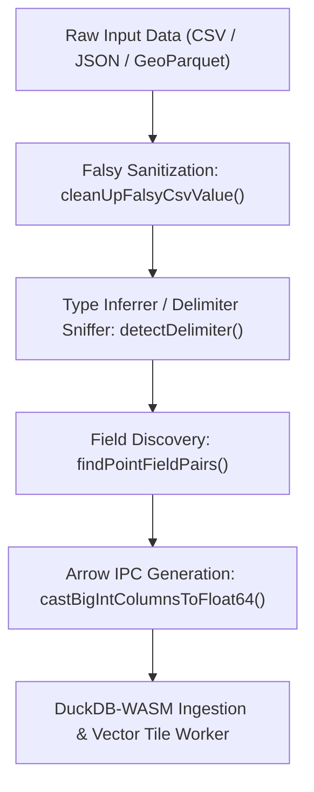

# Kepler.gl Adoption Recommendations for Terrn Performance Architecture

## Executive Summary

This document provides a grounded, codebase-verified analysis of patterns, algorithms, and defensive guardrails from **Kepler.gl** (`/tern/kepler.gl/src`) that can be adopted directly into **Terrn's Performance Optimization Plan** ([`Terrn_Performance_Implementation_Plan.md`](file:///tern/tern_poc/docs/plan/sprint-11/Terrn_Performance_Implementation_Plan.md) and [`Terrn_Performance_Solutions_Review.md`](file:///tern/tern_poc/docs/plan/sprint-11/Terrn_Performance_Solutions_Review.md)).

Every recommendation below is tied to concrete source code in Kepler.gl and mapped directly to Terrn's Sprint 11–15 release roadmap.

---

## 1. Roadmap Alignment Matrix

| Terrn Release & Scope | Target Problem in Terrn | Pattern to Adopt from Kepler.gl | Kepler.gl Source Reference |
| :--- | :--- | :--- | :--- |
| **R2 (0.10.3.0) & R6 (0.12.0.0)** | DEF-14 `tableFromJSON` silent type coercion & Arrow ingestion | `cleanUpFalsyCsvValue` & `castBigIntColumnsToFloat64` | [`data-processor.ts`](file:///tern/kepler.gl/src/processors/src/data-processor.ts#L42, #L589) |
| **R6 (0.12.0.0) & R8 (0.13.0.0)** | DEF-07 / DEF-15 Classification materialization into `StyleConfig` | Quantile domain calculations & scale function generators | [`data-scale-utils.ts`](file:///tern/kepler.gl/src/utils/src/data-scale-utils.ts) |
| **R10 (0.14.0.0) Stage 3** | Ingest worker: Delimiter sniffing & CSV Lat/Lng discovery | `detectDelimiter` heuristic & `findPointFieldPairs` | [`data-processor.ts`](file:///tern/kepler.gl/src/processors/src/data-processor.ts#L57) & [`kepler-table.ts`](file:///tern/kepler.gl/src/table/src/kepler-table.ts) |
| **R10 (0.14.0.0) & R13 (0.15.0.0)** | GeoParquet / DuckDB WKB geometry column extraction | `getGeoArrowMetadataFromSchema` & DuckDB BLOB WKB detection | [`data-processor.ts`](file:///tern/kepler.gl/src/processors/src/data-processor.ts#L468) & [`duckdb-table.ts`](file:///tern/kepler.gl/src/duckdb/src/table/duckdb-table.ts#L528) |
| **R3 (0.10.4.0) & R8 (0.13.0.0)** | 3D Deck.gl picking buffer limit & MapLibre v6 transform compatibility | `compactArrowTable` & Native MapLibre viewport binding | [`arrow-data-container.ts`](file:///tern/kepler.gl/src/utils/src/arrow-data-container.ts#L144) & [`map-container.tsx`](file:///tern/kepler.gl/src/components/src/map-container.tsx#L1383) |

---

## 2. Ingestion & Arrow Pipeline (R2, R6, R10)



### 2.1 Falsy Value Sanitization Before Type Inference (Solves DEF-14)
- **Terrn Problem**: In DEF-14, Terrn identified that `tableFromJSON` silently coerces mixed-type columns based on the first row it sees:
  - `1`, `"N/A"`, `3` $\rightarrow$ `1`, `null`, `3` (`Float64`)
  - `1`, `""` $\rightarrow$ `1`, `0` (`Float64`)
  - `{c:1}`, `"str"` $\rightarrow$ `{c:1}`, `{c:null}` (`Struct`)
- **Adopt from Kepler**: In [`src/processors/src/data-processor.ts:42`](file:///tern/kepler.gl/src/processors/src/data-processor.ts#L42), Kepler runs `cleanUpFalsyCsvValue()` before type detection:
  ```ts
  export const CSV_NULLS = /^(null|NULL|Null|NaN|\/N||)$/;

  function cleanUpFalsyCsvValue(rows: unknown[][]): void {
    const re = new RegExp(CSV_NULLS, 'g');
    for (let i = 0; i < rows.length; i++) {
      for (let j = 0; j < rows[i].length; j++) {
        if (typeof rows[i][j] === 'string' && (rows[i][j] as string).match(re)) {
          rows[i][j] = null;
        }
      }
    }
  }
  ```
- **Action for Terrn**: Place this directly inside `ingest.worker.ts` (R10) and the R2 data-fix patch before building Arrow vectors.

---

### 2.2 Casting 64-bit BigInt Columns to Float64 (`castBigIntColumnsToFloat64`)
- **Terrn Problem**: When Terrn queries DuckDB or builds Arrow tables with `Int64` / `Uint64` properties, JavaScript cannot pass BigInt values to standard math functions, d3 scales, or JSON serializers without throwing `TypeError: Do not know how to serialize a BigInt`.
- **Adopt from Kepler**: In [`src/processors/src/data-processor.ts:589`](file:///tern/kepler.gl/src/processors/src/data-processor.ts#L589), Kepler guards every Arrow table with:
  ```ts
  function castBigIntColumnsToFloat64(arrowTable: arrow.Table): arrow.Table {
    const needsCast = arrowTable.schema.fields.some(
      f => arrow.DataType.isInt(f.type) && f.type.bitWidth === 64
    );
    if (!needsCast) return arrowTable;

    const newColumns: Record<string, arrow.Vector> = {};
    for (let i = 0; i < arrowTable.numCols; i++) {
      const field = arrowTable.schema.fields[i];
      const col = arrowTable.getChildAt(i);
      if (arrow.DataType.isInt(field.type) && field.type.bitWidth === 64) {
        const float64Array = new Float64Array(col.length);
        for (let j = 0; j < col.length; j++) {
          const val = col.get(j);
          float64Array[j] = val === null ? NaN : Number(val);
        }
        newColumns[field.name] = arrow.makeVector(float64Array);
      } else {
        newColumns[field.name] = col;
      }
    }
    return new arrow.Table(newColumns);
  }
  ```
- **Action for Terrn**: Adopt this in `duckdb.ts` when converting DuckDB query results to Arrow, and in `ingest.worker.ts` when serializing tables for the attribute table.

---

### 2.3 Delimiter Sniffing & Coordinate Column Auto-Detection
- **Terrn Problem**: Terrn relies on standard file extensions and basic CSV parsing on the main thread (`main.ts:129-137`).
- **Adopt from Kepler**:
  1. **Delimiter Detection ([`detectDelimiter`](file:///tern/kepler.gl/src/processors/src/data-processor.ts#L57))**: Tests `,`, `\t`, `;`, and `|` against the first line using row parsers and selects the delimiter generating the highest column count ($\ge 2$):
     ```ts
     const SUPPORTED_DELIMITERS = [',', '\t', ';', '|'] as const;

     export function detectDelimiter(rawData: string): string {
       const newlineIdx = rawData.indexOf('\n');
       const firstLine = newlineIdx === -1 ? rawData : rawData.slice(0, newlineIdx);
       if (!firstLine) return ',';

       let bestDelimiter = ',';
       let bestCount = 1;
       for (const delimiter of SUPPORTED_DELIMITERS) {
         const parsed = getRowParser(delimiter)(firstLine);
         const count = parsed[0]?.length || 0;
         if (count > bestCount) {
           bestCount = count;
           bestDelimiter = delimiter;
         }
       }
       return bestDelimiter;
     }
     ```
  2. **Spatial Coordinate Discovery ([`findPointFieldPairs`](file:///tern/kepler.gl/src/table/src/kepler-table.ts))**: Matches field pairs with latitude patterns (`lat`, `latitude`, `y`) and longitude patterns (`lng`, `lon`, `longitude`, `x`). When a CSV is dropped, `ingest.worker.ts` can immediately construct Point geometries without forcing manual user assignment.

---

## 3. DuckDB & GeoParquet Ingestion (R10, R13)

### 3.1 GeoArrow Schema Metadata Extraction
- **Terrn Problem**: In Stage 4 (R13), Terrn plans to ingest GeoParquet files. The plan notes: *"GeoParquet's geometry is WKB, which must be decoded to GeoJSON for the map... its value on input is typed, compact attributes that DuckDB reads directly."*
- **Adopt from Kepler**: Kepler already implements the GeoParquet 1.1 schema metadata parser in [`src/processors/src/data-processor.ts:468`](file:///tern/kepler.gl/src/processors/src/data-processor.ts#L468):
  ```ts
  export function getGeoArrowMetadataFromSchema(table: arrow.Table): Record<string, string> {
    const geoArrowMetadata: Record<string, string> = {};
    try {
      const geoString = table.schema.metadata?.get('geo');
      if (geoString) {
        const parsedGeoString = JSON.parse(geoString);
        if (parsedGeoString.columns) {
          Object.keys(parsedGeoString.columns).forEach(columnName => {
            const columnData = parsedGeoString.columns[columnName];
            if (columnData?.encoding === 'WKB') {
              geoArrowMetadata[columnName] = GEOARROW_EXTENSIONS.WKB;
            }
          });
        }
      }
    } catch (error) {
      console.error('An error during arrow table schema metadata parsing');
    }
    return geoArrowMetadata;
  }
  ```
- **Action for Terrn**: In `ingest.worker.ts` (R13), use this exact function to identify which column contains WKB bytes in a GeoParquet file, bypassing manual column selection.

---

### 3.2 DuckDB WKB BLOB Detection & Round-Trip Preservation
- **Terrn Problem**: When DuckDB reads or queries geometry as a `BLOB`, it discards GeoArrow / GeoJSON metadata, leaving the application with an untyped byte vector.
- **Adopt from Kepler**: In [`src/duckdb/src/table/duckdb-table.ts:527-540`](file:///tern/kepler.gl/src/duckdb/src/table/duckdb-table.ts#L527), Kepler tests the first row of any `BLOB` column with `@loaders.gl/wkt`'s `WKBLoader`:
  ```ts
  const data = table.getChildAt(fieldIndex)?.get(0);
  if (data) {
    const binaryGeo = parseSync(data, WKBLoader);
    if (binaryGeo) {
      type = ALL_FIELD_TYPES.geoarrow;
      field.metadata?.set(GEOARROW_METADATA_KEY, GEOARROW_EXTENSIONS.WKB);
    }
  }
  ```
- **Action for Terrn**: Use this in Terrn’s SQL query runner (`duckdb.ts`) to automatically detect when a user query (or spatial join) returns valid geometry, enabling the "Add query result as layer" feature without requiring manual geometry declarations.

---

## 4. Classification & Style Compilation (R6, R8)

### 4.1 Materialized Domain Classification (`data-scale-utils.ts`)
- **Terrn Problem (DEF-07 & DEF-15)**: Terrn’s Stage 1 plan requires: *"materialize classification into `StyleConfig`... accessors become O(1) lookups against stored stops with precomputed RGBA."* Stage 2 then translates this into MapLibre expressions (`style-compiler.ts`).
- **Adopt from Kepler**: Kepler’s [`src/utils/src/data-scale-utils.ts`](file:///tern/kepler.gl/src/utils/src/data-scale-utils.ts) contains tested numerical domain engines:
  - **Quantile calculation ([`getQuantileDomain`](file:///tern/kepler.gl/src/utils/src/data-scale-utils.ts))**: Extracts sample arrays from data containers and uses `d3-array` quantile thresholds.
  - **Threshold Extraction ([`getThresholdsFromQuantiles`](file:///tern/kepler.gl/src/utils/src/data-scale-utils.ts))**: Converts quantile bins into discrete break values.
  - **Scale Evaluators ([`getScaleFunction`](file:///tern/kepler.gl/src/utils/src/data-scale-utils.ts))**: Implements `linear`, `log`, `quantize`, `quantile`, and `ordinal` mapping.
- **Action for Terrn**: Incorporate this directly into Terrn’s `style-compiler.ts` (R8) to compile MapLibre `step` and `interpolate` expressions from pre-computed breaks.

---

## 5. Defensive Guardrails Learned from Kepler.gl

### 5.1 The Deck.gl 255 Leaf Layer Picking Overflow (Critical for 3D Bubble / Future Hybrids)
- **The Issue in Kepler.gl**: Deck.gl's GPU picking system renders layer indices into an 8-bit color channel ($2^8 = 256$, max 255 pickable leaf layers). In Kepler, when multi-batch Arrow tables were rendered, each record batch created an internal sublayer. Datasets with $>255$ batches silently broke hover and click picking across the majority of the map!
- **Kepler's Solution**: [`compactArrowTable`](file:///tern/kepler.gl/src/utils/src/arrow-data-container.ts#L144) collapses batches into a single contiguous chunk per column.
- **Action for Terrn**: While Terrn moves 2D rendering to MapLibre, it **retains Deck.gl for 3D Bubble** (and potential analytical query overlays). If Terrn ever passes Arrow tables or batch-loaded datasets into Deck.gl `ColumnLayer`, Terrn must compact batches or picking will silently fail on large tables.

### 5.2 MapLibre v6 Transform Isolation
- **The Issue in Terrn (R3 / R7)**: Terrn noted: *"MapLibre v6, where `map.transform` moved to `_camera` and `@deck.gl/mapbox` throws per frame."*
- **How Kepler Solved It**: In [`src/components/src/map-container.tsx:1383-1390`](file:///tern/kepler.gl/src/components/src/map-container.tsx#L1383), Kepler separates MapLibre from Mapbox by using `@vis.gl/react-maplibre` directly and passing native view states into DeckGL (`viewState={internalViewState}`), rather than letting Deck.gl hook into internal private properties (`map.transform`).

---

## 6. Implementation Checklist for Terrn Engineers

- [ ] **Sprint 11 — R2 (`0.10.3.0`)**:
  - Add `CSV_NULLS` regex and `cleanUpFalsyCsvValue` to fix `tableFromJSON` type coercion bug (DEF-14).
  - Add `castBigIntColumnsToFloat64` to prevent BigInt serialization exceptions from DuckDB queries.
- [ ] **Sprint 12 — R6 (`0.12.0.0`)**:
  - Adapt Kepler’s `getQuantileDomain` and `getThresholdsFromQuantiles` for materializing classification stops in `StyleConfig`.
- [ ] **Sprint 14 — R10 (`0.14.0.0`)**:
  - Port `detectDelimiter` and `findPointFieldPairs` into `ingest.worker.ts` for automated CSV coordinate discovery.
  - Implement `compactArrowTable` guard when feeding multi-batch Arrow results to Deck.gl 3D Bubble layers.
- [ ] **Sprint 15 — R13 (`0.15.0.0`)**:
  - Port `getGeoArrowMetadataFromSchema` into `ingest.worker.ts` to automatically extract WKB geometry column names from GeoParquet metadata.
