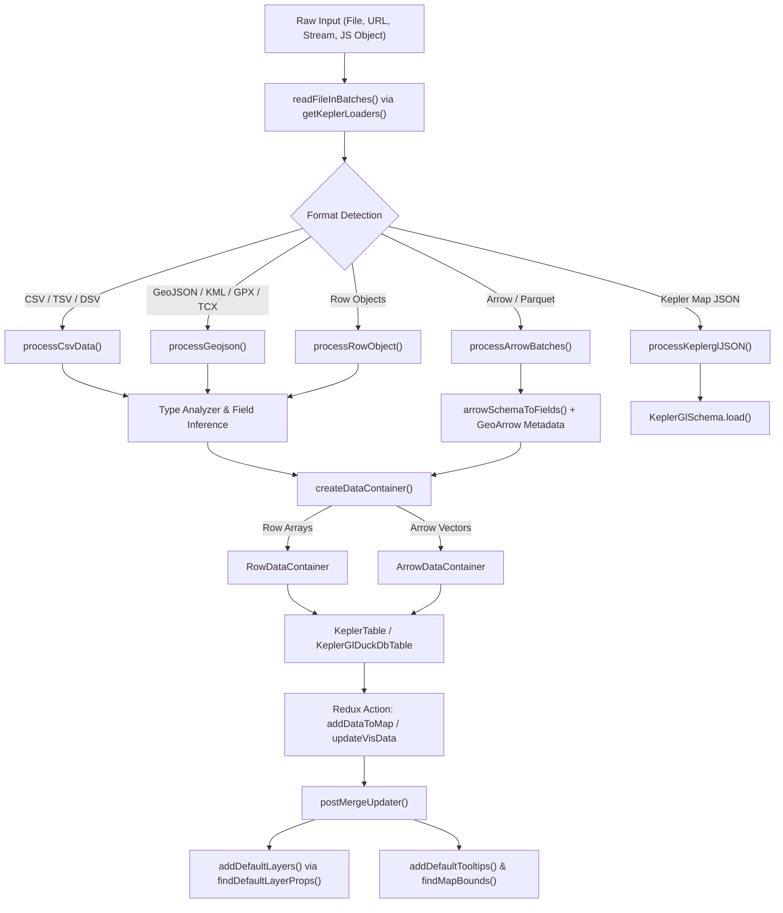
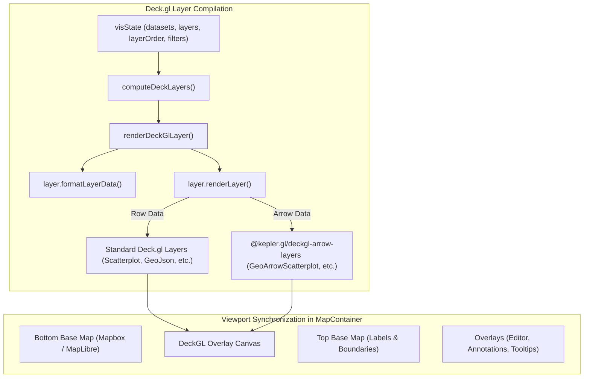
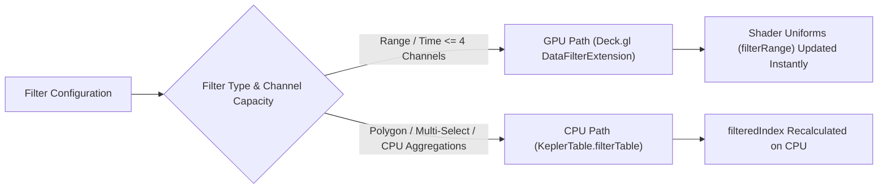

# Kepler.gl Data Ingestion and Rendering Architecture

## Executive Summary

Kepler.gl is a high-performance, WebGL-powered geospatial visualization engine designed to render massive location datasets directly in the browser. Its technical architecture centers on three foundational pillars:
1. **Universal Tabular Abstraction (`DataContainerInterface`)**: Data is decoupled from memory layout—whether stored as standard JavaScript row arrays or as zero-copy Apache Arrow columnar buffers.
2. **Declarative Layer Compilation**: Kepler.gl does not issue WebGL draw calls directly; it functions as a declarative compiler that evaluates visual channels, scales, and filters to generate a dynamic [Deck.gl](https://deck.gl) layer graph.
3. **Multi-Stratum Sandwich Viewport**: Synchronizes base map rendering (Mapbox / MapLibre vector/raster tiles), WebGL Deck.gl data overlays, and top-stratum labels/annotations in real time.

---

## 1. Monorepo Organization & Key Subsystems

Kepler.gl is structured as a monorepo under `src/`, where each package maintains distinct boundaries:

| Package | Path | Role & Responsibilities |
| :--- | :--- | :--- |
| **`processors`** | `src/processors/` | File ingestion, format streaming (`@loaders.gl`), delimiter sniffing, schema & type inference. |
| **`table`** | `src/table/` | `KeplerTable` class, column statistics, GPU filter slot allocation, and CPU filter indexing. |
| **`utils`** | `src/utils/` | Memory structures (`DataContainerInterface`, `RowDataContainer`, `ArrowDataContainer`), scales, and projections. |
| **`duckdb`** | `src/duckdb/` | DuckDB-Wasm spatial query engine integration, SQL queries, and Arrow spatial table management. |
| **`layers`** | `src/layers/` | High-level visualization abstractions (`PointLayer`, `GeojsonLayer`, `H3HexagonLayer`, `TripLayer`, etc.). |
| **`deckgl-layers`** | `src/deckgl-layers/` | Custom Deck.gl composite layers (3D buildings, SVG icons, enhanced text labels, globe projections). |
| **`deckgl-arrow-layers`**| `src/deckgl-arrow-layers/` | Zero-copy Apache Arrow Deck.gl layers (`GeoArrowScatterplotLayer`, `GeoArrowArcLayer`, etc.). |
| **`reducers`** | `src/reducers/` | Redux state management (`visState`, `mapState`, `mapStyle`, `uiState`). |
| **`actions`** | `src/actions/` | Action creators (`addDataToMap`, `loadFiles`, `updateVisData`, `layerConfigChange`). |
| **`components`** | `src/components/` | React UI and viewport synchronization (`MapContainer`, `DeckGL` bridge, controls). |

---

## 2. Data Ingestion Architecture



### 2.1 File Loading & Streaming Pipeline

The ingestion pipeline begins either programmatically via `addDataToMap()` or interactively via user uploads handled in `src/processors/src/file-handler.ts`:

1. **Loader Registry (`src/processors/src/loader-registry.ts`)**:
   Kepler uses `@loaders.gl/core` with dynamically imported loaders:
   - **CSV/TSV/DSV**: `KeplerCSVLoader` with delimiter sniffing (`detectDelimiter`), testing `,`, `\t`, `;`, and `|`.
   - **JSON / GeoJSON / NDJSON**: `JSONLoader` and `NDJSONLoader` configured to stream JSON paths (`$`, `$.features`, `$.datasets`).
   - **Spatial Vector Formats**: `KMLLoader`, `GPXLoader`, `TCXLoader`.
   - **Columnar & Binary**: `GeoArrowLoader` and `ParquetArrowLoader`.

2. **Progressive Batch Processing (`readFileInBatches`)**:
   - `parseInBatches()` yields data in streaming increments.
   - `makeProgressIterator()` tracks byte offsets and row counts, allowing the UI to display live progress bars for multi-gigabyte files.

---

### 2.2 Format Processors & Schema Discovery (`src/processors/src/data-processor.ts`)

Each format is routed through dedicated processing functions:

#### A. Delimited Text (`processCsvData`)
1. **Sanitization**: `cleanUpFalsyCsvValue` turns blank tokens, `null`, `NULL`, `NaN`, and `/N` into JavaScript `null`s to prevent string-type pollution.
2. **Sampling & Analysis**: `getSampleForTypeAnalyze` selects non-empty rows for `type-analyzer` (`AnalyzerDATA_TYPES`).
3. **Type Normalization**: `parseRowsByFields` iterates through each row and parses string values to their native types (`boolean`, `integer`, `real`, `timestamp`, `geojson`, `h3`).

#### B. GeoJSON (`processGeojson`)
1. Normalizes raw features using `@mapbox/geojson-normalize`.
2. Extracts feature geometry into a dedicated `_geojson` column.
3. Flattens feature `properties` into table fields, padding missing properties with `null` so every row shares a uniform schema.

#### C. Apache Arrow & Parquet (`processArrowBatches` / `processArrowTable`)
1. **Schema Mapping**: `arrowSchemaToFields` inspects Arrow field metadata for GeoArrow extensions (`geoarrow.point`, `geoarrow.linestring`, `geoarrow.polygon`, `geoarrow.wkb`).
2. **Batch Compaction (`compactArrowTable`)**:
   > [!IMPORTANT]
   > Deck.gl's picking engine encodes pickable leaf layers in an 8-bit color buffer (maximum 255 pickable layers). Progressive loads or multi-batch parquet files can exceed 255 batches. Kepler rebuilds Arrow vectors into a single compacted chunk per column to preserve picking fidelity.

---

### 2.3 The Data Container Abstraction (`src/utils/`)

Kepler encapsulates table storage behind `DataContainerInterface` (`src/utils/src/data-container-interface.ts`):

- **`RowDataContainer`**: Traditional 2D array container (`rows: any[][]`). Fast for row-by-row lookups and small CSV datasets.
- **`ArrowDataContainer`**: Zero-copy columnar container wrapping Apache Arrow `Table` and `Vector[]`. Provides column-level buffer access directly to WebGL without converting vectors to JavaScript objects.
- **Unified Value Access**: Fields define a curried accessor:
  ```ts
  valueAccessor = (dc: DataContainerInterface) => (d: {index: number}) => dc.valueAt(d.index, fieldIndex);
  ```
  Layers, filters, and scales consume this accessor uniformly, regardless of whether memory is arranged by row or column.

---

### 2.4 Redux Ingestion & Auto-Layer Creation (`src/reducers/src/vis-state-updaters.ts`)

Once normalized:
1. An instance of `KeplerTable` is assigned to `visState.datasets[id]`.
2. `postMergeUpdater` runs automated layer discovery:
   - Evaluates `findDefaultLayerProps(dataset)` on all registered `layerClasses`.
   - Lat/Lng coordinate pairs $\rightarrow$ automatically instantiates a `PointLayer`.
   - GeoJSON geometry or GeoArrow WKB $\rightarrow$ automatically instantiates a `GeojsonLayer`.
   - H3 index column $\rightarrow$ automatically instantiates a `H3HexagonLayer`.
   - Origin/Destination coordinate pairs $\rightarrow$ automatically instantiates an `ArcLayer`.
3. Auto-configures default tooltip fields (`addDefaultTooltips`).
4. Computes initial bounding boxes (`findMapBounds`) to center the camera on the imported data.

---

## 3. Rendering Architecture

Kepler.gl operates as a declarative compiler that turns dataset state and visual configurations into a composite [Deck.gl](https://deck.gl) layer tree.



### 3.1 The Three-Tier Visual Sandwich

In `MapContainer._renderMap()` (`src/components/src/map-container.tsx`), rendering is divided into three synchronized vertical strata:

1. **Bottom Base Map**:
   - Rendered using `@vis.gl/react-maplibre` or `react-map-gl/mapbox-legacy`.
   - Paints land, water, bathymetry, and base building geometry.
   - In 3D Globe mode, substituted by `KeplerGlobeView` (`src/deckgl-layers/src/globe/globe-view.ts`) using spherical raster tiles and atmosphere shaders.
2. **Deck.gl Data Canvas**:
   - Synchronized with the camera `viewState` (`latitude`, `longitude`, `zoom`, `pitch`, `bearing`).
   - Renders all data layers, custom post-processing effects (lighting, ambient occlusion, shadows), and layer blending modes (`normal`, `additive`, `subtractive`, `screen`).
3. **Top Base Map**:
   - Renders place labels, road numbers, and borders *on top* of Deck.gl data layers so data density does not obscure geographical context.

---

### 3.2 Kepler Layer to Deck.gl Layer Compilation

Every visualization layer subclassing `Layer` (`src/layers/src/base-layer.ts`) implements two core lifecycle methods:

#### 1. `formatLayerData(datasets, oldLayerData)`
- Evaluates visual channels against dataset columns.
- Generates d3-scale functions (`linear`, `log`, `quantile`, `quantize`, `ordinal`) mapping column domains to ranges (colors, radii, stroke widths, elevations).
- Compiles text label buffers and attribute accessors.

#### 2. `renderLayer(opts)`
- Returns concrete Deck.gl layer instances.
- For example, `PointLayer.renderLayer()` (`src/layers/src/point-layer/point-layer.ts`):
  - **Standard Row Path**: Creates `@deck.gl/layers/ScatterplotLayer`.
  - **Arrow Zero-Copy Path**: Creates `@kepler.gl/deckgl-arrow-layers/GeoArrowScatterplotLayer`. Column buffers feed directly into WebGL vertex attributes without row iterations.
  - Generates hover highlight layers and text label sublayers (`CollisionTextLayer`).

---

### 3.3 Dual-Mode Filtering: GPU vs CPU

Kepler maximizes interaction performance using a two-tier filtering system:



1. **GPU Shader Filtering (`src/table/src/gpu-filter-utils.ts`)**:
   - Powered by Deck.gl's `DataFilterExtension`.
   - Allocates up to 4 parallel 32-bit float channels (`MAX_GPU_FILTERS = 4`).
   - Standard range filters consume 1 channel; interval time filters consume 2 channels (`start` and `end`).
   - Slider interactions update WebGL shader uniforms (`filterRange`) in real time, achieving 60 FPS playback on millions of points without touching CPU geometry buffers.

2. **CPU Filtering (`KeplerTable.filterTable` in `src/table/src/kepler-table.ts`)**:
   - Used for non-GPU filters: categorical multi-selects, spatial polygon clipping, or aggregation layers (Hexagon and Grid bins) that require CPU-side spatial indexing.
   - Produces `filteredIndex` arrays that prune rows prior to Deck.gl layer creation.

---

### 3.4 Animation and Interaction Mechanics

- **Timeline & Trips Animation**:
  - `animationConfig` manages playback state (`currentTime`, `domain`, `speed`).
  - In `TripLayer`, `currentTime` is passed directly as a Deck.gl prop and update trigger, driving animated trailing coordinates inside the vertex shader.
- **Picking & Hover Detection**:
  - Deck.gl renders an off-screen picking frame buffer.
  - When hovered or clicked, `getLayerHoverProp` maps the picked index back to the underlying `DataContainer` via `layer.getHoverData(object, dataContainer)` to render popovers and tooltips.
- **Multi-Map / Split Viewports**:
  - In split mode (`mapState.isSplit = true`), two synchronized `MapContainer` viewports render concurrently. Each viewport filters layers through `splitMaps[mapIndex].layers`.

---

## 4. Architectural Summary

| Dimension | Ingestion Phase | Rendering Phase |
| :--- | :--- | :--- |
| **Data Representation** | Raw Files $\rightarrow$ `ArrowTable` or `RowObject[]` | `ArrowDataContainer` or `RowDataContainer` |
| **Schema Extraction** | Dynamic sniffing via `type-analyzer` & Arrow schemas | Visual channel scale mapping (`getScaleFunction`) |
| **Execution Engine** | Web Worker loaders & DuckDB-Wasm spatial SQL | Deck.gl WebGL / WebGPU pipeline |
| **Filtering Mechanism** | Initial boundary checks & type validation | GPU `DataFilterExtension` + CPU `filteredIndex` |
| **Compositing** | `KeplerTable` in Redux `visState` | Bottom Map $\rightarrow$ Deck.gl $\rightarrow$ Top Map |
| **Performance Target** | Incremental batch streaming without UI freezes | 60 FPS camera motion & real-time shader uniform filtering |
